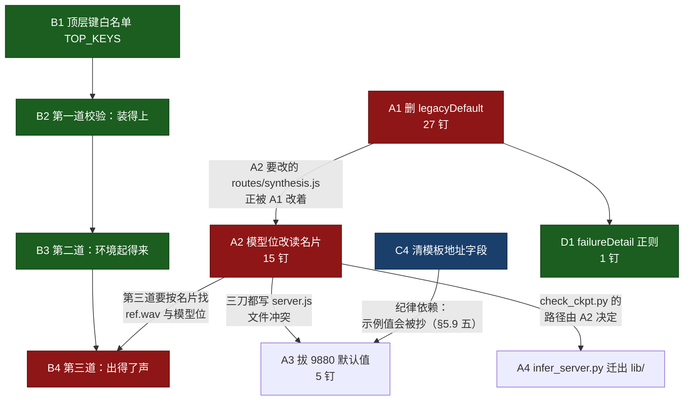

# 引擎契约（Engine Contract）· 版本 2

> **状态：已冻结（2026-08-23，Owner 拍板）。**
> 冻结的是**条款**，不是实现 —— 标【待建】的章节仍待落地。
> 条款要改，先改这份文档并说明理由，不许先改代码再回头补文档。
>
> **契约版本：2**（`manifest.json` 的 `contract_version` 必须写 `2`）
> 版本 1 = 冻结于 r12c 的那份，只描述"目录 + `param_keys`"。
> 版本 2 与版本 1 **不兼容**：名片要多回答"怎么起、怎么调"，
> 平台要多做三道校验。所以跳整数，不用 1.1 —— 小数会让人以为能混用。
>
> ---
>
> 这份文档回答一个问题：**再接一个 TTS 引擎，要做什么。**
>
> 版本 2 的目标（可验收，不是口号）：
>
> > 加一个新引擎 = 克隆上游 + 写一张 `manifest.json` + 确认三五个字段。
> > **一行代码都不写**，`lib\`、`server.js`、`web\` 一个字都不用改。
>
> 反面表述同样重要：**如果接第二个引擎时你不得不打开 `lib\` 或 `server.js`，
> 那不是你做错了，是契约漏了一处抽象，应该回来补这份文档。**

> ---
>
> ## 术语对照表（先读这张，全文都按它理解）
>
> 这份文档里有几个中文说法是**本项目内部的简称**，不是行业标准术语。
> 每一个都在这里给出它对应的**真实文件名 / 字段名 / 通行叫法**。
> 正文继续用简称是为了行文，**含义以本表为准**。
>
> | 本文的说法 | 它到底是什么 | 通行叫法 |
> |---|---|---|
> | **名片** | `engines/<id>/manifest.json` —— 一个引擎的全部声明都写在这一个文件里 | manifest / 清单文件 |
> | **判据** | 一条**可以自动跑、只有过或不过两种结果**的检查 | 验收条件 / 断言 / acceptance criterion |
> | **格子** | 界面上的一个参数输入框，对应 `params.schema` 里的一项 | 参数字段 / form field |
> | **旋钮** | 同上，指用户可调的引擎参数（`engine_params` 里的一项） | 可调参数 / knob |
> | **探活** | 向 `runtime.ready_endpoint` 发一个 HTTP GET，看引擎起来了没有 | 健康检查 / liveness probe |
> | **地板 / 天花板** | 只在 §11 的测试结果表里出现：地板 = 同一条件重复两次的差异（噪声下限）；天花板 = 故意换一个条件后的差异（说明这把尺子分得出区别） | 基线噪声 / 阳性对照 |
>
> ⛔ **新写的内容不许再引入这种简称。** 报错信息、API 返回、字段名里
> **一律直接写真名**（`manifest.json`、`runtime.ready_endpoint` …）——
> 读到那句话的人手上没有这份文档。
>
> ---
>
> ## ⭐ 版本 2 只管推理，不管微调
>
> **这份契约承诺的兼容范围 = 合成（推理）。训练/微调不在内。**
>
> 理由是诚实：微调流程各家差异远大于推理。推理这一侧存在事实上的共性
> —— 绝大多数开源 TTS 以**零样本**为卖点，给一段参考音频就能出声；
> 微调这一侧没有这种共性，数据格式、目录结构、几阶段、产物形态各不相同。
> **没有验证过的东西不写进契约**（见"读数陷阱"那一节的同一条精神）。
>
> 所以 Aurivox 的定位是：
>
> | | 承诺 |
> |---|---|
> | **推理** | 理论上兼容一切开源 TTS，加引擎零代码 |
> | **微调** | **只支持 GPT-SoVITS 一家**，它是这个项目的核心业务模型 |
>
> 名片里的 `capabilities.supports_finetune` **默认 `false`**，版本 2
> 里平台只拿它做一件事：**为 false 就不显示训练页**。
>
> ⭐ 这一步不能省。省掉它的后果不是"多一个页面"，是**用户在
> IndexTTS2 上点开训练页、按 GPT-SoVITS 的流程跑了一轮，最后才发现
> 它根本不该出现在那里** —— 损失的是几小时机时。
>
> 一句话：**藏起来是版本 2 的事，做出来不是。**
> 哪家引擎的微调将来要接，那是一份**单独的训练契约**，另立文档。

---

## ⚠ 阅读须知：哪些是现状，哪些是待建

这份文档里的章节分两类，每节开头都标了：

| 标记 | 含义 |
|---|---|
| **【现状】** | 代码里已经这样了，可以直接照做 |
| **【待建】** | 契约先冻结，代码后跟上。**照做会发现平台还不支持** |

**为什么要标**：版本 2 是先定契约再动代码。不标的话，半年后没人分得清
"这是设计"还是"这是描述"，而这两者读起来一模一样。

**每完成一节的实现，就把标记改掉。全文没有【待建】那天 = 版本 2 落地。**

---

## §0 修订记录

**为什么有这一节**：这份文档有版本号（`版本 2`），却没有任何地方记"改过什么"。
Owner 2026-08-23 的原话是「**我也不知道是第几版契约了**」—— 版本号回答
"名片该写几"，回答不了"上周那条规矩是不是还算数"。这一节补的是后者。

**什么时候跳整数**：只在**不兼容**时（名片要多回答什么、平台要多做什么）。
⛔ 不用小数版本（`2.1`）—— 小数会让人以为能混用，见头部说明。
兼容范围内的改动记在这张表里，`contract_version` 不动。

| 日期 | 版本 | 改了什么 | 为什么 |
|---|---|---|---|
| 2026-08-23 | 2 | **冻结** | 见头部 |
| 2026-08-31 | 2（修订 11） | **刀 B1 落地：§12.14 新增「名片顶层的键：认识的就这些」**。`lib\engines\profile.js` 新增 `TOP_KEYS`（23 个，**名单是从三张真名片量出来的**）+ 编辑距离建议（距离 > 3 就不猜）；名片顶层出现表外的键 ⇒ **`ENGINE_MANIFEST_INVALID_VALUE` 抛错**，⛔ 不静默忽略。台账 B1 → ✅。钉子 **22 行 / 12 文件不变**（这道闸里没有任何引擎名字），测试 1549 → **1561 真跑 1529 / fail 0** | ⭐⭐⭐ 这道闸开起来的**第一个受害者是我们自己**：`hostProfileCli.node.test.js` 的名片夹具写着 `manifest_version`（契约里没这个键，正确的是 `contract_version`），两个夹具还写着 `hard_max_chars` —— **那是 `profile.js:1145` 算出来的（`max_chars × 2`），根本不是名片键**，其中一处还写成了 13 而 7×2=14。三处全都被静默忽略了不知多久，**一条测试都没红过**。⇒ 判据：**「你设了它，但什么都没发生」是最难查的一类问题** —— 顶层拼错比 `runtime` 里拼错更值得守，runtime 里拼错至少还会超时，顶层拼错**连症状都没有**。⭐ 顺序必须是**先查拼写、再查内容**：反过来的话作者看到「缺少 `max_chars`」会去**再加一个**键，于是 `max_char` 和 `max_chars` 并排躺着，前者永远没人读。⚠ 本刀撞出一条**真冲突，见 §12.14 三，⛔ 未裁决** |
| 2026-08-23 | 2（修订 1） | §0 新增本节 | 有版本号无修订记录 ⇒ 没人分得清一条规矩是不是还算数 |
| 2026-08-23 | 2（修订 1） | §4 第 4 步改写：**条款不变，形态改为「机器辅助人类判断」** | Owner 拍板：「确认字段可以用机器辅助人类判断，比如自动读取之类的，读取不了当然需要人类来告诉他有哪些字段……第四步理论上不太能省」。原文只说"让人点一次头"，没说平台该先替他读到什么程度 ⇒ 实现者会理解成"甩一张空表给人填" |
| 2026-08-23 | 2（修订 1） | §6 第三道门**新增第 3 条判据「绑定判别」**，冒烟夹具由一段参考音频改为两段 | ⛔ **§6 开头承诺「确认错了当场装不上」，但它自己列的两条判据兑现不了**：参考音频绑到一个收字符串却忽略它的参数上，进程不崩、输出是合法 WAV、长度也够 —— 三条全过，音色根本没克隆。这正是 §4:250 点名的"猜错了不会报错，只会声音不对" |
| 2026-08-23 | 2（修订 1） | §9 补一行 `lib\inference\infer_server.py`；并划掉 §9 末节已过期的"死字段"清单 | 前者是漏记的账（一台引擎的服务器住在平台目录里），后者是**销错了的账**（那批字段 `lib\engines\profile.js` 早就在读了） |
| 2026-08-25 | 2（修订 2） | §8 新增 **C12 — 环境只维护一套，平台只验不建** | Owner 2026-08-24 拍板「我们不可能维护这么多环境」。这条规矩已经在执行（micromamba 整棵删除、IndexTTS2 环境归作者），但**一直没有条款**⇒ 下一个人完全可能好心引入第二个包生态 |
| 2026-08-25 | 2（修订 2） | §8 新增 **C13 — 那三个实测得来的数：能留空，填了要说出处** | §9 末尾早就记着这条"契约本身的缺口"：`max_chars`/`timeout_ms`/`ready_timeout_ms` 三个数**接引擎的人第一次填不出来，除非先跑一轮**，而契约没有任何一节说它们该怎么来 |
| 2026-08-25 | 2（修订 2） | §9 划掉 `tools\scripts\start.ps1:52`；`runtime` 那行从"无人读"改写为**三档** | 2c（commit `506cd6d`）已把启动脚本里写死的引擎知识搬进名片。⭐ 但**不能整条划** —— 核账时发现 `ready_endpoint`/`ready_timeout_ms` **只被打印、没有执行者**，`preload` **一个消费者都没有** |
| 2026-08-25 | 2（修订 2） | §4 补一小节，指向 C13 | 原文第 4 步只讲"哪个参数是文本/参考音频"，走完六步的人不会知道还有三个数要交代出处 |
| 2026-08-29 | 2（修订 3） | §12 第 4 步落地：新增「第 4 步：安装脚本」一节，规定 `upstream.commit` 形态、`commit_unknown_reason`、可选的 `install.env_command` | C10 早就写着"commit 号是唯一必须留在 git 里的上游信息"，但**两张真名片的 `upstream` 都只是一个裸网址**，一台连 sha 都没有 ⇒ 条款在、字段在、**没有任何代码读它**，等于没有 |
| 2026-08-30 | 2（修订 3） | **§5.7 新增「我的模型怎么找」**：名片新增 `weights`（模型位声明，含可选的 `param`）；磁盘布局改为 `assets\<角色>\models\<引擎id>\<模型位>\`；§9 那笔「GSV 的两个权重槽」的账划掉一半 | ⛔ **「模型在磁盘哪里」这个事实，从落盘→扫盘→元数据→接口→界面全程只有第一台引擎的形状**（写死两个目录名、两个元数据键、两个下拉）⇒ 第二台引擎装上了、名片写了、界面上也能选，但在「有哪些模型可用」这份清单里**一个入口都没有**。⭐ Owner 2026-08-30 定案：模型只有「底模」和「角色下的微调模型」两类且穷尽，**来源无关**（社区微调的也是模型）；筛选是**引擎 × 角色**二维。⛔ 同时删掉「不能热换就把下拉藏掉」—— 那是拿「怎么装载它」定义「它存不存在」 |
| 2026-08-30 | 2（修订 4） | **§5.8 新增「换一份模型，换在哪一步」**：模型位新增可选的 `applies_at`（`launch` / `call`，不写按有没有 `param` 推）；引擎级 `capabilities.hot_swap_models` **降级为推导值**（声明了模型位就可以整行不写，写了必须与位级一致）。同时 §5.7 的音色筛选补上「音色下拉 = 底模 ∪ 每个位都有自己模型的角色」 | ⛔ **「能不能换」是每个模型位各自的事，被硬提到了引擎级** —— 一台引擎两个位、一个能一次调用换掉一个不能的时候，那一位**没有正确答案**。⭐ Owner 2026-08-30 定案：送法穷举只有两种（开进程那一步 / 进程活着时的某一次调用），LoRA 那一类算后者；「一个进程同时挂几份」是引擎自己的容量，不是送法。⭐⭐ 硬约束：**不许麻烦上游作者** —— 两种送法走的都是作者本来就有的东西（构造参数 / 已有接口），平台只是知道该送到哪一步，上游一行代码都不用写 |
| 2026-08-30 | 2（修订 5） | **§12 新增「第 5 步：进程管理」并转【现状】**：用到才起 / 空闲 10 分钟放掉 / 同时最多 2 台 / `runtime.preload` 接上电（**一票否决**语义）；`ready_endpoint` + `ready_timeout_ms` 的探活循环建起来（住在后端，不在启动脚本里）；`applies_at: launch` 的位改成**带着新的那一份重开一次进程**。同时 **§5.8 的 `capabilities.hot_swap_models` 从"推导值"一路退到「退休」**（平台不读、不产出；老名片照装、只提醒一次）。§9 结清三行 | ⛔ **`engines\` 里躺着的 IndexTTS2 一起进程就吃约 6G 内存 ⇒ 开机全点着，装第三台就没法开机了** —— 而"装得下更多引擎"正是这份契约的目的，所以这不是优化，是能不能继续往下装。⭐⭐ 修订 4 把那一位降级为推导值，**中间那一档留不住**：属性还在就一定会有人接着读，而它在"两种位都有"的引擎上只可能是错答案 ⇒ 一路退到底。⭐⭐⭐ 实做时发现的坑：`{checkpoints}` 是**通用宿主自己从落盘 profile 读的**、不是从命令行传的（IndexTTS2 的 `runtime.args` 里根本没有它）⇒ 只在启动计划里顶替**一个字都不会生效且不报错**，正是本步要修的 bug 原样复发 ⇒ 自检句「**改『送什么给引擎』之前，先问这份数据是谁读进去的**」 |
| 2026-08-31 | 2（修订 10） | **A1 + A2 + D1 三刀落地**（钉子 **43 → 22 行 / 21 → 12 文件**，测试 **1455 真跑 1423 → 1514 真跑 1482 / fail 0**）：删掉 `lib\engines\legacyDefault.js` 及全部消费者；模型位名字改从名片读并抽出 `lib\assets\slotPicks.js`；训练管线身份收进 `lib\training\pipelineIdentity.js` **一处**；`failureDetail.js` 那条上游报错正则改成锚定 + 从 `upstreamError.FAILED` 取常量；前端 `engine_id` 一路穿到 5 个渲染点。同时 **§12.11 新增「引擎名字出现在代码里，什么时候是错的」**、**§12.10 第 0 步①的量法改成 `tools\count_nails.cjs`**、台账新增 **A5**（`gpt_sovits_url`） | ⭐⭐⭐ 量法那一改是本轮最贵的一课：§12.10 把钉子数称作**唯一的进度纵轴**，却只留了一行 grep —— 那行 grep 原样跑出来是 **355 行 / 77 文件**，和记下的 66/20/58 差五倍，试了 10 种排除组合**没有一种能复现** ⇒ **那个数在写下的那一刻就不可复算了**。⇒ 判据：**凡被称作"唯一真相"的数字，量法必须是仓库里一个能跑的东西**，⛔ 不是文档里一句话。⭐ 顺带发现旧量法**看不见 `web\src\`**（今天 22 根里有 7 根在那儿）⇒ 纵轴补上第三条腿，否则会出现「`lib\` 归零了、前端还写死引擎名」的假完工。⭐⭐ A2 的核心不是"把 15 处改成动态"：其中**训练管线那几处改成动态就是 bug**（会把 GSV 的权重塞进 IndexTTS2 的格子，且训练时不报错、几天后合成才炸）—— 见 §12.11 一 |
| 2026-08-31 | 2（修订 9） | **§12.10.1 三条裁决落定**（Owner 12:22）：② **默认值不归平台管** —— 病根是「把引擎默认值拷进平台存档」这个动作，⛔ 不是「取自哪台」，新增禁令：不许把任何引擎默认值拷进 `voices.json`/`recipes`/`advanced_params.json`；③ 老配方 v<4 认领 **直接删**，⛔ 不迁移不标记；④ 读音校对**跟着选中的引擎走**，能不能用**问出来**⛔ 不给名片加字段，⛔⛔ 绝不回落到另一台引擎的 g2p | ⭐ ② 那一句取消的不是一个选项，是**问题本身** —— 我问「问哪张名片要默认值」，正确答案是平台不该有"要一份默认值"这个动作。⭐⭐⭐ ④ 的判据在 `lib\inference\infer_server.py:574` 的注释里找到：「**复用引擎已加载的 g2pW，保证预览读音 == 实际合成读音**」⇒ 换一台引擎预览，读音可能对，但它**不再回答原来那个问题**。这正是 Owner 说的「原理得接得上」 |
| 2026-08-31 | 2（修订 8） | **§12.10 新增「开工入口 —— 接手的人从这里开始」【钉死】**：三条重建上下文的命令及其 2026-08-31 答案（钉子 ~~66/58~~ ⚠ 作废见修订 10、测试 1455 真跑 1423、引擎 2 台）、**13 把刀的台账表（状态 + 依赖 + 归零 grep）**、"做完"的四项判据、四条不许 | Owner 原话：「**你自己把计划钉死，不要再要我重新给你做 onboarding**」。⇒ 上下文必须能从仓库自助重建，⛔ 不许再由 Owner 口述。⭐ 台账表被指定为**进度的唯一真相**：状态记在别处已经分叉过一次（§5.9 草稿丢在 Downloads ⇒ 我几小时后把自己刚做的裁决推翻重推） |
| 2026-08-31 | 2（修订 7） | **§12.9 新增「排程：谁必须排在谁后面，哪几刀能同时开」**：给出~~可重跑的~~进度纵轴（`lib\`+`server.js` 里的钉子数，基线 ~~**66 行 / 20 文件，剔掉 8 行文案后真钉子 58**~~ ⚠ **这三个数已确认不可复算，被修订 10 作废** —— 量法改为 `tools\count_nails.cjs`，见 §12.10 第 0 步那条⚠）、五类病因的分账、依赖图与**文件冲突矩阵**、关键路径 `A1→A2→B4`、每刀的四项验收 | 「差多远」此前只有形容词没有数 ⇒ 无法判断一刀有没有真的推进。⭐ 冲突矩阵是算出来的不是感觉出来的：A1/A2/A3 三刀都要写 `server.js` ⇒ **A 泳道内部必须串行**，而 A/B/C 三条泳道零文件交集 ⇒ **可以同时开**。⛔ 本节不含日期与工期：排程依据只有技术依赖和文件冲突，这两条能当场验证 |
| 2026-08-31 | 2（修订 6） | **§5.9 新增「端口：是运输，不是管理」**：端口**保留**（此前 2026-08-30 那次「端口不该存在」的裁决**推翻**）；明确端口的单位是**进程**不是引擎；`default_base_url` 走 `capabilities.hot_swap_models` 同一条**退休**路（平台不再读，改由运行期分配）；名片确认为 **launch 期物**（进程活着期间认的是启动那一刻那一份）；列出驻留的五个问题及各自已答/未答 | ⛔ 「端口不该存在」这条裁决是**只算了成本没算价值**得出的：端口是今天唯一能接住「**不是平台亲手生的进程**」的通道（上游作者自己点起的 webui、局域网另一台机器上的显卡盒子、用户手动起的那个），而这正是「能挂任何后台」这句话的大半。⭐ 真正错的不是端口存在，是**端口号由名片作者写死**（`engines\gpt-sovits\manifest.json` 的 `"default_base_url": "http://127.0.0.1:9880"`）—— 那是作者替运行期把一个动态状态拍死在静态描述上 |
| 2026-08-29 | 2（修订 3） | C10 补齐后半句：名片新增可选的 **`models` 段**（`checkpoints_env` / `required` / `hint` / `source`），底模状态做成三态并接到界面和安装脚本 | C10 只说了"权重不进 git、放 `models\tts\<id>\`"，**没说谁告诉接入的人该往哪儿放、放什么、去哪儿拿**。实测：老引擎的底模目录写死在平台代码里，新引擎的只有启动器读、界面零展示 ⇒ Owner 原话「**你都读不到底模在哪里**」「上游要接入进来，他还得手动把模型放对」 |

---

## §1 为什么会有这份文档 【现状】

r12c 之前，"GPT-SoVITS" 这个名字散落在项目的十几处：参数白名单硬编码在
`lib\flowgraph\adapter.js`、引擎判断是 `if (engineId !== 'gpt-sovits') throw`、
源码躺在 `vendor\tts\gpt-sovits\` 而 `vendor\` 名义上是"第三方成品"。

结果是：**接第二个引擎需要通读并修改五个互不相邻的地方**，而且没有任何东西
会提醒你漏了哪一个。

r12c（版本 1）把这些收敛到两处：`engines\<id>\manifest.json`（引擎自己描述
自己）和 `lib\engines\registry.js`（按目录发现引擎，不认识任何具体引擎名）。

### 版本 1 不够用在哪 —— IndexTTS2 实测

接 IndexTTS2 时，`lib\`、`server.js`、`web\` **确实一个字节都没改**，
契约按它自己的判据是通过的。但代价转移到了引擎作者身上：
**必须写一个 523 行的 `shim.py`。**

> ✅ **2026-08-27 结账：那 523 行已经归零，文件删了。**
> 下面这张"该归谁"的表不是设想，是**实际搬完的账单** ——
> 左边每一行今天都在 `lib\engines\host.py` 里（一份，所有引擎共用），
> 右边那一行在 `engines\indextts2\manifest.json` 的 `call` 段里。
> 判据 8 的三份取证见 §11。

把那 523 行按"该归谁"拆开：

| 这部分干什么 | 该归谁 |
|---|---|
| 洗 `sys.path`（防宿主机上别的程序污染） | 平台 |
| 起 HTTP 服务、探活接口、合成接口 | 平台 |
| 参数白名单、不认识的键回 400 | 平台 |
| 加载状态机（加载中 / 就绪 / 失败） | 平台 |
| 推理排队（一块显卡不能同时跑两个） | 平台 |
| 种子生效（`random` / `numpy` / `torch` 三处都要播种） | 平台 |
| 临时文件读回、解析 wav 头、算时长和 RTF、回响应头 | 平台 |
| **IndexTTS2 独有的部分** | **名片** |

**通用部分约 96%，引擎独有约 4%。** 而那 4% 展开之后，
**没有一行是逻辑，全部是名字**（见 §5）。

下一个引擎作者要把那 96% 再写一遍，而且大概率写得不如这份好 ——
种子那个坑（收下 `seed` 却不用，导致"重跑声音不一样"而 `meta.json` 里
白纸黑字记着一个没生效的种子）他多半会踩。

> ⭐ **这句话已经不再成立了，这正是想要的结果。**
> `engines\_TEMPLATE\` 里今天没有任何 `.py` —— 模板教的是填 `call` 段，
> 不是照抄一个脚本。⛔ 哪天模板里又长出一个 `shim.py`，
> 就是这一节说的问题原样复发，**别让它过夜**。

**版本 2 的全部动机就是这一句：那 96% 属于平台，不属于插件作者。**

---

## §2 这份契约管什么、不管什么 【现状】

### 管

- **本地跑的开源 TTS**，以零样本（给一段参考音频就能克隆音色）为主。
  这是当下开源 TTS 的共性，也是平台的假设基线。
- 调用方式是 **Python 包**（导入一个类，调一个方法）或 **命令行**
  （起一个子进程，传参数，产出音频文件）。这两种都是一等公民，见 §5。

### 不管

- **闭源云端服务**（只提供网络接口的商业模型）。不在兼容范围内 ——
  它们不需要这套抽象，也不该让平台为它们扭曲设计。
- **流式输出**（边合成边吐字节）。目前开源侧罕见，且与"分段 + 拼接 + 段边界"
  这条主路径冲突。要接走 §7 的逃生门。
- **模型权重**。权重永远不进仓库、不随发行包分发，见 §3。

---

## §3 顶层目录的角色 【现状】

判据不是"这东西是什么"，而是**"换 TTS 引擎的时候，它跟不跟着换"**。

| 目录 | 判据 | 例子 |
|---|---|---|
| `engines\` | 换引擎时**跟着换**。一个目录一个引擎 | `engines\gpt-sovits\` |
| `pipeline\` | 换引擎时**不换**，但属于第三方代码 | `pipeline\asr\` `pipeline\uvr5\` `pipeline\slicer\` |
| `vendor\` | 第三方**成品**，我们一行没改过 | `vendor\ffmpeg\` `vendor\micromamba\` |
| `models\` | 全部权重。删了能重新下载 | `models\tts\` `models\asr\` |
| `data\` | 用户编辑过的东西。**删了要不回来** | `data\pron_lexicon\zh.json` |
| `lib\` `server.js` `web\` | 我们自己写的。上游根本不知道它存在 | — |

### ⭐ C10 — 上游源码与权重都不进仓库

**这是版本 2 新增的条款，也是版本 2 最硬的一条。**

Aurivox 提供的是**平台**，不是模型。别人的源码和权重都不进 git、
不随发行包分发。理由不是洁癖，是许可证：

- 各家 TTS 的许可证条款差异极大。IndexTTS2 用的是自定许可，
  里面有"不得用于改进 AI 模型""营收超线须另行授权""分发须把条款
  原样传给下游并承担连带责任"这类条款 —— **带着它的源码分发，
  等于把这些条款也扛到自己身上，还要替下游担责。**
- 权重的许可证通常与源码不同，且往往更严。

**所以：**

```
engines\<id>\
├── 我们自己写的东西        ← 进 git
├── 上游源码                ← 不进 git，安装时按 pin 的 commit 拉取
└── 权重                    ← 不进 git，放 models\tts\<id>\
```

**唯一必须留在 git 里的上游信息，是那个 commit 号**（写在名片的
`upstream.commit` 里 —— ⚠ `UPSTREAM.md` 那种 markdown 表格**机器读不了**，
安装脚本用不上）。删了上游的 `.git` 之后，这个号事后再也拿不回来 ——
丢了它，安装脚本都不知道该拉哪一版。执行者见 §12「第 4 步：安装脚本」。

> **实证**：2026-08-23 把 IndexTTS2 的 215 个上游文件从仓库摘除，
> 平台代码零改动（它们之间只有 HTTP 一条通道）。同期发现 `bst.t7`
> 这个权重二进制混进了 git —— 因为忽略名单里有 `.pth .ckpt .pt .bin
> .safetensors` 却漏了 `.t7`。**权重的扩展名比你想的多，靠列举会漏。**

#### C10 的唯一例外：冒烟参考音频进 git

`engines\<id>\smoke\ref.wav` **进 git**，且是 C10 的唯一例外。

理由：**它不是素材，是判据。**第三道校验要回答"这个引擎装好了没有"，
而"装好了"这个判断只有在**每台机器、每次安装、每个引擎用的是同一段
音频**时才成立。让装的人自己找一段，等于每台机器的判据都不一样 ——
那就不是校验，是各自感觉。

约束（避免这个例外被扩大）：

- 只此一个文件，**每个引擎一个**，不许放第二段
- ≤ 5 秒、16 位 PCM WAV、**≤ 500 KB**
- 必须是可自由分发的音频（自录或明确授权），**不许用上游仓库里的示例音频**
  —— 那段音频往往跟着上游的许可证走
- 守卫测试：`engines\*\smoke\` 下只允许一个 `ref.wav`，超尺寸即变红

#### ⭐⭐ C10 欠的那半句：权重不进仓库，但得有人说它在哪【修订 3 / 2026-08-29】

C10 只说了"权重不进 git、放 `models\tts\<id>\`"。它没说的是：**谁告诉
接入的人该往哪儿放、放什么、去哪儿拿。** 2026-08-29 之前，答案是"没有人"。

Owner 的原话是两句：

> 「你都读不到底模在哪里」
> 「上游要接入进来，他还得手动把模型放对」

当时的实况（只读探针 `tools\dev\probe_base_models.js` 量出来的）：

| | 老引擎 | 后接的引擎 |
|---|---|---|
| 底模目录出处 | **写死在平台代码里**（`lib\paths.js` 的一个常量） | 名片 `runtime.checkpoints` |
| 谁读它 | `server.js` 里几张写死的权重表 → 内置音色的两个下拉 | **只有启动器**（`host.py` 的 `{checkpoints}`） |
| 界面显示 | 看得到 | **一个字都没有** |

于是同一个概念在平台里有两条互不相通的路，而且新接的那条是哑的：
放对了没有，只能靠引擎起不起得来事后倒推。

**修订：名片新增可选的 `models` 段**（解析在 `lib\engines\profile.js` 的
`parseModels`，落盘检查在 `lib\engines\checkpoints.js`）：

```json
"models": {
  "checkpoints_env": "<某个环境变量名>",
  "required": ["config.yaml", "gpt.pth"],
  "hint": "一句给人看的话",
  "source": {
    "url": "模型主页",
    "license_gate": false,
    "command": ["下载器", "...", "{checkpoints}"],
    "cwd": "engine_dir"
  }
}
```

四条规矩，每一条都有它防的那个具体坏法：

1. **路径不在这一段里** —— 它就是 `runtime.checkpoints`。同一个事实两处写
   早晚对不上（`server.js` 那两张权重表的注释已经为这件事警告过一次）。
2. **`command` 是名片自己写的一条 argv，平台不认识任何下载器。**
   规矩同 `base_url_env` / `install.env_command`：HF、ModelScope、直链、
   网盘各家不同；平台一旦替谁生成命令，就等于把那一家写进 `lib\`，
   而且生成错了不会报错，只会下到一半或者下错版本。
   ⛔ 命令里必须出现 `{checkpoints}`，否则下完了平台照样说"底模没放"。
3. **`required` 是下限不是上限**，宁可少写。多写一个可有可无的文件，
   代价是所有人的界面上永远挂着一个红色的"底模缺 1"。
4. **状态是三态**（同 `online`）：齐 / 缺 / **说不出来**。
   名片没写路径、或写了路径但没点名文件，就是"说不出来"（灰色）。
   ⛔ 折成"缺"会让一台好好的引擎永远挂红灯；折成"齐"等于替名片作者
   担保一件他从没说过的事。

**这一版平台只打印取回命令，不执行**（真执行要联网、要动安装计划的
步骤表，是单独一刀）。字段现在就是最终形状：接入者写一次，以后不用再改。

**判据（可机器验）**：每一张真名片都要说得出底模在哪
（`runtime.checkpoints`），且它的底模状态算得出三态之一 ——
守卫在 `lib\engines\realManifests.node.test.js`。

### 三条辅助判据

1. **`LOCAL-CHANGES.md` 在哪，哪就不是 `vendor\`。**
   这个文件是"我们改过上游"的物证。它出现在 `vendor\` 下，说明那棵树需要
   我们维护，该归 `engines\` 或 `pipeline\`。
   *由 `lib\engines\registry.node.test.js` 守卫。*

2. **`engines\` 下的目录数 == 这台机器支持的引擎数。**
   这个数字必须有意义。所以 asr / uvr5 / slicer 这些工具**不能**放进去 ——
   放进去会让"支持几个引擎"变成一个需要人工甄别的问题，也会让加引擎的人
   误以为自己也得弄一个 asr。

3. **`pipeline\` 里的代码不许提到任何具体引擎名。**
   一旦提到了，说明"换引擎时不换"这条判据破了，该重新归类。
   *由守卫测试扫描代码行（注释里说明来历是允许的）。*

### 为什么 asr / uvr5 / slicer 归 `pipeline\` 而不是 `engines\`

因为**训练任何引擎都要用它们**：whisper 打标、uvr5 去伴奏、slicer 切片。
换成 IndexTTS2，这三样一模一样。它们由 `lib\training\steps\*` 和
`lib\routes\*` 直接调用，与引擎选择无关。

---

## §4 加一个引擎，具体做什么 【待建】

```
第 1 步  建目录          engines\<你的引擎id>\
第 2 步  克隆上游        按上游文档装好它自己的环境（不进 git）
第 3 步  生成草稿名片    一条命令，平台扫一遍，八成字段自动填好
第 4 步  确认映射        平台给出带依据的候选，你看一眼点确认；读不出来的才要你说
第 5 步  三道校验        名字对得上 → 名片自检 → 冒烟出声（含绑定判别）
第 6 步  出声 = 装上了
```

### 第 1 步：目录名就是引擎 id

必须与 `manifest.json` 里的 `id` 字段**完全一致**（不一致会抛
`ENGINE_MANIFEST_ID_MISMATCH` —— 否则"按目录找"和"按 id 找"会得到
不同答案，这种不一致极难查）。

`_` 开头的目录**不会**被当成引擎。抄 `engines\_TEMPLATE\` 起步。

### 第 3 步：草稿名片是生成的，不是手写的

平台读你的上游代码，**用反射列出**：有哪些类、哪些方法、每个方法收哪些
参数、哪些有默认值、哪些必填。命令行引擎则读它的 `--help`。

这一步能自动填掉大约八成字段。

### ⭐ 第 4 步：唯一需要人的地方，也是没法省的地方

机器猜不准的只有一件事：**哪个参数是"文本"，哪个是"参考音频"。**

各家起名完全不同 —— IndexTTS2 叫 `spk_audio_prompt`，别家可能叫
`ref_audio`、`prompt_wav`、`speaker_wav`。机器看到 `spk_audio_prompt`
没法确定它要的是一个音频文件路径，还是一个说话人编号。

**猜错了不会报错，只会出来的声音不对 —— 这正是最难查的一类问题。**
所以这一步宁可让人点一次头。

> **"零代码"的诚实定义：一行代码都不写，但要确认一次映射。**
>
> 不要追求"一次确认都没有"，那不可能。要追求的是
> **"确认错了当场装不上"** —— 那个能做到，见 §6。

#### ⭐ 但"需要人"不等于"甩一张空表给人填"【修订 1 / 2026-08-23】

Owner 拍板的原话：**"确认字段可以用机器辅助人类判断，比如自动读取之类的，
读取不了当然需要人类来告诉他有哪些字段。因为每个模型参数不一样，
无法完全自动读取，第四步理论上不太能省。"**

所以这一步的**形态是有条款的**，不是随实现者发挥：

| 平台**必须**已经替他做掉的 | 怎么做到 |
|---|---|
| 列全参数，并分出**必填 / 可选** | `inspect.signature`：没有默认值的就是必填。CLI 形态读 `--help` |
| 给出**候选绑定**，而不是空格子 | 参数名、类型标注、docstring 三样一起看 |
| 给出**依据**，让人能判断这个猜测靠不靠谱 | 例："名字含 `audio`/`prompt`/`spk`" |
| 把契约划出去不管的键**自动隐掉** | 名字命中 `stream` 的隐掉（§2：流式不管） |

拿 IndexTTS2 的上游原文举例（`indextts/infer_v2.py:365`，**没人改过它**）：

```
方法 IndexTTS2.infer —— 3 个必填参数
  spk_audio_prompt   候选：参考音频   依据：名字含 audio / prompt / spk
  text               候选：文本       依据：名字精确匹配 text
  output_path        候选：输出路径   依据：名字含 output + path
  [确认]  [改绑]
另有 11 个可选参数已列为参数格子；stream_return 已隐藏（§2 不管流式）
```

⇒ **人做的事是"看一眼、点确认"，只有机器读不出来时才需要他动手告诉它。**

⛔ **一条硬规矩**：平台**不许**把猜测当成已确认直接装上。
"我猜是这个" 和 "人说是这个" 必须是两个状态 —— 前者的代价是声音悄悄不对，
而那类问题查起来最贵。**没被点过头的绑定 = 没装。**

⚠ 点头也可能点错（名字看着像、其实是说话人编号）。所以第 4 步**不是最后一道防线**，
§6 的第三道门必须能把点错的绑定当场打回来 —— 见 §6 的"绑定判别"。

#### ⭐ 还有三个数，机器和人都填不出来【修订 2 / 2026-08-25】

除了绑定，名片里还有三个数是**跑过才知道**的：`max_chars`（一次最多喂多长）、
`timeout_ms`（一次合成等多久）、`runtime.ready_timeout_ms`（起进程等多久）。

它们和绑定不是一类问题 —— 绑定是"机器猜不准，人知道"；这三个数是**人也不知道**，
除非他先把引擎跑一轮。所以第 4 步**不要求**填它们。

**规矩见 C13**：留空是合法的（平台取保守值）；填了就必须写明出处。
⇒ 走到第 5 步冒烟时你会拿到真实读数，那时回填才是有依据的。

---

## §5 名片：怎么调这个引擎 【现状】

> ✅ **2026-08-27：`call` 一节已通电，并且已经回到 `engines\_TEMPLATE\manifest.json` 里。**
> 读它的是通用宿主 `lib\engines\host.py`（经 `lib\engines\hostProfile.js` 装配）。
>
> 2026-08-25 本节还是【待建】，当时的理由是：`call` **没有任何代码读它**
> （实测 `tools\dev\measure_manifest_reads.cjs`，读取 0 次），而真正管用的是
> 引擎自带一个 `shim.py`。两条路同时摆在模板里，作者会选看起来更省事的那条，
> 然后发现什么都不发生 —— 所以当时把 `call` 从模板里**摘掉**了。
>
> ⭐ 那次"摘掉"是对的，这次"装回"也是对的，**判据是同一条**：
> 模板里只许摆**真的会发生点什么**的键。今天 `call` 满足了，`shim.py` 不再需要。
>
> ✅ **2026-08-31：§5.3 `cli` 形态也通电了**（`call.kind: "cli"`）。
> ⚠ 仍是【待建】的只剩 `http` 形态（§5.1 表里的第三行）——
> 名片里填了会被**当场拒绝启动**，不会静默。

**核心主张：调用方式是一串数据，不是一段代码。**

因为 Flow（画布）要把引擎当**节点**用 —— 要读它的参数生成面板、要排程、
要做质量门。引擎是数据才做得到；是代码就永远做不成工作流。

### §5.1 三种调用形态

| 形态 | 什么意思 | 谁在用 |
|---|---|---|
| `python` | 平台起一个子进程，在里面导入一个类、调一个方法 | IndexTTS2 |
| `cli` | 平台起一个子进程，传命令行参数，产出音频文件 | **多数开源 TTS** |
| `http` | 引擎自己是一个常驻服务，平台发请求 | GPT-SoVITS（现状） |

⭐ **`cli` 是一等公民，不是降级方案。**绝大多数开源 TTS 都提供命令行，
往往比它的 Python 接口更稳定（作者会保证命令行向后兼容，内部类名说改就改）。

### §5.2 `python` 形态要说清什么

以 IndexTTS2 为例，**全部是名字，没有一行逻辑**：

```jsonc
"call": {
  "kind": "python",

  // 从哪个模块拿哪个类
  "module": "indextts.infer_v2",
  "class": "IndexTTS2",

  // 造它的时候给什么（改了这些要重启进程）
  "init_args": {
    "cfg_path":  "{checkpoints}/config.yaml",
    "model_dir": "{checkpoints}"
  },

  // 合成方法叫什么
  "method": "infer",

  // ⭐ 平台的三样东西，在这个引擎里分别叫什么
  //    这三行就是第 4 步要人确认的东西
  "bind": {
    "text":        "text",
    "ref_audio":   "spk_audio_prompt",
    "output_path": "output_path"
  },

  // 结果怎么拿："file" = 它写文件，平台去读；"bytes" = 方法直接返回字节
  "returns": "file",

  // ⭐ 种子怎么生效 —— 见 §5.2.1
  //    IndexTTS2 的 infer() 根本没有 seed 参数，所以只能让宿主
  //    在调用之前、同一把锁内，把种子打到这几个全局 RNG 上
  "seed": {
    "mode":  "global",
    "rngs":  ["python", "numpy", "torch", "torch.cuda"],
    "when":  "before_call",
    "scope": "locked"
  }
}
```

### ⭐ §5.2.1 `call.seed`：种子是副作用，不是实参 【现状】

**这一节是 2026-08-25 量 `engines/indextts2/shim.py` 时发现的契约缺口。**
（⚠ 那个文件 2026-08-27 已删，下文凡引 `shim.py:NNN` 的都是**存档引文**。）

✅ 三态全部通电，逐条有取证：`tools/dev/probe_host.py` [3] 同 seed 两次
**字节完全相同**、换 seed 字节不同（后者不做的话前一条是假绿）；
[5] `call.seed = "none"` 的引擎**拒收**带 seed 的请求（400，不是收下扔掉）；
[6] `mode: "global"` 却没列 `rngs`、`scope` 不是 `locked`、`rngs` 里有不认识
的随机源 —— 三种都**拒绝启动**（rc=2），不是运行时吞异常。

§1 早就点名过这个坑 —— 原话是「收下 `seed` 却不用，导致"重跑声音不一样"
而 `meta.json` 里白纸黑字记着一个没生效的种子」，并把它列为版本 2 的动机之一。
但 §5.2 的 `bind` 只有 `text` / `ref_audio` / `output_path`，
**契约至今没给种子留任何落点**。

#### 为什么不能用 `bind` 或 `{seed}` 槽位解决

槽位只能填进**参数**。而 `IndexTTS2.infer()` 的签名里根本没有 seed ——
它靠的是「在调用之前，把进程里的全局随机源全部播一遍」。
这是**副作用**，不是实参，`bind` 表达不了。

#### `call.seed` 三态

| 写法 | 什么意思 | 谁来做 |
|---|---|---|
| `{"arg": "seed"}` | 引擎自己的合成方法/命令行收 seed | 引擎 |
| `{"mode": "global", ...}` | 引擎不收，宿主播全局 RNG | **平台** |
| `"none"` | 这台引擎不可复现 | 谁都不做，但**必须写出来** |

⛔ **`"none"` 不是可以省略的。** 省略 = 今天的行为 = 静默忽略，
而静默忽略正是 §1 点名的那个坑。写了 `"none"`，平台就**显式拒收**
带 seed 的请求（返回 400），用户当场知道；不写，用户拿到的是一个
声音对不上的 `meta.json`。**"不支持" 和 "没写" 必须能区分开。**

#### `mode: "global"` 的两条 MUST

```jsonc
"seed": {
  "mode":  "global",
  "rngs":  ["python", "numpy", "torch", "torch.cuda"],
  "when":  "before_call",
  "scope": "locked"
}
```

1. ⭐ **`rngs` 必须由名片列，平台不得写死。**
   IndexTTS2 要播四个（`random` / `numpy` / `torch` / `torch.cuda`）；
   换一台纯 ONNX 或纯 JAX 的引擎，`torch` 根本没装。
   平台无条件去播一个不存在的 RNG，只能靠 `try/except: pass` 吞掉 ——
   **那等于播种失败是静默的**，又回到同一个坑里。
   ⚠ 名片列了但环境里没有 ⇒ 这是 §6 第一道校验该拦的事（注册时就拦），
   不是运行时吞异常。

2. ⭐ **`scope: "locked"` 是正确性要求，不是优化。**
   播种改的是**进程级**全局状态。两个并发请求如果不在同一把锁内，
   会互相冲掉对方刚播下的种子 —— 两边的 `meta.json` 都记着自己的 seed，
   两边的声音都不对。
   ⚠ 而 §5.6 第 2 条已经把「排队」判给了平台：既然锁在平台手里，
   **名片就没有能力自己保证这件事** ⇒ 播种必须由平台在它自己的锁内做。

#### 取证：播了什么要记下来

宿主播完种要把**实际生效的 RNG 列表**写进 `meta.json`
（`lib/engines/host.py` 的 `X-Seed-Applied` 响应头就是干这个的，实测值
`python+numpy+torch+torch.cuda`；这个做法承自已删的 `shim.py.apply_seed()`，
它当年返回的是 `"numpy+torch+cuda"` —— ⭐ 少一个 `python`，
那正是"名片列 `rngs`、平台不写死"要解决的那类漏播）。
理由同上：只播不记，用户没法区分"播了"和"以为播了"。

⚠ 即使四个 RNG 全播到，CUDA 上部分 kernel 本身非确定性，
跨 GPU 型号不保证逐字节一致。契约承诺的是**同机同输入可复现**，
不是数学意义上的确定性 —— 这一点要在界面上对用户说清楚。

### §5.3 `cli` 形态要说清什么 【现状】

> ✅ **2026-08-31：`cli` 形态已通电。** 实现在 `lib\engines\host.py`
> （`build_cli_argv` / `_render_cli_arg` / `Engine._synthesize_cli`）+
> `lib\engines\hostProfile.js`（`parseArgv` / `parseArgs`）。
> 读数：`tools\dev\probe_cli_host.py` **17 ok / 0 FAIL**（起真进程、拿真 wav 字节）、
> `lib\engines\hostProfileCli.node.test.js` **16 pass**。
>
> ⚠ **本节 2026-08-31 改过写法，和上一版的例子不兼容。**
> 旧写法是把 `{text}` `{ref_audio}` 直接写进 `argv`。它表达不了两件必然出现的事：
> ① 参数**没给**的时候那个开关要整个消失（照旧写法会拼出 `--ref` 后面跟一个空词）；
> ② 布尔开关没有值可填（`--stdin` / `--fp16` vs `--no-fp16`）。
> ⇒ 改成 `bind`（三个核心槽位）+ `args`（引擎私有参数的开关形状表）。

```jsonc
"call": {
  "kind": "cli",
  // 要执行的命令本身。占位符只有路径类的四个（见下）。
  "argv": ["{engine_python}", "-m", "yourtts.cli", "synth"],
  "cwd": "{engine_dir}",          // 可不写 = 不 chdir
  // 三个核心槽位 → 命令行开关。⭐ 和 python 形态是同一张槽位表，
  //   但这里填的是**开关**（"--text"），那里填的是**方法参数名**（"text"）。
  "bind": {
    "text":        "--text",
    "ref_audio":   "--voice",     // 不要参考音频的引擎不写这一行
    "output_path": "--output"     // returns="file" 时必填
  },
  // 引擎私有参数（params.call_time 里的那些）→ 开关形状。
  "args": {
    "speed":      { "flag": "--speed" },                            // value（默认）
    "verbose":    { "flag": "--verbose", "style": "boolean" },
    "fp16":       { "flag": "--fp16",    "style": "boolean_optional" },
    "emo_vector": { "flag": "--emotion-vector", "style": "join", "join": "," },
    "ref":        { "flag": "--ref",     "style": "repeat" }
  },
  "returns": "file",              // "file"=写到 --output；"bytes"=从 stdout 读
  "seed": "none"
}
```

**`argv` 里可用的占位符只有四个**（全是路径，⛔ 没有参数槽位）：

| 占位符 | 值 |
|---|---|
| `{engine_python}` | `runtime.python` 的绝对路径 —— ⛔ 别在名片里再抄一遍解释器路径 |
| `{engine_dir}` | `engines\<id>\` 的绝对路径 |
| `{checkpoints}` | `runtime.checkpoints` 的绝对路径（这一次选中的那份模型） |
| `{root}` | 项目根 |

⛔ 认不出的占位符**当场抛**，不原样留着 —— 原样留着会变成一个长得像路径的
字符串传给上游，错误信息里再也看不出是名片写错了。

**`args` 的五种 `style`**（这张表是穷举的，⛔ 没有"其余情况看着办"）：

| style | 值 | 拼出来 |
|---|---|---|
| `value`（默认） | `1.2` | `--speed 1.2` |
| `value` | `null` | （整个不出现） |
| `boolean` | `true` / `false` | `--verbose` / （整个不出现） |
| `boolean_optional` | `true` / `false` | `--fp16` / `--no-fp16` |
| `join`（要 `"join"`） | `[0,0,1]` | `--emotion-vector 0,0,1` |
| `repeat` | `["a","b"]` | `--ref a --ref b` |

⭐ `boolean_optional` 对应 argparse 的 `BooleanOptionalAction`：**"不传" 和
"传 false" 是两件不同的事**，所以 false 也要出词。它靠 `--no-` 前缀造否定式
⇒ 开关必须是长开关（`--` 开头），短开关当场拒。

⛔ **请求里出现了没写进 `call.args` 的参数 ⇒ 当场抛。** 静默丢弃是这条路上
最容易犯、最难发现的错：参数在界面上调了、在请求里到了、在命令行上没有，
三处都不报错，只是声音悄悄不一样。

⛔ **`cli` 形态每次请求起一个新进程 ⇒ 模型每次重载。**
`/health` 上如实报 `"resident": false`、`"call_kind": "cli"`。
这是运输/形状的读数，⛔ 不许拿它冒充"模型已驻留"。冷启动贵的引擎
（IndexTTS2 的启动预算是 `180000ms`）走这条路是**不划算的**，
解决办法是驻留策略，不是让宿主谎报。

⛔ **`call.seed` 在 `cli` 形态下只能是 `{"mode": "arg", ...}` 或 `"none"`。**
`cli` 形态每次合成都是一个新进程，`mode: "global"` 在这里无处安放
（平台没法往一个还没起来的进程里播种）—— 所以 `cli` 引擎要么自己收 seed，
要么老老实实写 `"none"`。见 §5.2.1。

### §5.4 参数表：分三类

```jsonc
"params": {
  // 开机时给的。改了要重启进程
  "load_time": ["use_fp16", "use_cuda_kernel", "use_deepspeed"],

  // 每次合成给的
  "call_time": ["emo_alpha", "interval_silence", "max_text_tokens_per_segment"],

  // ⭐ 每个参数长什么样 —— 界面按这个长出面板，不再写死一套 GPT-SoVITS 的
  "schema": {
    "emo_alpha": {
      "type": "number", "min": 0, "max": 1, "default": 0.8,
      "label": { "zh": "情绪强度", "en": "Emotion strength" }
    }
  }
}
```

⭐ **`schema` 就是"预留兼容字段"的落点。**IndexTTS2 的情绪参数、别家的
语速/停顿/风格，都写在这里，平台不需要认识它们中的任何一个 ——
**平台只知道"有一个数字参数，范围 0 到 1，界面上叫情绪强度"，
至于它是什么意思，平台不需要知道，也不应该知道。**

⭐ `type` **只有五种**（`text` / `number` / `select` / `boolean` / `file`），
外加 `repeat` / `multi` / `only_when` 三个修饰。完整的表在下面
「五种预设样式」那一节，唯一定义处是 `lib\engines\paramTypes.js`。
**说得出是哪一种，界面就长得出来 —— 接一台新引擎不用写一行前端。**

### ⭐ §5.5 只搬运，不翻译

**平台绝不做参数的跨引擎映射。**不把某家的"温度"自动映射成另一家的
"情感强度"，哪怕它们听起来像一回事。

理由：**翻译错了不会报错，只是声音不对。**这是最难查的一类问题 ——
没有任何一条日志会告诉你翻错了。

代价是每个引擎自带一套词汇表，用户换引擎时参数不通用。
**这个代价是主动选的，不是疏漏。**

（这条在版本 1 就已经写在 `engines\indextts2\manifest.json` 的注释里，
版本 2 把它提升为契约正文。）

### §5.6 名片没有资格声明的三件事

以下由**平台**决定，名片说了不算，写了会被拒绝注册：

1. **音频格式**。平台内部一律 16 位 PCM WAV。引擎给别的，平台负责转。
2. **并发**。同一块显卡上的推理由平台排队，引擎不需要自己加锁。
   ⭐ 推论：**播种也必须由平台在这把锁内做**（§5.2.1 `scope: "locked"`）——
   名片手里没有这把锁，声明了也保证不了。
3. **重试与超时**。名片只声明"我大概要多久"（`timeout_ms`），
   怎么重试、什么时候放弃，是平台的事。

**理由**：这三件事每个引擎作者都会做，而且每个人做得都不一样 ——
让它们进名片，等于让 96% 的通用代码换个地方重新长出来。

### ⭐⭐ §5.7 我的模型怎么找 【现状 / 修订 3 · 2026-08-30】

**平台不知道"模型"长什么样，只知道"你有几个模型位"。**这一节是名片里唯一
一处谈模型的地方，一共两个字段，都在 `weights` 里。

#### 模型只有两类，而且穷尽

| | 放在哪 | 谁产的 |
|---|---|---|
| **底模** | 引擎自己的全局位置（`runtime.checkpoints` 指的那个目录） | **来源无关**：官方发的、社区微调的、用户手放的，都算 |
| **微调模型** | 角色资产目录 `assets\<角色>\models\<引擎id>\<模型位>\` | 训练管线"接入"进来的 |

⛔ **平台永远不知道某一份权重是谁训的，也不该知道。**「一台引擎有没有微调
接口」和「一台引擎有没有别的模型可选」是两件事 —— 社区自己微调一版扔到盘上，
它就是一个模型。把这两件事焊在一起，唯一的出路是给那台引擎单写一套，
而那正是这份契约要消灭的东西。

#### 界面上给几个下拉：`weights`

```jsonc
"weights": [
  { "name": "gpt",    "label": "GPT",    "param": "gpt_model" },
  { "name": "sovits", "label": "SoVITS", "param": "sovits_model" }
]
```

| 字段 | 必填 | 说明 |
|---|---|---|
| `name` | ✅ | 模型位的 id。**同时是磁盘上的目录名**：`assets\<角色>\models\<引擎id>\<name>\` |
| `label` | ❌ | 界面上写什么。不写就显示 `name` |
| `help` | ❌ | 悬停解释 |
| `param` | ❌ | **选中的那一份，用哪个参数名发给引擎**。见下 |
| `applies_at` | ❌ | **这一份选择送到哪一步**：`launch` / `call`。见 §5.8 |

- 只写一个字符串也算数：`"weights": ["model"]` 等价于 `{ "name": "model" }`。
- ⛔ **`weights` 不写 = 这台引擎一个模型位都没有 = 界面上一个下拉都不长。**
  平台**不会**兜底成两个 —— "两个位"是某一台引擎的形状，不是默认值。
- 一份权重是**一整个目录**也完全合法：位下面放目录，平台照样把它当一份候选。

#### 下拉里装什么：**引擎 × 角色** 二维筛选

> 这台引擎的**底模** ∪ **当前角色**下这台引擎这个位的模型

⛔ 不会出现别的角色的模型。挑了别人的权重，参考音频会跟着一起变，
而用户在界面上看不见也管不着这件事。要用别人的模型，就切到那个角色去。

#### ⭐⭐ 音色下拉里装什么【修订 4 / 2026-08-30】

> **底模那一条 ∪「在这台引擎下**每一个模型位**都有自己模型」的角色**

- ⭐ **为什么要筛**：列一个在这台引擎下没有任何自己模型的角色，选中它之后
  每个位都只能落回底模 —— 也就是说，选它和选底模发出去的东西**一模一样**，
  而界面却告诉用户"你选中了这个角色"。那是一句假话。
- ⭐⭐ **筛掉了不影响用别人的声音**：借参考音频是**另一条入口**（底模条目下面
  那个「使用其他音色的参考音频」），它不经过这个下拉。
  ⛔ 别把「选中某个角色」当成「用到某个角色的声音」的唯一途径 —— 界面上从来不是。
- ⚠ **每一个位都要有**，不是"有任意一个位就算"。只训出一半的模型是特殊需求，
  不在这个下拉里照顾；真要混搭，在模型位的下拉里各挑各的，**引擎报什么错原样传回去**。
- ⚠ 名片一个模型位都没写的引擎 ⇒ **不筛**（那种引擎没有"自己的模型"这个概念）。
- ⚠ 换引擎之后，上一台选中的角色可能不在下拉里了 ⇒ 回落到第一条（底模永远在）。
  ⛔ 不收拾的话下拉显示成空白而选择还是老值：看着没选，一按生成却按老角色发出去。

---

### ⭐⭐ §5.8 换一份模型，换在哪一步 【现状 / 修订 4 · 2026-08-30】

#### 只有两种，而且穷尽

| `applies_at` | 这一份选择送到哪一步 | 换一份的代价 | 必须配 `param` 吗 |
|---|---|---|---|
| `launch` | **开进程那一步**（构造参数 / 启动占位符） | 带着新的那一份**重开一次**进程 | ⛔ **不许写**（那个键永远发不出去） |
| `call` | 进程活着时的**某一次调用** | 一次调用 | ✅ **必须写** |

- 盘上两台的实况：GPT-SoVITS 两个位都是 `call`；IndexTTS2 那一个位是 `launch`。
- ⭐ **「一个进程同时挂几份」不是第三种。** 那是引擎自己的**容量**，不是送法。
  vLLM 那种"底模装一次、微调件按请求选"的做法，送法上仍然是「进程活着的时候
  把选择告诉它」⇒ 归 `call`。
- ⚠ Triton 那套 `NONE` / `POLL` / `EXPLICIT` 回答的是**「谁触发装载」**（启动时全装 /
  盯目录自动重载 / 全靠 API），是另一根轴。对本平台它固定是"用户在界面上换"，
  ⇒ **不进名片**。

#### 不写会怎样

**按有没有 `param` 推**：写了 `param` ⇒ `call`，没写 ⇒ `launch`。
⇒ ⭐ **老名片一个字都不用改**，语义原封不动。

⭐ 默认落在 `launch` 而不是 `call`，是因为**填错的后果不对称**：

| 填错方向 | 后果 |
|---|---|
| 该 `launch` 当 `call` | 发一个引擎不读的键 ⇒ 用户以为换了、声音却没变，**不报错**（最难查的一类） |
| 该 `call` 当 `launch` | 只是多重开一次进程 ⇒ **慢，但不撒谎** |

#### ⭐⭐ 上游作者要做什么：**什么都不用做**

两种送法走的都是作者**本来就有的东西** —— `call` 走它已有的那个换权重接口，
`launch` 走它已有的构造参数。平台只是知道该把选择送到哪一步。
⛔ 通用宿主不读 `manifest.json`（只读平台解析后落盘的 profile），
⇒ 加一台 `launch` 的引擎，**上游侧一行 Python 都不用写**。

#### 装不上的三种写法

| 写法 | 为什么当场拒绝 |
|---|---|
| `applies_at` 是第三个值 | 只有两个值，且穷尽。留着它等于让平台去猜 |
| `applies_at: "call"` 但没有 `param` | 平台不知道该把选择发到哪儿 ⇒ 「下拉能点、请求体里一个键都没有」 |
| `applies_at: "launch"` 又写了 `param` | 那个参数名永远不会被发出去。两句话只能留一句 |

#### ⛔ 引擎级 `capabilities.hot_swap_models` 已**退休**（修订 5，2026-08-30）

- **它的毛病**：「能不能换」是每个位各自的事。一台引擎两个位、一个能热换一个
  不能的时候，这一位**没有正确答案** —— 它是"每个位各自的事"被硬提到引擎级的产物。
- **现在**：⛔ **不要写**。同一件事逐位写在 `applies_at` 上，两种送法穷尽。
  平台**不再读**这个键，也**不再产出** `profile.hot_swap_models` 这个属性。
- ⚠ **老名片还写着它 ⇒ 照装，不报错**（"不许麻烦上游作者"是硬约束）。
  平台每台引擎在日志里提醒一次「这一行可以删了」，⛔ 但不静默：一个死字段
  一旦既不报错又不提醒，下一个作者会照着抄，然后以为自己回答了一个问题。
- ⭐ 写成 `true` / `false` / 甚至写成一个非布尔值，**都不拦**。拿一个平台
  已经不读的字段拦下一整台装得好好的引擎，是纯粹的自伤。
- ⭐⭐ 修订 4 曾把它降级为"推导值"（可以不写，写了必须与位级一致）。
  修订 5 把它一路退到底 —— 中间那一档留不住：只要那个属性还在，就一定会有人
  接着读它，而它在"两种位都有"的引擎上**只可能是一个错答案**。

#### `param`：选中的那一份怎么发出去

- **写了**（⇒ `applies_at: call`）⇒ 平台把选中的路径按这个参数名发给引擎。
  这个名字**必须**同时出现在名片的参数表键名里，否则**装不上**（当场抛
  `ENGINE_MANIFEST_INVALID_VALUE`）—— 与 C11「参数表只有一份」是同一句话。
- **不写**（⇒ `applies_at: launch`）⇒ 这一份权重是**开进程那一刻吃进去的**。
  此时：
  - ✅ 候选**照样列出来给人看**。⭐⭐「**换法不同**」不等于「**有没有**」——
    把清单藏掉等于对用户说"你没有模型"。
  - ⛔ 那个选择**一个字节都不进引擎请求体**。发一个引擎不读的键不会报错，
    只会让人以为换了而声音没变 —— 最难查的那一类。
  - ✅ 平台改为**带着新的那一份把引擎重开一次**（§12「进程管理」）。
    界面必须写明"换模型会重开引擎，第一次要多等"，⛔ 不再写"选了不生效"。
- ⭐⭐⭐ 修订 5 起，**「换不了」这个状态不存在了**，只剩「换法不同」。
  修订 4 时写在这里的"⛔ 一个字节都不发 + 界面写明为什么选了不生效"，
  是在平台还不会重开进程的那一天写的，现在**只剩前半句**还算数。

---

## §5.9 端口：是运输，不是管理 【待建】

> ⚠ 本节**推翻** 2026-08-30 讨论中「端口数应当为 0」那条口头裁决。
> 推翻的理由写在下面第 1 条，⛔ 不要把这一段删掉 —— 一条被推翻的裁决
> 只有连着它错在哪一起留着，才不会在三个月后被原样重新提出来。

### 一、端口保留。三条理由，按硬度排

1. **它是唯一能接住「不是平台亲手生的进程」的通道。**
   stdio 只覆盖父子关系 —— 平台 spawn 出来的孩子。覆盖不了：上游作者自己
   点起来的 webui、局域网另一台机器上的显卡盒子、用户手动起的那一个。
   而「能挂任何后台」这句话里的**任何**，一大半落在这个区域。
2. **上游生态原生就长这样。** GPT-SoVITS 的 `lib\inference\infer_server.py`
   本来就是 `-a {host} -p {port}`；通用宿主 `lib\engines\host.py` 也是
   `--host {host} --port {port}`。不用端口 = 每接一台都要先说服上游改形状，
   而 §5.8 已经定死了**不许麻烦上游作者**。
3. **它是唯一能被人肉验的通道。** stdio 坏了只能翻日志；端口坏了能 `curl`。

### 二、⭐⭐ 端口不需要「兼容所有 TTS」—— 兼容性不在它身上

端口后面站的不是引擎，是**通用宿主**。`lib\engines\host.py` 那一段 HTTP，
源码注释自己写着：`# 3) HTTP —— 这一段每台引擎逐字一样`。

⇒ **端口两端的形状是固定的**：进去一个 JSON，出来一段 WAV 字节 + 一份 meta
（采样率 / 声道 / 时长 / `infer_seconds` / `rtf`，`host.py` 的 `_wav_meta`）。

兼容性落在**两段翻译**上，而这两段**分开、不许合并**（`lib\engines\hostProfile.js:46`）：

```
平台 --HTTP(maps / payload_keys)--> host.py --python(call.bind)--> 上游类
                                            --cli   (call.args)--> 上游命令行
```

| 段 | 谁在做 | 把什么翻成什么 | 名片上的字段 |
|---|---|---|---|
| 第一段 | 平台（`lib\engines\payload.js`） | 平台的词 → HTTP JSON 的键名 | `maps` / `payload_keys` |
| 第二段 | 通用宿主（`host.py`） | 平台的词 → 上游认的名字 | `call.bind` / `call.args` |

⭐ `hostProfile.js:52` 那句必须抄进契约：
**「在某些引擎上两者恰好长得一样，那是巧合。」** 合并它们的那天，就是某台引擎
第二段翻对了第一段翻错了、而两处用同一个名字所以谁都看不出来的那天。

⭐ 第二段还随 `call.kind` 换词汇表：`python` 时 `bind` 里写的是**方法参数名**
（`spk_audio_prompt`），`cli` 时写的是**命令行开关**（`--voice`）。
同一个槽位、两套词汇 —— 这就是「运输 / 形状是数据」的具体含义。

### 三、⛔ 端口是运输层，不许兼职管理层

端口是一个**地址**。它知道的只有一件事：**往这儿发能到**。

它**不知道**：
- 里面装的是哪一份 launch 权重
- 它现在忙不忙
- 模型搬完显存了没

而这三样恰好就是驻留的全部难点。

⇒ **⛔ 不许用「端口通不通」当「这台能不能用」的判据。**
今天界面上那个 Connected 绿灯就是这么来的 —— 它绿的时候，进程里装的
可能是上一份权重。

### 四、⭐⭐ 端口的单位是**进程**，不是引擎

> **端口数 = 当时活着的进程数。**
> 这个数是**驻留策略算出来的产物**，⛔ 不是作者写在名片上的声明。

由 §5.8 的 `applies_at` 自动分档，⛔ 不需要任何新字段：

| 名片上的模型位 | 驻留单位 | 端口 |
|---|---|---|
| 有 `launch` 位（IndexTTS2：`model`） | **引擎 + 那一份权重** | 进程在端口在；换一份权重 = 换一个进程 |
| 只有 `call` 位（GPT-SoVITS：`gpt` + `sovits`） | **引擎**（进程是长命的壳） | 一个进程一个端口，起了就不放 |

⇒ 「一个引擎一个端口」这个说法错的不是**数量**，是**单位**：
IndexTTS2 换一份底模，是**同一个引擎、不同的进程**。

### 五、⛔ 地址不许由名片作者写下

`default_base_url` 走 `capabilities.hot_swap_models`（修订 5）**同一条退休路**：
平台不再读它；老名片照装，只提醒一次。端口由平台在**起进程那一刻**分配，
写进运行期状态，⛔ 不落盘回 `engines\`。

**预言（可证伪）**：只要端口继续由名片声明，第三台引擎的作者会抄
GPT-SoVITS 的名片、连 `9880` 一起抄走。两台一起装 ⇒ 后起的那台绑不上，
报出来的却是一句「引擎启动失败」，查到怀疑人生。

⭐ 启动脚本里那段抢号挪号的逻辑，挡的正是这个由我们自己制造的问题。
根子拔掉，那段逻辑跟着消失 —— ⛔ 不是「优化」它，是**它没有存在的理由了**。

**禁令**：⛔ 从此不许在 `engines\_TEMPLATE\manifest.json` 或任何文档示例里
出现 `default_base_url` / 固定端口号 / `host` / `base_url` 这一类**地址性质**
字段的示例值。示例值会被抄。

### 六、⭐⭐ 名片是 launch 期物

名片是在**起进程那一刻整份交给宿主的**（`runtime.args` 里的 `--profile-json`），
⛔ 不是每次请求带着走。

⇒ **进程活着期间，它认的是启动那一刻那一份名片。改了名片必须重开进程才生效。**
名片本身也是「开进程那一步吃进去的」，跟 `applies_at: launch` 的权重同构。

**预言**：作者改一行名片、刷新界面、发现没生效、以为平台没读它 ——
其实是进程还活着，里面装的是旧的那一份。
⚠ 这个坑**只在驻留做好之后才会出现**：今天 IndexTTS2 每次都重开进程，撞不上。

### 七、驻留要回答的五个问题（端口一个都不回答）

| # | 问题 | 今天 | 在哪 |
|---|---|---|---|
| 1 | 驻留的**单位**是什么 | ✅ 已答：`launchKeyOf()` = (引擎, launch 权重)。⚠ 但上限那个数还按「台」算 | `lib\engines\residency.js` |
| 2 | 它**准备好了**没 | ❌ 未答。「进程活着」≠「能接活」：端口已 listen、权重还在往显存搬，探活是绿的 | 探活循环在 `supervisor.js` |
| 3 | 它**正忙**时能不能动它 | ❌ 未答，**且已经在动** —— 见下面那个洞 | `residency.js` `planAdmission` |
| 4 | 放掉它，内存**真吐出来**了吗 | ✅ 已答，且答得好：有 `launch` 位才吐；只有 `call` 位吐不出来所以不吐 | `isOnDemand()` |
| 5 | 进程里那份**名片是不是最新的** | ❌ 未答（判据与 `launchKeyOf` 同构） | 无 |

⭐ 第 4 条答对的方式才是关键：**没问作者要新字段，是从 `applies_at` 推出来的。**
1 / 2 / 3 / 5 照这个办法接着推，⛔ 不许因为答不上来就往名片加字段。

### ⚠ 一个今天就能复现的洞（属第 3 条）

`lib\engines\residency.js` 的 `planAdmission`：它对**别人**处处守着 `!r.busy`
（`expired` 过滤、`candidates` 过滤都有），但轮到自己那一支：

```js
} else if (me) {
  action = 'relaunch'
  reason = '这台引擎在跑，但装的不是这一份模型 ——…要带着新的重开一次'
}
```

⛔ **不看 `me.busy`。**

⇒ **预言**：A 正在合成时，B 用同一台引擎的另一份 launch 权重发起请求 ⇒
A 那个进程被当场重开 ⇒ **A 拿到一个半截的 WAV，或者一句引擎原话报错；
而 B 一切正常。** 这条今天就能复现，不需要等任何重构。

### ✅ 常驻上限：单位是**引擎**，不是份【Owner 2026-08-31 定案】

原话：「同时驻留两台目前是 **16G 内存机器**比较极限的情况，**32G** 可能才够
驻留两台……应该是**以引擎作为单位**」。

⇒ 落到实现上是**两个数**：

| 数 | 值 | 单位 | 管什么 |
|---|---|---|---|
| `DEFAULT_CAP` | **2** | **台引擎** | 最多同时活几台**不同的**引擎 |
| 每台引擎的份数上限 | **1** | 份 | 同一台引擎的两份 `launch` 权重**不许**同时活 |

⭐ 第二个数取 1，⇒ 同一台引擎换 `launch` 权重照旧**互相踢**（重开进程、
吃满冷启动）。这是**故意**的：一台引擎吃两份约 6G 的代价，比每次多等
`ready_timeout_ms = 180000` 严重得多 —— **Windows 上 OOM 的后果不是变慢，
是系统级的。**

⭐⭐ 这也让 §5.9 第四条那一刀（`residents` 换键 `id` → `id + launchKey`）
成为一次**行为不变的纯重构**：设成 (2, 1) 与今天等价。换键的价值不在
"能同时装两份"，而在**给「就绪状态」和「名片指纹」腾出可挂的位置**。

### ⚠ 欠账：「起着贵不贵」今天一个实测数字都没有

`isOnDemand()` 用 `applies_at` 推出「起着贵不贵」，但 `applies_at` 回答的
其实是**「换权重要不要重开」**。两张真名片上这个推论恰好都成立，所以至今
没露馅。⛔ 它是**推的，不是量的**。

**现状（Owner 2026-08-31 已知悉并接受）**：

| 引擎 | 模型位 | `isOnDemand` | 开机点不点 | 起着占多少内存 |
|---|---|---|---|---|
| IndexTTS2 | `model` = `launch` | true | ❌ 不点 | 约 6G（估，未实测） |
| GPT-SoVITS | `gpt`/`sovits` 都是 `call` | false | ✅ **点** | **未知** |

⇒ **GPT-SoVITS 今天是开机就起的**（`residency.js:105` → `launchPlan.js:349`
→ `tools\scripts\start.ps1:325`），因为 `shouldPreload()` 只有作者写
`preload: false` 才一票否决，而两张真名片写的都是 `true`。

**Owner 裁决**：GSV 先照旧带着（它耦合太紧，`call` 还是 `null`，本来就没走
通用宿主这条路）；内存的数**等实测**，⛔ **现在不做这个优化**。

**预言（留档，等它发生）**：第一台 `applies_at: call` 但底模在**启动时**就
加载的引擎（壳和模型一起起、只是换的时候能热换 —— 这很常见），会**开机吃满
内存**，而平台会一脸自信地报它「起着不吃什么」。
⇒ 那一天要补的是**实测的内存数**（归 C13 管：实测得来的数，填了要说出处），
⛔ 不是再加一个让作者自己声明的字段。

---

## §6 三道校验：装不上，好过装上了一调就炸 【待建】

> ⚠ **2026-08-25：本节的 `smoke` 一节，已从 `engines\_TEMPLATE\manifest.json` 里移除**（同 §5，实测读取 0 次）。
> ⛔ 这一条尤其危险：模板里的注释白纸黑字写着"**强制，不可跳过**"，
> 而代码里没有任何东西会跑它。作者备齐了两段参考音频、按 §6 的三条判据
> 认真填完 `smoke`，然后**冒烟一次都没跑过** —— 他却以为引擎已经验过了。
> 「写着强制、实际不跑」比「没写」更坏：后者是空白，前者是**假的保证**。
> 等第三道门落地、本节改成【现状】，`smoke` 再回模板。

**这三道是"零代码"能成立的全部前提。**
没有它们，名片写错 → 声音悄悄不对；有了它们，名片写错 → 根本装不上。

| 第几道 | 什么时候 | 查什么 | 不过会怎样 |
|---|---|---|---|
| **一** | 注册时（平台启动） | 反过来去引擎环境里核对：名片写的模块、类、方法、参数名**真的存在**吗 | **不注册**。界面上表现为"没装" |
| **二** | 作者手动 | 一条命令自检名片，不用起整个平台 | 直接指出哪个字段错了 |
| **三** | 装完 | 固定文本 + 固定参考音频跑一次 | **出声才算装上** |

### 第一道：不是查格式，是去核对名字

这一点最容易被误解。**它不是校验 JSON 合不合法**，是拿着名片去引擎的
Python 环境里逐个核对：这个模块导得进来吗、这个类有吗、这个方法有吗、
这个方法真的收 `spk_audio_prompt` 这个参数吗。

方法名打错一个字母，**注册时就拦下来**，而不是等用户点合成才炸。

### ⭐ 第三道是强制的

装引擎的人必须先准备好权重，装的过程因此变慢。
**这个代价是主动选的**：换来的是"装了但一调就炸"彻底不可能发生。

冒烟不通过 = 这个引擎**没装**，不是"装了但有问题"。

**参考音频不用他准备** —— `engines\<id>\smoke\` 下的参考音频跟着 git 走
（C10 的唯一例外）。因为**它是判据不是素材**：换一段音频，"装好了"
这句话的含义就变了。

⭐ **是两段，不是一段**【修订 1 / 2026-08-23】：`ref_a.wav` 与 `ref_b.wav`，
必须是**音色明显不同的两个人**。理由见下面第 3 条判据。

冒烟判三件事，**都不判像不像**：

1. 进程没崩，在 `ready_timeout_ms` 内出了结果
2. 输出是合法 WAV，且长度 ≥ 名片声明的 `min_output_bytes`
3. **绑定判别**【修订 1】：见下

⛔ **不做音质比对、不做与基准音频的相似度判断。**那需要一份"标准答案
音频"，而不同权重、不同显卡、不同随机种子出来的波形本来就不一样 ——
拿它当判据只会得到一个经常无故变红、然后被所有人忽略的测试。

### ⭐ 第 3 条判据：绑定判别 —— 让"确认错了当场装不上"真的成立【修订 1 / 2026-08-23】

**这一条是补洞，不是加严。**

§6 开头承诺的是「名片写错 → 根本装不上」，`§4:256` 也把
「**确认错了当场装不上**」写成了第 4 步之所以可以只点一次头的全部理由。
但上面第 1、2 条判据**兑现不了这句承诺**：

> 把"参考音频"绑到一台引擎里某个**收字符串却忽略它**的参数上 ——
> 进程不崩（✅ 第 1 条过）、输出是合法 WAV（✅ 第 2 条过）、长度也够（✅）。
> **三条全过，可音色根本没克隆。**

而这恰恰就是 `§4:250` 自己点名的那类问题：**"猜错了不会报错，只会出来的声音不对。"**
⇒ 缺了这一条，第 4 步的点头就是**没有兜底的点头**。

判据本身很短，**跑两次，比自己**：

| 判什么 | 怎么判 | 不过说明什么 |
|---|---|---|
| **参考音频真的生效了** | 用 `ref_a.wav` 和 `ref_b.wav` 各合成一次**同一段文本** ⇒ 两段输出**必须不同** | 完全相同 = 这个参数没被用上 ⇒ 绑错了 |
| **文本真的生效了** | 用同一段参考音频合成**两段长度明显不同**的文本 ⇒ 输出**时长必须跟着变** | 时长不变 = 文本没进去 ⇒ 绑错了 |

⭐ **这一条不违反上面那道禁令。** 禁的是"跟一份**标准答案音频**比像不像"
—— 那需要一份跨显卡、跨种子、跨权重都成立的基准，而它不存在。
这里比的是**自己跟自己**：换了输入，输出就必须跟着变。
这个性质**跨显卡、跨随机种子、跨权重版本全都成立**，不会无故变红。

⚠ **诚实边界**：绑错了但**恰好还是让两次输出不同**（例如绑到某个也参与随机性的
参数上），这一条抓不住。它把"点错头"从"多半查不出来"压到"绝大多数当场打回"，
**不是零漏网**。⛔ 别在别处把它写成"保证不会绑错"。

### 这三道守的是版本 1 就已经有的一条规矩

> 半接上的引擎必须表现为"没装"，否则会变成"能选中，一调就炸"。

版本 1 里这条只靠"有没有 `manifest.json`"来判。版本 2 把判据从
"文件在不在"升级成"名字对不对得上、能不能出声"。

---

## §7 逃生门 【待建】

极少数引擎没法用纯名片描述（流式输出、需要一堆自定义预处理）。
留一个口子，但让它**显眼**。

三条规矩，缺一不可：

1. **必须在名片里明写**才启用（`"escape_hatch": "driver.js"`），不写就没有。
2. **注册表要显示**"这个引擎用了逃生门"。装了几个用逃生门的，一眼看得见。
3. **第三道校验照跑**。逃生门不豁免冒烟 —— 还是得出声才算装上。

**为什么留**：没有逃生门的后果不是"大家都守规矩"，是**有人回头去改平台**。
改平台是不可逆的伤害，用逃生门是局部的、看得见的、可以以后收回的。

### ⛔⛔ 补记 2026-08-25：键名只能是 `escape_hatch`，不能带下划线

模板里那一行原本写的是 `"_escape_hatch": "driver.js"` —— 比本节多一个下划线。
这不是笔误级别的小事，是**结构上永远不可能生效**：

```
lib/engines/registry.js:32     if (k.startsWith('_')) continue      // 注释键，剥掉
lib/engines/registry.js:55     const manifest = stripComments(parsed)
```

注册表读名片的**第一步**就是把所有 `_` 开头的键当注释扔掉。也就是说，
就算将来把逃生门实现出来，按模板那个写法写的名片，这个键也到不了运行时对象。
上面第 2 条"注册表要显示这个引擎用了逃生门"**永远不会触发**，
而且不报错 —— 表现为"我明明写了逃生门，平台当没看见"。

⭐ 所以本节的 `escape_hatch`（无下划线）是对的，模板抄错了。已随修订 2 一并移除。
⛔ 同一个坑对任何真键都成立：**别拿下划线给名片上的真键起名。**


---

## §8 契约条款 【现状】

### C7 — 不许数目录层数

不许用 `os.path.dirname` 连着套若干层来找项目根，也不许用
`path.join(__dirname, '..', '..')` 这类相对跳转定位跨目录资源。
搬一次家就会全错，而且**错得很安静**。

**正确做法**：向上找锚点文件。锚点是 **`server.js`**，不是 `package.json`
—— `node_modules\` 里遍地都是 `package.json`。找不到就显式抛错，别退回猜测。

### C8 — 层级规则

`lib\paths.js` 是**全项目唯一的位置权威**。任何模块要知道某个目录在哪，
一律 `require('lib/paths')` 取常量。

*由 `lib\paths.node.test.js` 守卫，有 EXEMPT 登记清单。*

#### ⚠ C8 的盲区：分段拼接

路径权威守卫和批量字符串替换都只看**字符串字面量**。下面这种写法躲得过去：

把目录名拆成一个个独立的字符串参数传给 `os.path.join` / `path.join`。

源码里根本不存在 `vendor/tts` 这个子串，替换扫不到，于是搬家后它静静地
指向一个空位置。r12c 期间 `lib\inference\infer_server.py`、
`tools\deploy\download_models.py`、`lib\paths.node.test.js` 三处都中过招 ——
其中 `infer_server.py` 那处**不在任何 JS 测试的覆盖面内**，表现为
"测试 407 全绿，但服务起不来"。

*现由 `lib\engines\registry.node.test.js` 的专门断言守卫。*

### C8.1 — 目录名不得携带语义

目录名就是标识符，不许从中解析版本、能力、后端类型。
需要表达什么，写进 `manifest.json`。

**例外**：上游自己规定的名字（IndexTTS2 的包名 `indextts`、权重目录名
`checkpoints`）不算违反 —— 那是上游契约的一部分，不是我们能挑的标识符。

### C9 — 错误里要带上下文

要一个没装的引擎，报错必须列出**这台机器上已装的引擎**。
光说 "unsupported engine" 会让排查再花一轮问答。

```
FG_ENGINE_UNSUPPORTED: 这台服务器上没有装引擎 xxx；已装的是：gpt-sovits
```

### ⭐ C10 — 上游源码与权重都不进仓库

见 §3。

### ⭐ C11 — 参数表只有一份

**同一个引擎认识哪些参数，全项目只能有一处记载：它自己的名片。**

版本 1 时期这份表在项目里存在**三份副本**：

| 位置 | 内容 |
|---|---|
| `engines\gpt-sovits\manifest.json` | `param_keys` |
| `server.js` 的 `TTS_PASS_THROUGH_KEYS` | 转发白名单 |
| `lib\workflow\adapters\legacySynthesis.js` | 硬编码 38 个 GSV 键 |

三份副本的问题不是重复，是**它们会各自漂移**，而漂移不会报错 ——
只会表现为"某个参数在 Workbench 里有效、在 Flow 里无效"。

**判据（可机器验）**：`lib\` 和 `server.js` 里搜不到任何引擎参数名的
硬编码清单。加一条守卫测试：仓库里再出现第二份写死的参数清单就变红。

✅ **守卫已建**：`lib\engines\c11ParamTable.node.test.js`（4 个 `test()` 块，
突变 6/6 全 RED）。它按规则判定、**自己不点任何参数名**：私有键 = 已装引擎
名片 `param_keys` 的并集 − `PLATFORM_REQUEST_KEYS`，去注释后扫 `lib\**\*.js`
+ `server.js`。

守卫自带三重防腐：

- **豁免是 (文件 → 键名清单)，不是 (文件)** —— 往已豁免的文件里塞一个**新的**
  参数名照样红，否则豁免会变成后门
- **反向守卫**：登记了却在源码里已经找不到的豁免条目也红，逼豁免清单只能越来越短
  （写这条守卫时它当场抓到我多写了两条）
- **活性守卫**：`registry` 返回空数组、名片解析坏掉 ⇒ 前三条会全部假绿，
  所以额外断言「至少认出 10 个私有键、每台已装引擎都有键被认出来」

⭐ **副本也会落在磁盘上，不只在代码里**。`data\advanced_params.json` 曾因
`save = {...load(), ...params}` 而每存一次就把当时的名片默认值全量拓印下来，
下次读盘上那份又赢过名片 —— 实测盖掉 6 个键，其中 `batch_size` 4→1 让 C11
刚裁定的 4 在真机等于没生效。已改为**替换**语义（`lib\advancedParams.js`），
它现在的身份是「界面上次拧到哪」的记忆，**不是默认值表**。

**当前豁免 5 条**（全部**不是**在记载「引擎认识哪些参数」）：

| 位置 | 键 | 为什么不是副本 |
|---|---|---|
| `lib\recipeStore.js` `V3_PARAM_KEYS` | 14 | v3 磁盘格式的**历史事实**，被存量配方冻住。名片变了它也不能变，跟着变就会把老配方读错 |
| `lib\recipeView.js` `V3_ENGINE_PARAM_KEYS` | 14 | 同上，回答「v3 的 params 里当年哪些键是塞给引擎的」 |
| `lib\engines\payload.js` `CORE_KEYS` | 2 | `maps` **左边**的平台概念名。长得像 GSV 键名纯属撞车 —— GSV 的 maps 恰好是恒等映射 |
| `lib\flowgraph\docs.js` | 1 | `aux_ref_audio_paths` 是**资产字段**（要做路径可移植性解析），不是可调旋钮。归 §12 第 2 步 |
| `server.js` | 2 | `aux_ref_audio_paths` 同上；`batch_size` 是 **`custom.training` 的训练配置**，与推理侧同名不同物 —— 契约 v2 只管推理，微调默认 1、推理默认 4，两个场景各自正确 |

### ⭐ C12 — 环境只维护一套，平台只验不建 【现状】

**平台只维护一套 Python 环境。引擎自己的环境是引擎作者的事，平台只核对、不代装。**

Owner 2026-08-24 拍板，原话：「我们不可能维护这么多环境，我只维护 GPT-SoVITS
兼容这一套，其他一概不负责。」

#### C12.1 一套环境是哪一套

根 `venv\`（6.8 GB）：平台自身、asr / uvr5 / 训练，以及基线引擎 GPT-SoVITS。
其他引擎装在 `engines\<id>\.venv\`，与根环境完全隔离 —— IndexTTS2 是
torch 2.8+cu128，根环境是 2.2+cu121，两者不可能共存于一个环境。

⚠ **基线引擎共用根环境，是当前的例外，不是设计终局。**

今天这么做是可用性保险：基线引擎一旦自带一套独立环境，项目可能连前端都起不来。
但**长期方向是拆掉根 `venv\`**，让 GPT-SoVITS 也住进 `engines\gpt-sovits\.venv\`，
平台自己只留一个瘦环境。

⭐ 这不是洁癖，是**自我定位**（Owner 2026-08-25）：Aurivox 要成为**平台**，
而不是"一个基于 GPT-SoVITS 的项目"。根环境里住着一台引擎，本身就是后者的物证。

⇒ 由此得到一条日常可用的判断法：**一件事该不该做，问它是让 GPT-SoVITS 更特殊，
还是更像一台普通引擎。**
⛔ 因此**不许新增任何依赖"共用"的机制** —— 例如让平台代码假设 GSV 的包一定在
自己的 `sys.path` 里。每加一处这样的假设，将来拆环境就要多还一笔。

#### C12.2 平台只验不建

平台做两件事：**核对**（名片声明的解释器在不在、模块 / 类 / 方法在不在）
与**启动**（起进程、轮询就绪）。

**核对不过 = 没装**（与 §6 第一道校验同一条规矩）—— 平台不代装、不修复、不背书。
⇒ 名片**不需要** `env` 字段，已有的 `runtime.python` 就够。

#### C12.3 不引入第二个包生态

⛔ 不引入 conda-forge，也不引入任何第二套包管理。

**理由不是技术，是许可证清单的边界**：`THIRD_PARTY_LICENSES\runtime\INDEX.json`
是**手工维护的，只有 5 条**。引入第二个生态，这份清单会立刻失去边界。
Owner 的原话是「万一遇上没有轮子的，我反而要背锅」。

⚠ 一条查证过的常见误解：conda-forge 的 `vs2019_win-64` **只做激活与版本核对，
不含 MSVC 本体**。Windows 上编译 native code 仍须自装 VC++ Build Tools ⇒
「让用户自己编译」不是省事，是把 10 MB 换成几个 GB 再加一个失败点。
**micromamba 真正的价值是免编译，不是自带编译器** —— 想清楚这一点，
才好判断放弃它到底放弃了什么。

**判据（可机器验）**：仓库里搜不到 micromamba / conda 的**调用**。
`vendor\micromamba\` 已于 2026-08-24 整棵删除，`vendor\` 下只剩 `ffmpeg`。

⚠ 判据说的是"调用"，不是"字符串"。核过一遍，今天全仓剩下的 `micromamba`
只出现在三类地方，**都不是调用**：`lib\paths.js` 的两句历史注释、
`lib\engines\registry.node.test.js` 的一句注释、以及 `tools\dev\apply-r12c-batch*.py`
这些**一次性的历史打补丁脚本**（它们记录的是当时的仓库状态，不该回头改）。
⭐ 另有一处**反向**用法要留着：`lib\engines\envCheck.node.test.js:413` 把
`micromamba` 列进"平台不许执行的命令"黑名单 —— 那正是 C12.2「只验不建」的守卫。

### ⭐ C13 — 实测得来的数：能留空，填了要说出处 【待建】

名片里有三个数，**接引擎的人第一次是填不出来的**：

| 字段 | 它回答什么 |
|---|---|
| `max_chars` | 一次最多喂多长的文本 |
| `timeout_ms` | 一次合成等多久算超时 |
| `runtime.ready_timeout_ms` | 起进程后等多久算起不来 |

三个都是**跑过才知道**的数。IndexTTS2 那张名片的注释就写着它们怎么来的：
RTF≈32、冷启动 import 34.55 秒 + 构造 26.51 秒。**一个刚接引擎的人没有这些数。**

#### C13.1 留空是合法的

这三个键都可以不写。不写 ⇒ 平台取一个宽到不会误伤的保守值。

⛔ 平台**不许**因为它们缺失就拒绝注册。「还没量过」和「名片写错了」是两回事；
把前者按后者处理，等于要求每个人在装上引擎之前就先跑一轮它 —— 而他要跑，
就得先装上。

**保守值怎么来**：⛔ 不在契约里写死一个数字 —— **我们没有测过所有引擎，
不敢承诺一个具体的值**。规则是：**以我们已经实测过的时间为基准，
向上取整到整分钟。**

| 依据 | 实测 | 保守值 |
|---|---|---|
| GPT-SoVITS 就绪（热盘） | 16.9 秒 | 1 分钟 |
| IndexTTS2 就绪（import 34.55 + 构造 26.51） | 61.06 秒 | 2 分钟 |

⭐ 向上取整到分钟是**故意粗**的：这个数唯一的作用是"等到什么时候可以判定它起不来"，
精确到秒既没有收益，又会诱使人把它当成性能指标去读。

⚠ **`max_chars` 不是时间，这条取整规则对它不适用** —— 它的保守值该怎么定，
契约目前没有答案，**这是一笔明记的账**，等有实测再补。

#### C13.2 填了就必须说明出处

写了值，就必须同时写明这个值怎么来的，三选一：

| 值 | 含义 |
|---|---|
| `measured` | 实测 —— 在本项目里跑出来的读数 |
| `upstream` | 上游文档 / 上游 README 写的 |
| `estimated` | 推算 —— 从别的读数换算，或凭经验拍的 |

**为什么**：这三个数半年后没人认得出是量出来的还是拍出来的。一个 `estimated`
的值被当成 `measured` 去信，表现是"引擎明明还在正常加载，平台先放弃了"——
而排查的人会去查引擎，不会怀疑这个数。**出处本身就是判据的一部分。**

**判据（可机器验）**：这三个键出现时，同级必须有对应的 `_source`
（`max_chars_source` / `timeout_ms_source` / `ready_timeout_ms_source`），
取值只能是上表三个词之一。加一条守卫测试。

⚠ **这条标【待建】有两件事没做**：守卫测试还没建；**现有两张名片都还没回填
`_source`** —— 守卫一旦建起来，第一件事就是让它们变红。回填时
IndexTTS2 的三个数有注释可依（`measured`），GPT-SoVITS 那几个**出处未考证**，
不许想当然标成 `measured`。

⚠ **`ready_timeout_ms` 今天还没有执行者** —— `start.ps1` 只把它打印成一句
「预算 180 秒」，引擎那条探活循环尚未建（见 §9）。这条条款对它是**先把规矩
定下来**，等探活循环建起来的那天，这个数已经是可信的了。

---

## §9 反向索引：仍然按 GPT-SoVITS 写死的地方 【待建】

版本 2 要清掉的就是这张表。**每清掉一行，划掉一行。**

| 位置 | 写死了什么 |
|---|---|
| ~~`lib\services\synthesisService.js:106,111`~~ | ~~参考音频必须 3–10 秒，报错文案直写 "GPT-SoVITS requires"~~ ✅ 早在第 1 步系列就已改成 `engine.reference_clip_seconds` + `${engine.label}`；**这一行是第 3 步复核时才发现忘了划的**（代码早就对了，账没销）。钉子测试里那句 "GPT-SoVITS requires" 是名片 `label` 喂出来的，不是硬编码 |
| ~~`lib\services\synthesisService.js:183`~~ | ~~每段合成前无条件 `switchModels`~~ ⇒ ~~改成 `if (engine.hot_swap_models)`~~ ⇒ ✅ **修订 5（2026-08-30）结清**：换成按**模型位**分的两步 —— 有 `launch` 位就先让看管人**带着这一次要的那一份把引擎备好**（§12「进程管理」），有 `call` 位才去 `switchModels`。⭐ 引擎级那个一刀切彻底退休：它在"两种位都有"的引擎上只可能是错答案 |
| `server.js:67` | 引擎地址写死 `127.0.0.1:9880`（名片写的 9881 没人读）⛔ **仍在**：这是健康页那条独立的第二份地址，`lib\gsv\client.js:141` 那个按名片现算的 getter 没被它用上。今天无症状纯属巧合（gsv 名片恰好也是 9880） |
| ~~`server.js:787-803`~~ | ~~无条件塞 14 个 GSV 默认值~~ ✅ 第 1c 步：`buildTtsPayload` 改为向名片要键名与 `payload_keys`，不认识的键不发 |
| ~~`server.js:890,894`~~ | ~~合成失败/空音频的报错文案写死 "GPT-SoVITS"~~ ✅ 第 3 步（甲）：名字取自名片 `label`，见 `lib\engines\upstreamError.js` |
| ~~`lib\routes\synthesis.js:452,583,586`~~ | ~~`/v1/audio/speech` 的三句报错文案写死 "GPT-SoVITS"~~ ✅ 第 3 步（甲）：这条路由是外部程序唯一的错误来源，名字错了等于把调用方指向另一台机器 |
| ~~`lib\services\synthesisService.js:22`~~ | ~~靠正则匹配报错文案里的 "GPT-SoVITS" 来剥出上游原话（**文案当机器接口**）~~ ✅ 第 3 步（甲）：承重搬到 `err.upstreamStatus` / `err.upstreamBody` 属性上；正则原样保留作兜底，服务于还没接过来的抛错点 |
| ~~`lib\flowgraph\nodes.js:69`~~ | ~~默认 `engine_id: 'gpt-sovits'`~~ ✅ 第 2 步：默认值改为空，回落交给名片的 `legacy_default` |
| ~~`lib\flowgraph\docs.js:218-219`~~ | ~~引擎选项只列 gpt-sovits~~ ✅ 第 2 步：下拉框按 `engines/*/manifest.json` 现算；「引擎参数」节点的格子同时改成按 `param_keys` 生成 |
| ~~`tools\scripts\start.ps1:52`~~ | ~~`$ENGINE_PORT = 9880`，只起一个引擎；名片的 `runtime` 段全平台无人读，IndexTTS2 要人手工拉起来~~ ✅ **2c（commit `506cd6d`）**：五个写死的 `$ENGINE_*` 改为向 `lib\engines\launchPlan.js` 要计划，`stop.ps1` 的端口列表也改成遍历名片。⭐ 判据是停止脚本现在会同时打印 `:9880 gpt-sovits stopped` 和 `:9881 indextts2 no listening process` —— 端口是**遍历名片**来的，不是写死的一个。⚠ 那 90 行端口逻辑（`Test-Port`/`Resolve-Port`/`Test-IsOwnProcess`）**有意留着**：Windows-only 知识，重写没法验"行为一个字节不变"。它们是**下一笔账**，见本表末尾 |
| `lib\inference\infer_server.py` | 补记【修订 1】：**一台引擎的常驻服务住在平台目录 `lib\` 下**（583 行）。它本身合法 —— §5.1 的 `http` 形态点名 GPT-SoVITS 就是这样，**不需要搬进通用宿主**（它带流式、ogg/raw/wav/aac 四种封装、热切权重两个端点，前两样正是 §2 划出去不管的）。**记这一笔只为一件事**：位置暗示它是平台的一部分，将来清点"平台里还有多少 GPT-SoVITS"时极易被漏掉。⚠ 另有 `/pron/preview`（`:529`）是**平台功能长在引擎服务器里**，那一条才是真该收回的 |
| `lib\audio\concat.js:37`、`lib\audio\wav.js:10` | 静音段采样率写死 22050 |
| `web\src\lib\models.js` | 领域模型写死"一个音色 = 一个 GPT 权重 + 一个 SoVITS 权重" |
| `web\src\components\TrainingTab.jsx` | 3177 行，全文无 `engine_id` ⇒ 训练页对所有引擎无条件显示。⚠ 版本 2 **只在外面加一道显隐判断**（`supports_finetune` 为 false 就不显示），**不动这 3177 行** —— 微调不在版本 2 范围内 |

### ⭐ 名片里已经写好、但平台还没读的字段

⛔ **这一节写于第 1 步之前，2026-08-23 复核发现大半已过期【修订 1】。**
下面那句"除 `id` 和 `param_keys` 外全是死字段"**今天不成立** ——
`lib\engines\profile.js` 已经在读 `default_base_url`（含 `base_url_env`）、
`max_chars`、`timeout_ms`、`maps`、`payload_keys`、`defaults`（含 `defaults_env`）
以及 `capabilities` 的 `requires_reference_audio` /
`reference_clip_seconds` / `output_sample_rate`。
⛔ 其中 `hot_swap_models` 自**修订 5**（2026-08-30）起**已退休**：平台不再读它、
也不再产出 `profile.hot_swap_models`。同一件事逐位写在 `weights[].applies_at`
上（§5.8）。老名片还写着它照装不报错，只在日志里提醒一次。

~~`engines\indextts2\manifest.json` 把该声明的都声明了，~~
~~**除 `id` 和 `param_keys` 外全是死字段**：~~
~~`default_base_url`、`max_chars`、`timeout_ms`、~~
~~`capabilities`（`hot_swap_models` / `requires_reference_audio` /~~
~~`reference_clip_seconds` / `streaming` / `output_sample_rate`）。~~

**⭐ `runtime` 段不能整条销账 —— 它今天是三档【修订 2 / 2026-08-25】**

2c 之后，`runtime` 的字段处在三种完全不同的状态。**混作一谈会让人以为
「名片写了就会生效」，而其中两档并不会**：

| 档 | 字段 | 状态 |
|---|---|---|
| ✅ **真读了** | `python` / `entry` / `args` / `cwd` / `checkpoints` | `launchPlan.js` 算成计划，`start.ps1` 拿它 spawn。这一档是活的 |
| ~~⚠ **只打印，没有执行者**~~ ✅ **修订 5 结清** | `ready_endpoint` / `ready_timeout_ms` | ~~`start.ps1` 打一句「探活 …，预算 180 秒」然后直接退出，引擎那条探活循环根本不存在~~ ⇒ 探活循环建起来了，住在**后端**（`lib\engines\spawnEngine.js` + `supervisor.js`），不在启动脚本里。⭐ 位置是有意的：要在"用到才起"的那一刻探活，那一刻启动脚本早就退出了 |
| ~~⛔ **一个消费者都没有**~~ ✅ **修订 5 结清** | `preload` | ~~算出来放进计划，然后没人要~~ ⇒ 现在是**一票否决**：写 `false` 就永不开机预热；⛔ 语义**不是**"写 true 才预热"（见 §12 进程管理） |

⇒ 这一档的账**不是"某个数填多少"，是"探活循环没建"**。已归 §12 的进程管理那一步结清。

**今天仍然完全没人读的**：

| 字段 | 谁该读它 | 不读的后果 |
|---|---|---|
| ~~`runtime.preload`~~ | ~~进程管理~~ | ~~算出来了没人要~~ ✅ **修订 5 接上**（一票否决） |
| ~~`capabilities.supports_finetune`~~ | ~~训练页显隐~~ | ~~`profile.js:247` 解析出来了，全仓没有任何消费者~~ ⇒ **2026-08-29 接上**：`App.jsx` 的 Tune 页签改成 `showsTrainingTab(engine) &&`，页面本身也一并关上（否则上次停在 Tune 页的人刷新后照样进得来）。判据 11 从空头支票变成两条会红的测试 |

**"把名片接上电"不是从零设计，是把已经写对的东西接上。**

#### 2026-08-29 结清的三笔（第 3 步）

| 原来写死在哪 | 现在 |
|---|---|
| `GenerateTab.jsx:127-143` **13 个写死的 `useState`** + 两档共 13 段一模一样的 `<input>` —— 一台引擎的参数表被手抄进了前端 | 一份 `paramValues` 字典 + 按 `engine.param_schema` 循环渲染。装一台谁都没见过的引擎，这段代码一个字都不用改 |
| `App.jsx:150` 健康徽章写死 `GPT-SoVITS Connected` | 报当前选中那台的 `label`；引擎列表还没回来时说「引擎」，⛔ 不退到任何一台的名字 |
| 训练页签无条件显示 | `showsTrainingTab(engine)`，fail-closed |

新增 `web/src/lib/engines.js`（纯函数数据层，无 React）：面板长什么样、
发哪些键、训练页显不显示，全部关在这里，才有会红的测试可写 ——
JSX 在这个仓库里跑不了单元测试。

⚠ **还写死在前端的**：`GenerateTab.jsx` 里那三个只对流式路径有意义的参数
（`STREAM_ONLY`）。它们是名片里真实存在的参数，只是这一页走 `/api/generate`、
消费不了流（2026-08-23 因此撤掉格子）。现在靠前端一份三个键名的清单拦着。
⛔ 更干净的做法是名片自己说清「这个参数只在流式路径上有意义」，
但那要给 `params.schema` 加字段 —— **没有裁决之前不擅自加**。

~~⚠ 顺带一条**契约本身的缺口**：名片里 `max_chars` / `timeout_ms` /~~
~~`runtime.ready_timeout_ms` 三个值，一个刚接引擎的人填不出来，除非先跑一轮。~~
~~契约目前没有任何一节说这三个数该怎么来。~~
✅ **已由 C13 回答【修订 2 / 2026-08-25】**：留空合法（平台按"已实测时间向上取整到
整分钟"取保守值），填了必须写 `_source`。⚠ C13 本身标【待建】—— 守卫未建、
两张现有名片未回填。⚠ 且 `max_chars` 不是时间，取整规则对它不适用，那一格仍是空账。

### ~~⚠ 一笔明知而暂不动的账：GSV 的两个权重槽~~ → 已还一半【修订 3 / 2026-08-30】

~~`gpt_ckpt` / `sovits_pth` 今天仍是**配方的顶层字段**，前端仍有专门画它们的~~
~~代码（`models.js` / `BrokerTab.jsx` / `Dialogs.jsx` / `ReferenceCompareTab.jsx`）。~~

✅ **界面这一半已经还了**：模型下拉不再是写死的两个，而是**名片说几个就几个**
（§5.7）。磁盘布局、扫盘、元数据、对外清单全部按 `models\<引擎id>\<模型位>\`
分层，`meta.assets.checkpoints` 这两个键**已删除**。

⚠ **配方那一半仍然欠着**（Owner 2026-08-30 明确本轮不动）：`gpt_ckpt` /
`sovits_pth` 还是配方顶层字段，只装得下两个位，而且是第一台引擎的形状。
✅ 顺带修掉的一句谎话：「保存为配方」的预览原来是**写死的两行**，换一台引擎
就永远显示「GPT（无）/ SoVITS（无）」—— 那等于对用户说"你没有模型"。现在
存进去了才列出来，一个都存不进就直说「暂时存不进配方」。

现在整个前端只有**一个文件**认识这两个字段（`web/src/lib/recipes.js`），
配方升级时改那一处即可。

⚠ 连带欠着、还账时要一起动的三处（每一处代码里都写着同一笔账）：

1. 「换模型」小面板（Broker 页）—— 它改的就是配方那两个字段。
2. 参考音频比对页 —— 整页是"两份权重两两组合"的形状。
3. 音色体检里的「模型齐不齐」—— 后端固定问两个位，该按当前引擎有几个位去问。

⭐ **这笔账不挡目标**：新引擎从来不碰这两个字段，它在名片里写自己的
`weights` 即可（§5.7）。

---

### ⭐ 下一笔账：启动脚本里剩下的 Windows 知识【修订 2 / 2026-08-25】

2c 搬走的是**引擎知识**，没搬**平台的宿主知识**。`tools\scripts\start.ps1` /
`stop.ps1` 里仍然写着只有 Windows 才成立的东西：端口三件套
（`Get-NetTCPConnection`，不可用时退回解析 `netstat -ano`）、
`Start-Process -WindowStyle Hidden`、`Get-CimInstance Win32_Process`。

⭐ Owner 2026-08-25 定的方向：**项目逐渐偏向理论上的全平台，外围的 Windows
`start.ps1` 要逐渐去掉。** 这不是眼下的任务，但它给出一条日常判据：

> **新能力默认往 `lib\`（Node，跨平台）放，不往 `.ps1` 放。**
> PowerShell 脚本只该剩「把 Node 叫起来」这一层。往脚本里加逻辑 =
> 在给一个要退场的东西加债。

⛔ 反过来也要克制：**不要因为这条方向就回头重写那 90 行端口逻辑**。
它们是被真机 bug 打磨出来的（只认 LISTENING 不认 TIME_WAIT、能区分
"我上次留下的"和"别人占了"），而开发机是 Linux，`netstat -ano` 的输出
长什么样在这里验不了。**搬它要等有真机 Windows 的验证手段**，
否则就是拿"跨平台"的名义引入回归。

---

## §10 两个前端形态共用一条路径 【现状】

Aurivox 有两个产品形态（见 `docs\WORKFLOW_ARCHITECTURE.md`）：

- **Workbench** —— 当前的 WebUI，面向固定工作流
- **Flow** —— 画布/节点，面向可编排流程

⭐ **它们共用同一条合成路径。**画布上的引擎节点最终调回
`generateService`（`lib\flowgraph\adapter.js`），也就是 `server.js` 那条
按 GPT-SoVITS 写的老路径。

后果：**名片的白名单只在进老路径之前筛了一次，进去之后 GSV 的默认值
又被塞回来。**

这对版本 2 是好消息：**抽象层插在合成服务这一层，两个形态同时受益，
只做一次。**别在画布层重做一遍。

---

## §11 完成判据

### 版本 1 的判据（继续有效）【现状】

1. `node tools\run_tests.cjs` —— tests 总数不降，0 fail
2. `engines\` 下目录数 == 支持的引擎数
3. `lib\engines\registry.js` 里搜不到任何具体引擎名
4. `vendor\` 下搜不到 `LOCAL-CHANGES.md`
5. **真机能起服务、能合成一段音频** —— 测试全绿不等于能出声

### 版本 2 新增的判据 【待建】

6. **`lib\` 和 `server.js` 里搜不到 `gpt-sovits`、搜不到 `9880`**
7. ~~**参数清单只有一份**（C11）~~ ✅ 守卫已建：
   `lib\engines\c11ParamTable.node.test.js`，见 C11 节。
   ⚠ 判据本身**长期有效**（守卫留在那儿常红常绿），划掉的只是"建守卫"这件事
8. ~~**IndexTTS2 的 `shim.py` 缩到零** —— 只剩一张名片。~~
   ✅ **2026-08-27 达成：523 → 0，文件已删。**
   缩不到零，说明通用宿主还漏了东西，**这是版本 2 的主验收判据**。
   ⚠ 判据长期有效（`engines/<id>/` 里再长出一个 shim 就是退步），
   划掉的只是"缩这一刀"。三份取证：

   | 取证 | 问的是什么 | 读数 |
   |---|---|---|
   | `tools/dev/run_ab.py` | 换了路径，出来的**声音**还一样吗 | 5 条 5 过。跨路径梅尔差 **0.00%**、时长差 0.00%；天花板 127.25%（证明 5% 这个阈值分得出差别，全绿不是空转）；地板 0.00% |
   | `tools/dev/verify_launch.py` | **平台自己的启动路径**照新名片起得来、出得了声吗 | 14 条 14 过。ready 29.6s，`/tts` 200 / 138796 字节 / 3.146s，同 seed 两次逐字节相同 |
   | `tools/dev/probe_host.py` | 宿主把那 96% 样板**真的**做了吗 | 29 条 29 过（四类 400、播种取证、名片不完整拒绝启动） |

   ⛔ **三份缺一不可，而且顺序不能倒**：`run_ab` 证的是"host 能替代 shim"，
   `verify_launch` 证的是"平台照新名片起得来" —— 那是**两件事**。
   我一度把前者读成后者，是 `verify_launch.py` 存在的理由：
   `run_ab.py` 自己拼命令起引擎，**从来没走过 `engine-launch-plan.cjs`**，
   而那才是 `start.ps1` 真正用的东西。

   ⚠ **这一刀的连带修复**（不修就是留了个必炸的雷）：走通用宿主之后
   所有引擎的**入口绝对路径必然相同**，而 `own_process_mark` 原先取的正是
   入口绝对路径 ⇒ `start.ps1` 会认为"我的引擎已经在跑了"，
   **第二台永远起不来且不报任何错**。改用
   `cache/engines/<id>.profile.json` 当记号（见 `lib/engines/launchPlan.js`）。
   ⇒ 教训：**抽公共实现时，先问"哪些东西原来靠'各家不一样'才成立"**。
9. **装一个假引擎**（只有名片、不真出声）：界面能正常长出它的参数面板，
   且**不显示训练页** —— 证明界面确实在按名片长，不是按 GSV 长
10. **`engines\<id>\` 里搜不到上游源码和权重**（C10）；
    唯一例外是 `smoke\ref.wav`，且只有一个、≤ 500 KB
11. **训练页只对 `supports_finetune: true` 的引擎显示。**
    ⚠ 这条判据是"藏得住"，**不是"训练接得通"** ——
    微调不在版本 2 范围内，别把它读成承诺
12. ~~**启动/停止脚本里搜不到任何具体引擎名、入口文件名、端口号**~~
    ✅ **2c 已达成**（commit `506cd6d`，见 §9）。反向闸 12 条断言常驻在
    `tools\dev\apply-2c-scripts.ps1`。⚠ 判据长期有效，划掉的只是"搬这一刀"
13. **名片里那三个实测数要么留空、要么带 `_source`**（C13）——
    守卫未建，见 C13 节


### ⚠ 一个必须记住的读数陷阱 【现状】

r12c 搬家后测试数从 **396 掉到 369**。那不是 27 个测试失败了 ——
是 `tools\run_tests.cjs` 只 `collect(vendor)`，搬到 `engines\`、`pipeline\`
的测试文件**根本没被收集**。

> **先确认 tests 总数，再看 pass/fail 分配。**
> "全部通过"和"根本没运行"在读数上长得一模一样。

同理，守卫测试如果扫描一个不存在的目录，遍历结果为空，断言会
"恒真通过"。这种情况必须显式 `skip` 并说明，让读数如实反映"没测"。

---

## §12 改造顺序（每块做完能立刻验）【待建】

| 顺序 | 做什么 | 做完怎么验 |
|---|---|---|
| **0** | **给老路径补钉子测试**（不改行为） | 全仓最危险的 `synthesisService.js` 目前只有 4 个测试直接覆盖。先把今天 GSV 的实际表现钉死：同输入同种子，档案字段、分段数、段边界、批次号一字不差 |
| 1 | 合成路径改成读名片（地址、超时、分段长度、要不要换权重、参考音频约束、采样率） | GPT-SoVITS 行为一个字不变，测试仍全绿 |
| 2 | 通用引擎宿主 + 三道校验 | IndexTTS2 的 523 行缩到零 —— ✅ **2026-08-27 达成**（见 §11 判据 8 的三份取证）。⚠ 见下方「第 2 步是两半」 |
| 3 | 界面按名片生成（参数面板、权重槽、训练页显隐） | 假引擎测试（判据 9、11）—— ✅ **2026-08-29 达成**（参数面板 + 训练页显隐 + 引擎选择器，见下方「第 3 步：界面按名片生成」）。⚠ 权重槽仍写死「GPT 权重 + SoVITS 权重」（`web\src\lib\models.js`），单列 |
| 4 | 安装脚本：按 pin 的 commit 拉上游 | `engines\<id>\` 只剩名片 + 说明 —— ✅ **2026-08-29 达成**（`tools\install-engine.cjs`，见下方「第 4 步：安装脚本」） |
| **5** | **进程管理：用到才起、不用就放；换一份 `launch` 的模型 = 带着它重开一次** | ✅ **2026-08-30 达成**，见下方「第 5 步：进程管理」 |

### ⭐⭐⭐ 第 5 步：进程管理（用到才起、不用就放）【现状】

**做完的那一句话**：开机不再把 `engines\` 下每一台都点着；哪台被用到，
哪台才起来；空了一阵子就放掉。而「换一份开进程时吃进去的模型」，
从此就是这套机制的一个自然结果 —— **带着新的那一份重开一次**。

**为什么非做不可**：`engines\` 里躺着两台，其中 IndexTTS2 **一起进程就吃约 6G
内存**。开机全点着 = 装了第三台就没法开机了 —— 而"装得下更多引擎"正是整份
契约的目的。⛔ 这不是省资源的优化，是**能不能继续往下装**的问题。

#### 四条规矩

| 规矩 | 内容 | ⛔ 反面 |
|---|---|---|
| **用到才起** | 合成落到哪台引擎，才把哪台拉起来并等它探活通过 | ⛔ 不许在开机时全起 —— 装第三台就开不了机 |
| **不用就放** | 空闲 **10 分钟**（`DEFAULT_IDLE_MS = 600000`）且**不在忙**的按需引擎，由 **60 秒**一次的清扫放掉 | ⛔ 正在合成的**绝不能**被放掉：清扫不排队，一台"算得久"的引擎看起来和"闲着"一模一样 ⇒ 合成全程打「正在忙」标记，收尾**无条件**清掉 |
| **同时最多几台** | 默认 **2**（`DEFAULT_CAP = 2`）。要起第三台时，先放掉最久没用的那台 | ⚠ 这个数**不是**理论上限，是内存现实。将来引擎管理做起来了再谈放开 |
| **开机预热** | `runtime.preload` 是**一票否决**：写 `false` ⇒ 永不预热 | ⛔ 语义**不是**"写 true 才预热"。老名片没写这一行的，行为不许因为这一步而改变 |

#### 换一份 `launch` 的模型（§5.8 的另一半）

合成前分两步，各管各的一半，**都在同一把合成锁里面**：

| 步 | 条件 | 做什么 |
|---|---|---|
| 1 | 这台引擎有 `applies_at: launch` 的位 | 让看管人保证它**正在跑、而且装的就是这次要的那一份**。已经是这一份 ⇒ 复用；不是 ⇒ 停掉、带着新的重开 |
| 2 | 这台引擎有 `applies_at: call` 的位 | 发一次换权重的调用 |

- ⚠ **两步都必须在锁里**：在锁外面做，两个请求会同时给同一台引擎装两份不同的模型。
- ⭐⭐ 一台引擎**可以两种位都有**，两步各跑各的 —— 这正是引擎级那个是非题
  答不上来的情形。
- ⛔ **最多一个 `launch` 位**（`MAX_LAUNCH_SLOTS = 1`）。两个的话，"这个进程装的
  是哪一份"就不是一个可比较的值了。有需要再谈，⛔ 不许先猜一个规则。

#### ⭐⭐⭐ 那一份选择是怎么送进进程的 —— 一个差点静默失效的坑

`{checkpoints}` 这个占位符是**通用宿主自己从落盘的 profile 里读的**
（`runtime.checkpoints`），**不是**从启动命令行传进去的 ——
IndexTTS2 的 `runtime.args` 里**根本没有 `{checkpoints}`**。

⇒ 顶替必须落在**写出去的那份 profile 的 `runtime.checkpoints`** 上。
只在启动计划的命令行里顶替，**一个字都不会被用到，而且不报错** ——
正是这一步要修的那个 bug 原样复发。

> ⭐ **自检句：改「送什么给引擎」之前，先问这份数据是谁读进去的。**

⚠ 顶替写的是**绝对路径**，这是有意的：宿主那边做 `join(root, ckpt)`，
join 到绝对路径会直接采用它。
⚠ 这条路依赖一个假设：**模型目录自带引擎要的配置文件**（IndexTTS2 是
`config.yaml`）。不带的话报错来自**引擎自己**，平台原样传回，⛔ 不替它编。

#### 进程是平台的下属，不是孤儿

- spawn 时 **不 detach**：留下孤儿进程比崩掉还糟 —— 下次启动会被自己的残骸占住端口。
- 后端退出时把起过的都停掉 —— 挂在 **`process.on('exit')` 上，只挂这一个**。
- 那个 60 秒的清扫定时器必须 `unref`，否则 Ctrl-C 之后后端不退出。

> ⛔⛔ **这一步不许自己挂 `SIGINT` / `SIGTERM`。**
> 后端 1.0.7 起就有一套优雅退出：收到信号后**先不退**，停收新请求、
> 让正在跑的合成做完（`AURIVOX_SHUTDOWN_GRACE_MS`，默认 **120000**），
> 然后才退。在它旁边再挂一个"收到信号就 `process.exit`"，等于把那 120 秒
> 删掉 —— 用户 Ctrl-C 一下，一个跑了两分钟、马上就要出音频的合成当场没了。
> `exit` 是那套流程的**最后一站**：正常走完、超时强退、第二次信号强杀，
> 三条路都会经过它，同步执行正好够 kill 掉子进程。
>
> ⚠ 这个错**一条测试都不会红**（没有任何测试在跑真的信号）。实做时是
> `node --check` 撞上重名变量才顺带把它逼出来的，⇒ 现在由
> `lib\engines\serverWiring.node.test.js` 的**源码守卫**按「挂了几次」钉住。
>
> ⭐ **自检句：往一个进程上挂信号处理之前，先查这个进程已经挂了什么。**

#### 界面：三种「没在跑」不许说成同一句

引擎从"开机全点着"改成"用到才起"之后，界面上出现了一个以前不存在的状态：
**这台引擎现在没在跑，而这是正常的**。

`/api/engines` 每台多吐一个 `process`。⭐⭐ 它和 `online` **有意不合并**：

| 字段 | 回答的问题 |
|---|---|
| `online` | 探活打得通吗（**别人手工起的也算 true**） |
| `process` | **这个平台**起没起过它（`running` / `pid` / `phase` / `busy` / `launch_key`） |

徽章三态，⛔ 一条都不许合并：

| 情形 | 界面 | ⛔ 说错的后果 |
|---|---|---|
| `process === null` | **不说进程的事**（这台机器不管进程）⇒ 退回下面那条老语义 | 画成"停着"⇒ 用户去点一个不存在的启动按钮 |
| `running:false` 且不在线 | **「待命」，灰的**，悬停明说"这是正常的、下次会自己起" | 画成红的 ⇒ 每天开机一排红灯 ⇒ 学会无视所有红灯，包括真出事那次 |
| `running:false` 但 `online:true` | **「外部进程」**，明说平台不会去停它 | 合并了这个状态就没法表达，而它是开发机上最常见的 |

⭐⭐⭐ **`phase` 必须优先于 `busy`**：换一份 `launch` 的模型 = 带着新权重把
进程整个重开，6 GB 起步、几十秒到几分钟一声不吭。这是这整套东西里**唯一**
会让人以为卡死的时刻 ⇒ 徽章写「启动中…」，悬停里那句
**「不用再点一次 —— 再点只会排在后面，更慢」**就是它存在的全部理由。
（`busy` 优先的话人会以为"在合成、马上就好"。）

⚠ 引擎列表本身开页面拉一次就够（只有装卸引擎才变），但进程状态得**轮询**
（8 秒）。⭐ 合并只动 `process` 一个字段，且**内容没变时原样还回旧数组** ——
服务端每次都吐新对象，引用比较永远判"变了"；不还回旧数组的话每一轮都产出
新数组 ⇒ 所有 `useEffect([engines])` 每 8 秒重跑，整棵树跟着重画。
⛔ 顺手把新拉到的名片/参数也采纳进来是错的：会让用户填了一半的参数面板
在轮询到的某一秒被换掉。

#### ⭐⭐⭐ 顶栏关于当前引擎，只许有**一枚**灯（2026-08-30 修订）

上面那三态**判断一条没改**，但它们**不再各占一个格子**。

起因是 Owner 的原话：

> 「你现在右上角的指示灯越来越多了，是**非常不好的兆头**，底模齐这种东西
> 要写出来吗？idle 这种东西下面不是有一个指示灯了嘛？你再加是想变成
> **飞机仪表盘**嘛」

⭐⭐ 并掉的理由**不是省地方**，是那三枚里有两枚在新世界里已经在**说错话**：

| 原来那枚 | 为什么不能留 |
|---|---|
| `Connected / Unreachable` | 引擎改成"用到才起"之后，**"探活不通"变成了常态** ⇒ 这枚灯天天红。一枚在正常状态下常亮红灯的指示灯，唯一的效果是**训练人忽略所有红灯**，包括真出事那次 |
| `底模齐` | 放对了就**永远绿**。一枚永远绿的灯不携带任何信息，只消耗注意力 |

⇒ 合成一枚，谁上台按「**谁最需要人动手**」排：

| 序 | 状态 | 颜色 | 为什么是它 |
|---|---|---|---|
| 1 | **底模缺 N** | 红 | 你不动手它**永远**起不来 ⇒ 唯一有资格用红色的 |
| 2 | **启动中…** | 橙 | 唯一会让人以为卡死的时刻（见上一节） |
| 3 | **合成中** | 橙 | 在干活 |
| 4 | **在跑** / **外部进程** | 绿 | |
| 5 | **待命** | 灰 | 没起，**而这是正常的** ⇒ ⛔ 绝不许红 |

⭐ **降级进悬停、⛔ 不许丢掉的**：底模目录绝对路径、名片写的取回命令、
`pid`、`launch_key`（"现在装的是哪一份"）、那句「不用再点一次」。
灯面上省的是**格子**，不是**信息** —— 悬停里两段原样叠着，一个字没删。

⭐ `process === null`（这台机器不管进程）时，**老那套 `Connected` /
`Unreachable` 语义原样保留**：只有在没有任何人会去起它的时候，
"探活不通"才真的是一件坏事。

⛔ 顶栏不许再出现第二个直接读 `health.engine_online` 的灯（有源码守卫，
剥掉注释后数：`engineBadge(` 恰好 1 次，`checkpointBadge(` / `processBadge(` /
`engine_online ?` 各 0 次）。⚠ 这两个函数本身**没有退休**，它们仍是判断的
唯一出处，只是现在由合并那一枚统一调用 ⇒ 不会出现"顶栏说一句、别处说另一句"。

#### ⛔ 这一步**没有**动的

- 名片**零新增字段**（净变化：**减 1**，即退休的 `hot_swap_models`）。
- `start.ps1` 里那 90 行 Windows 端口逻辑（`Test-Port` / `Resolve-Port` /
  `Test-IsOwnProcess`）一个字没动 —— 见 §9 那一行的说明。
- 上游作者**零改动**：两种送法走的都是他本来就有的东西。
- **界面布局**一个块都没挪 —— 顶栏那排徽章**净少两枚**（三枚并成一枚）。
- 那套优雅退出（1.0.7）一个字没动，见上面那条 ⛔。

#### ⭐⭐⭐ 盘上摆的东西 ↔ 名片声明的权重位：对账（2026-08-30 补）

**这一节是被真机逼出来的。** Owner 为了模拟一份微调模型，把复制来的一整套
权重放成了：

```
assets/<角色>/models/<引擎id>/<那份模型的十几个文件和两个子目录>
```

也就是**没有建权重位那一层**。平台当时同时发生三件事，而且**一个字都没说**：

| # | 表现 | 为什么 |
|---|---|---|
| 1 | 「这个角色有这台引擎的模型」是**对的**，资产那边的灯亮了 | 那一层只看目录名 |
| 2 | 那份模型自己的两个内部子目录被**当成了两个权重位名** | 扫盘纯目录驱动，把引擎目录下的每个子目录都当位名 |
| 3 | 直接躺在引擎目录下的十几个文件被**整个丢掉** | 扫盘只收子目录 |

⇒ 用户看到的是：**认出来了，但选不出来，而且没有任何一处解释为什么。**

##### ⭐⭐ 真正的毛病不是「用户放错了」，是平台**自己两侧规矩不一样**

底模那一侧（`lib/assets/baseModels.js`）早就写着「**先细后粗**」两步：

1. 有 `<目录>/<权重位名>/` 这一层 ⇒ 里面每一项是一个候选；
2. **没有那一层 ⇒ 整个目录本身就是这个位的那一个候选**（仅当只有一个权重位）。

第 2 步的注释还专门写了它是为谁准备的：「底模是一整套文件、不是单个权重」的引擎。

而角色资产那一侧**只有第 1 步**。⇒ 同一个用户、同一台引擎、同一份模型，
**放进底模目录能用，放进角色目录就不行，且不报错。**

⛔ 所以这一刀做的**不是「多支持一种摆法」**，是**把两侧的规矩对齐**。
多支持一种摆法才是单点修复 —— 下一个用户会用第三种摆法。

##### ⭐⭐ 第二件对齐的事：「一份模型齐不齐」的那张表，名片早就写了

名片的 `models.required` 点名了「这台引擎的一份模型算齐需要哪些东西」。
平台此前**只拿它检查底模**。可是角色目录里选中的那一份，在开进程那一步是要
**整个顶替底模目录**的（§5.8 的 `checkpoints` 覆盖）——
⇒ **顶替进去的那一份按同一张表检查，是从这件事本身推出来的，不是特例。**

**同一张表，两处使用。零新字段、零引擎特判**，且名片改了 `required`，两处一起变。

##### 规矩（唯一定义处 `lib/assets/slotResolve.js`）

| 盘上的样子 | 平台怎么理解 | `layout` |
|---|---|---|
| 有名片声明的位名那一层 | 位目录里每一项各是一个候选 | `per_slot` |
| 没有那一层，且名片只声明 **1** 个位 | **整个引擎目录就是那一个候选**（无歧义） | `whole_dir` |
| 没有那一层，且位**不止一个** | ⛔ 报空 + 说明。把同一个目录报成两个位的候选是**撒谎** | `none` |
| 引擎目录空 / 不存在 | 没有候选，也**没有话说**（⛔ 别为"本来就没有"制造噪音） | `none` |

**齐不齐**是三态，跟 `checkpointStatus.ready` 同一条纪律：

- `complete === true` 名片点名的东西一个不少
- `complete === false` 少了，`missing[]` 列出少哪些，`missing_text` 是那句人话
- `complete === null` **说不出来** —— 候选是单个文件（那台引擎的一份模型本来
  就是一个文件，这张表说的不是它），或者名片压根没写 `required`。
  ⛔ 这不是「齐」也不是「缺」。

##### ⛔ 三条不许

- ⛔ **静默丢弃**。位目录命中之后，引擎目录下**其余的目录名**和**直接躺着的
  文件**都要报出来（`unknown_slot_dir` / `loose_files`）。
  ⚠ 反过来（`whole_dir` 命中时）**不许**报 —— 那时候那些子目录多半是模型
  自己的内部结构，报出来就是在骂用户放错了。
- ⛔ **前端拼话**。整句人话由后端生成（只有它知道名片写了什么），
  前端只负责把它放到用户看得见的地方。同一句话要在日志、接口、界面三处
  出现，拼三遍就是三句话开始分叉的起点。
- ⛔ **为这件事加一枚指示灯**。话说在**它出问题的那个下拉旁边**，看完就没用了
  —— 不该占一个常驻格子。见上面「顶栏只许有一枚灯」那节。

##### ⚠ 平台不认识的引擎：fail-open

盘上有目录、但这台引擎没装（或名片坏了）⇒ **原样端出扫到的东西**，
不做归位。⛔ 不许因为"对不上名片"就把它藏起来：用户看得见目录、
界面上却找不到，是这个仓库最难查的一种坏法。

##### ⚠ 一处**没有**改的

`launchPlan` 的那句「少了文件的话，报错来自引擎自己，平台原样传回去」
**仍然成立**，一个字没动。这一刀改的是**更早的一步**：在用户**还在选**的时候
就把「这一份装不起来、少的是这几样」写在下拉那一行上。
⇒ 平台没有开始替引擎判断，它只是把名片作者自己写的那张表**提前执行了一遍**。

### ⭐ 第 3 步：界面按名片生成

**做完的那一句话**：装一台谁都没见过的引擎，前端一行代码不用改，
它的参数格子自己长出来。

三块，各自的入口：

| 界面上的东西 | 由名片哪一段决定 |
|---|---|
| 参数面板（两档格子） | `params.schema[]` —— `type` 决定控件、`tier` 决定放常用还是高级、`min/max/step/choices` 直接进 `<input>`、`label`/`help` 直接显示 |
| 训练页签显不显示 | `capabilities.supports_finetune`（§63，**默认 false**） |
| 引擎选择器 | 装了几台就有几项；装一台时不显示 |

#### 判断逻辑全部搬进 `web\src\lib\engines.js`

**这一条是这一步的关键，不是风格问题**：这个仓库跑不了 JSX 的单元测试
（`node --test` 不认 JSX，也没有 jsdom）。判断逻辑只要写在 `.jsx` 里，
就没有会红的测试，判据 9 和 11 就只能靠人肉点界面 ——
那和「没验」是一回事。

所以 `engines.js` 是**纯函数、不 import React**：给它一张名片，
它回答「有哪些格子、什么类型、发哪些键、训练页显不显示」。
`GenerateTab.jsx` 只负责把这些答案画出来。

⛔ `engines.js` 里不许出现任何引擎 id、任何参数名 —— 有一条测试专门守这个。

#### ⭐ 第 3 步的第二半：配方（2026-08-29 补完）

第 3 步一度被报成"做完了"，其实只做完了**画出来**那一半，**存回来**那一半是断的。

**断在哪（用户能看见的那句话）**：存一个配方 → 关掉 → 再打开 →
新引擎的每一格都变回默认值，**而且不报错**。

原因是前端搬运层 `web\src\lib\recipes.js` 里写死了一张 20 个 GPT-SoVITS
参数名的名单，只按名字一个个往外取。存的时候后端 `recipeStore.js` 的兜底
（不认识的键收进 `engine_params[<engine_id>]`）替我们把值存住了，
所以"存"看起来是好的 —— 只有"取"是空的。**存得住、读不回**，
这是这个仓库最难发现的一种坏法。

`recipeStore.js:61-65` 早就写着「要动前端 `web/src/lib/recipes.js`，留给下一刀」。
⛔ 这一句我当初没读到就报了完成 —— **报完成之前先把这一步涉及的文件的注释读完**。

**改成什么**：`recipes.js` 现在**整袋倒出，一个键名都不认**：
把 `recipe.params` 和 `recipe.engine_params[<当前引擎>]` 合起来给合成页
（同名以引擎那份为准）；平台自己的那几样（参考音频、发音覆盖等）另行整形。
⛔ 这个文件里不许出现任何引擎的参数名或 id —— 两条测试守着。

**怎么验**：`web\src\lib\recipes.node.test.js`，一台参数名跟盘上两台处处不
重合的假引擎，走「存进去 → 读回来」的完整往返。

---

#### ⭐⭐ 五种预设样式 —— 参数类型的**唯一**一张表（2026-08-29 定案）

> 这一节取代了下面「`type: "path"`」那一节的类型清单。
> 那一节讲的**为什么**仍然成立（往下读），只是词换了。

`params.schema` 的 `type` **只有五种，没有第六种**。唯一定义处是
`lib\engines\paramTypes.js`（`PARAM_TYPES`）——
⛔ 想加第六种之前先读那个文件的文件头。

| type | 中文 | 界面长什么样 | 附加字段 |
|---|---|---|---|
| `text` | 文本 | 输入框 | —（⛔ 平台不 trim、不截断、不改大小写） |
| `number` | 数字 | 数字框 / 滑块 | `min` `max` `step` `unit`（**全是界面刻度，不是校验**）、`int: true` |
| `select` | 下拉 | 下拉框 | `choices` **XOR** `source`、`multi`、`allow_custom` |
| `boolean` | 勾选 | 开关 | — |
| `file` | 路径 | 输入框 + 选文件 | `accept`（只是文件选择框的过滤器）、`portable` |

**正交修饰（⛔ 不是第六种类型）**

| 字段 | 含义 | 谁说了算 |
|---|---|---|
| `repeat: N` | 这一格是一排 N 个（情绪向量八维） | **名片**定死 |
| `multi: true` | 一个下拉里勾好几项（辅助参考音频挑 3 段） | **用户**定 |
| `only_when` | 勾了 A 才显示 B | 名片，⭐ **fail-open** |
| `group` / `order` / `width` | 排版 | 名片，可全省 |

⛔ **`repeat` 省略或写 1 ⇒ 是标量，不是长度 1 的数组。**
「一格」和「一格但装在数组里」发给引擎是两件事，而且**一路不报错**。
⛔ `repeat > 1` 时 `default` **必须**是等长数组 —— 平台不替名片把一个数摊成
一排：否则「默认每一维都是它」和「作者只写了一维」长得一模一样。

##### `select` 的两个来源：`choices` 与 `source`

| | 选项从哪来 | 什么时候知道 |
|---|---|---|
| `choices` | 名片里写死的一串 | 装引擎的时候 |
| `source` | 平台扫盘：`voices` / `weights` / `audio` | **运行时** |

⛔ 两个都写会当场抛：选项有两个来源等于没有来源。
⭐ `source` 的取值在**收取侧一律放行** —— 有哪些要运行时才知道，拿旧名单去卡
的症状是「我明明选了它却没生效」，还不报错。

##### ⚠ `select + source` 与 `file` 的区别是**候选从哪来**

- `select + source: "audio"` —— 从平台的音频库里挑一个，有候选列表。
- `file` —— *custom file*，平台压根不认识的任意文件，**没有候选列表**。

搞混的后果：给 `file` 硬配一份候选，就等于替引擎规定「文件只能放我们指定的
地方」；给 `select` 去掉候选，用户就得手抄一遍库里已经有的路径。

##### ⭐ 老名字永远收得进来

| 老写法 | 折成 |
|---|---|
| `integer` | `number` + `int: true` |
| `enum` | `select` |
| `path` | `file` |
| `string` | `text` |

折叠**只发生在读名片的那一刻**，出口永远只有五种。
理由：第三方名片不该因为我们换了个词就装不上，三张名片也不必一次改完。

##### ⛔ 平台不认识任何一种业务身份

五种样式里没有「权重」、没有「参考音频」、没有「情绪」。
IndexTTS2 的**情绪参考音频**和 GPT-SoVITS 的**辅助参考音频**在平台这边走的是
**同一段代码**（`select` + `source: "audio"`），只是两张名片给格子起了不同的名字。
判据在 `lib\engines\paramTypes.node.test.js` 最后一组。

**怎么验**：`lib\engines\paramTypes.node.test.js` —— 五种样式**每一种**都有一条
独立的收取侧判据（⛔ 不用循环写：循环写的话删掉一个分支只红一条，会被当成
「边角坏了」而不是「一整种类型没接上」），外加模板名片五种一个都不缺。

---

#### ⭐ `type: "path"`（现名 `file`）—— 「这个参数的值是一个文件」（2026-08-29）

> ⚠ 词已改名为 `file`（见上一节）；`path` 仍然收得进来。下面讲的是**为什么**。

**为什么非加不可**：没有这一种，一台引擎就**说不出**"我要挑一个模型文件"。
于是 GPT-SoVITS 的两个权重当年只能在参数表之外另开一套（抬成配方的顶层字段
`gpt_ckpt` / `sovits_pth`，再让前端各画一遍"GPT 槽 + SoVITS 槽"），
**平台因此认识了"权重"这个概念**：知道它存在、知道该有两个、知道怎么配对。

而这三件事没有一件是普遍成立的 —— IndexTTS2 根本没有这个概念，
别家引擎的个数也不会正好是 2。

**加上之后，"权重"不再是平台的概念**，只是袋子里一个值是路径的普通参数：

| 问题 | 谁回答 |
|---|---|
| 有没有要挑的文件 | 引擎（`params.schema` 里写不写 `type: "path"`） |
| 有几个、叫什么 | 引擎（写几条就是几条） |
| 这一格填什么 | 用户 |
| 填了要不要检查 | ⛔ 平台不检查：不查文件在不在、不查后缀、不查个数 |

⭐ **平台对 `path` 只多做一件事**：把值交给 `pathResolver`。
`pathResolver` 本来就按值的形状（`{base, path}`）工作、**不认字段名**，
所以这里不需要任何新的名单。

**界面**：一个可以直接打字的输入框 + 一份候选下拉（平台已经扫到的模型文件，
**不分种类** —— 种类是 GPT-SoVITS 的说法）。
⛔ 不做"必须从列表里选"：那等于替引擎规定它的文件只能放在我们指定的地方。

**空着 = 不发这个键**（⛔ 不能发空字符串：引擎会拿空串当路径去开文件，
报出来的错跟用户做的事对不上）。清空一格就是清空，⛔ 不许弹回默认值 ——
那是用户表达"这一项我不要"的唯一方式。

**怎么验**：
- `lib\engines\pathParam.node.test.js` —— 后端：两个 path 参数的假引擎认得出、
  **一个 path 参数都没有的假引擎一格都不长**、个数不必是 2、
  拼错类型当场拦下且报错里列得出 `path`。
- `web\src\lib\engines.node.test.js` 末尾一组 —— 前端：空的不发、
  `{base, path}` 原样收、`pathFields()` 对没有 path 参数的引擎返回空数组。

⚠ **GPT-SoVITS 的两个权重暂不改写成 `path` 参数**。改了它会在高级面板里
**再长出两个重复的格子**（顶层字段那一套还在），一份参数表变成两份 —— 正是 C11
要禁的事。GSV 走老路不影响目标：目标是"新引擎不用写代码"，不是"老引擎必须搬家"。
这一笔记在 §9。

---

#### 一个真实的坑：`tier` 漏写时格子会凭空消失

前端原来写 `f.tier === tier`，而名片里 `tier` 是可选的。
后端 `profile.js:556` 早有兜底「没写 ⇒ advanced」，前端没跟上 ⇒
名片没写 `tier` 的参数在**两档里同时消失**，界面上不报错、也没有任何痕迹。

假引擎测试（名片里故意留一个不写 `tier` 的参数）第一跑就抓到了它。
**两端对同一个字段必须说同一句话**，否则会有「只在某条路径上消失」的格子。

#### 怎么验（判据 9、11）

- `lib\engines\fakeEngine.node.test.js` —— 把一张假名片写进临时的
  `ENGINES_DIR`，**起子进程**问平台看见了什么。
  ⛔ 不落进真 `engines\`（那会撞判据 2）。
- `web\src\lib\engines.node.test.js` —— 一台参数名跟盘上两台**处处不重合**
  的假引擎，走完整条数据层。
- `web\src\components\generate\paramPanelFromManifest.node.test.js` ——
  文本守卫，盯住那 13 个参数名和 `cut0…cut5` 不许回到 JSX 里。

⚠ **沙箱里验不了 JSX 语法**（无 node_modules）。这一步的最后一道闸是
真机上的 `cd web && npm run build`。

---

### ⭐ 第 4 步：安装脚本

```
node tools/install-engine.cjs <engine-id>          打印计划，不动磁盘
node tools/install-engine.cjs <engine-id> --yes    执行
```

**默认只打印计划。** 装一台引擎要联网下几个 GB 并写盘，
「敲错一个字就开始下载」不是一个合适的默认值。

它按名片的 `upstream` 段执行，顺序固定：

| | 命令 | 为什么 |
|---|---|---|
| 1 | `git init` | ⛔ **不能用 `git clone`**：安装的前提是名片已经写好并放在 `engines/<id>/` 里，而 `git clone` 拒绝拉进非空目录 |
| 2 | `git remote add origin <url>` | |
| 3 | `git fetch origin` | 不加 `--depth`：按 sha 做浅取要服务端开 `uploadpack.allowReachableSHA1InWant`，不是每个托管都开着 |
| 4 | `git checkout --detach <commit>` | 钉 sha 本身，不建分支 |
| 5 | 删除 `.git` | C10：上游不进 git，也不做嵌套仓库。**删完之后，名片里那个 sha 就是唯一还记得版本的地方** |
| 6 | `install.env_command`（可选） | 见下 |

**退出码**：`2` 名片读不下去或没钉版本；`3` 目录里已经有上游文件（不做覆盖安装）；
`4` 找不到 `git` 之类的命令；`5` 某一步失败（此时目录处于装了一半的状态）。

⭐ 装完它**不宣布「能出声了」**，只提示去跑 `tools\dev\check-engine-env.cjs`。
源码到位是源码到位，出声是三道校验的事。

#### `upstream.commit` 必须是完整 40 位 sha

短 sha 会随仓库长大而变得有歧义，分支和标签会被移动 —— 三者都回答不了
「半年后还能不能装回一模一样的版本」。

**真的拿不到就写 `null`，并在 `upstream.commit_unknown_reason` 里说清原因**
（C13.1：留空是合法的；C13.2 的对偶：填了要说出处，那么留空就要说原因）。
`engines\gpt-sovits\` 今天就是这个状态 —— 它的上游 `.git` 在源码搬进本仓库时
已被删除，C10 说的那种丢失真的发生了。

⭐ 严格程度**故意分两处，别合并**：

- **合成路径宽松**（`lib\engines\profile.js` 的 `parseUpstream`）：读不出就交 `null`。
  一台已经装好、正在出声的引擎，不该因为「commit 没记」而合成不了 ——
  那是把「档案不全」当成「引擎坏了」
- **安装工具严格**：没有 commit 就拒绝安装，⛔ **不替用户拉最新版顶上**。
  拉了最新版，出问题的样子不会是报错，是声音不对、或者某个参数悄悄失效
- 我们自己这两台另有守卫盯着（`realManifests.node.test.js`），不许漏

#### `install` 段（可选）

```json
"install": { "env_command": ["uv", "sync"] }
```

克隆下来还要跑一条命令才能建好环境时才写；在 `engines/<id>/` 里跑。
必须是**数组**，一个词一项 —— 写成字符串的话带空格的路径会被从中间劈开。
⛔ 别把具体的包管理命令写死在平台代码里：环境配方只有引擎自己知道，
平台只负责照着跑（C12.2 平台只验不建；C12.3 不引入第二个包生态）。

### ⛔⛔ 第 2 步是两半，别把做完一半读成做完了

上面那一格 ✅ 打在**第一半**上。完整的第 2 步是：

| | 是什么 | 状态 |
|---|---|---|
| ① **启动**路径由名片驱动 | 名片说跑什么，平台就跑什么；引擎自带脚本归零 | ✅ **2026-08-27 达成** |
| ② **合成**路径带 `engine_id` | 每一次合成调用自己说清"发给哪台引擎" | ⛔ **没做** |

②**不是**①的前置，两者可以分开做 —— 但**没有②，界面上就只有一台引擎**：

- `tools\scripts\start.ps1:57-58`：起哪台引擎看环境变量 `ENGINE_ID`，
  默认**写死** `'gpt-sovits'`，界面上没有切换的地方
- `lib\engines\legacyDefault.js` 文件头写得很直白：webui 的合成路径
  **从来没有"引擎"这个参数**，它绑死在 `legacy_default: true` 那张名片上
- `server.js` 全文**零次**出现 `indextts2`

⇒ 所以"从界面真起一次 IndexTTS2"**今天做不到**，那不是漏装、不是配置问题，
是②还没做。⭐ 验第一半要用 `tools\dev\verify_launch.py`（照平台真实启动
路径起一次），**不是**去界面上找。

②做完的标志：`lib\engines\legacyDefault.js` 和名片里的 `legacy_default`
键**整个删掉** —— 那个文件的注释里已经写好了自己的死刑条件。

### ⭐ 第 0 步：钉子测试要钉哪几颗

**它不产生任何新功能。**它的全部价值是：后面每一刀砍下去，
"GPT-SoVITS 的行为有没有被我改坏"这个问题**由测试回答，不由感觉回答**。

现状：`lib\services\synthesisService.js` 296 行，一个函数里干了 11 件事，
**只有 4 个测试直接覆盖它**。第 1 步要改的正是这个文件。

要钉死的是**今天的实际表现**（不是应该的表现 —— 这一步不修 bug）：

| # | 钉住什么 | 为什么是它 |
|---|---|---|
| 1 | 同文本同种子 ⇒ **分段数与每段边界一字不差** | 分段规则一改，音频节奏就变，而且不报错 |
| 2 | 生成档案的字段与取值 | 下游（画布、批量）都读它，字段名一改就静默断 |
| 3 | 批次号 / 生成 id 的生成规则 | 改了会让历史记录对不上 |
| 4 | 种子在三个地方的播种顺序 | 顺序一变，"同种子同结果"就不成立了 |
| 5 | 读音重映射的介入时机（分段前还是分段后） | 时机变了，多音字会在段边界上出错 |
| 6 | 参考音频 3–10 秒那条校验今天**确实会拦下**什么 | 第 1 步要把它改成读名片，得先知道原样 |
| 7 | 生成锁：第二个请求进来时今天的表现 | 并发行为最容易在重构中被悄悄改掉 |

**验收**：`node tools\run_tests.cjs` 的 tests 总数**只增不减**，0 fail，
**且这一步不改任何 `lib\` 下的行为代码**。
纯加测试的一刀，`git diff --stat` 里不该出现 `synthesisService.js`。

⚠ 钉子测试写完先**故意改坏一行再跑一次**，确认它真的会变红。
恒真通过的测试比没有测试更危险 —— 它给的是假的安全感。

### ⭐ 一条贯穿全程的纪律

> **每一刀结束时，老写法必须已经不存在。判据是 grep 不到。**

债务不来自"在原地改"，来自这三样：

- 两条路径并存，"先都留着以后再说"
- 加开关（走新的还是走老的）—— 开关永远不会被删掉
- "暂时保留兼容"

**⛔ 禁止 feature flag 双跑，禁止 legacy 分支，禁止"暂时"。**

注意"测试还绿"**不是**判据 —— 老写法留在那里，测试照样绿。
判据是那段代码在仓库里**搜不到了**。

---

### ⭐⭐ §12.9 排程：谁必须排在谁后面，哪几刀能同时开【2026-08-31 新增】

> ⛔ 本节**不含日期、不含工期、不含完成度百分比**。
> 排程的依据只有两条：**技术依赖**（B 要用 A 的产物）和**文件冲突**
> （两刀写同一个文件 ⇒ 不许并行）。这两条都能当场验证，日期不能。

#### 一、进度的纵轴：可复现的一个数

「离目标多远」= `SCOPE §1` 那句「`lib\`、`server.js` 一个字都不用改」还差多少。
**把它做成一个能重跑的数**：

```
grep -rn "gpt-sovits\|gpt_sovits\|9880\|legacyDefault\|legacy_default" lib/ server.js
  （排除 *.test.js、排除整行注释）
```

**2026-08-31 基线：66 行 / 20 个文件。** ⭐ 但这 66 行里有 **8 行是文案不是钉子**
（`launchPlan.js:136` 和 `:278` 的错误信息拿 `9880` 举例、`env_probe.py:11` 与
`config_repair.py` 的注释、`assetScanner.js:983` 的日志字样）——
**⇒ 真钉子 58 行**。⛔ 报这个数时必须把文案剔掉，否则改完文案会看到"进度"。

| 病因 | 真钉子 | 落在哪 |
|---|---|---|
| ① 老默认引擎（`legacyDefault`） | **27** | `legacyDefault.js`(10) / `gsv/client.js` / `recipeStore.js` / `routes/pron.js` / `routes/synthesis.js` / `routes/voices.js` / `synthesisService.js` / `server.js` |
| ② 模型位名字写死 `"gpt-sovits"` | **15** | `routes/assets.js`(4) / `routes/synthesis.js`(2) / `assetScanner.js`(2) / `paths.js`(2) / `training/steps/finalize.js`(3) / `check_ckpt.py`(1) / `server.js:1810`(1) |
| ③ 地址默认值 `9880` | **5** | `server.js:67` / `routes/system.js:74,80,114` / `__testsupport__/brokerHarness.js:261` |
| ④ 上游代码住在 `lib\` | **1 个文件** | `lib/inference/infer_server.py`（+ `config_repair.py` 是它的伴生） |
| ⑤ 上游报错正则 | **1** | `services/failureDetail.js:48` 那条 `/GPT-SoVITS \/tts failed/` |

#### 二、依赖图（边上写的是**为什么**，不是"感觉先做这个"）



**关键路径（红）= A1 → A2 → B4。**
⭐ 它不是"最重要的三刀"，是**别的刀都在等它**的那三刀。
⇒ 想让整体最快，人力压在 **A2**（15 钉、7 个文件、卡着 B4 和 A3 两条线），
⛔ 不是压在看起来最急的 §6 三道校验 —— B4 无论如何都得等 A2。

#### 三、⭐⭐ 能不能并行：按**文件交集**判，⛔ 不按"看起来相不相关"判

| | A1 | A2 | A3 | A4 | B1–B3 | C |
|---|---|---|---|---|---|---|
| **A1** | — | ⛔ `routes/synthesis.js`, `server.js` | ⛔ `server.js` | ✅ | ✅ | ✅ |
| **A2** | ⛔ | — | ⛔ `server.js` | ⛔ `check_ckpt.py` | ✅ | ✅ |
| **A3** | ⛔ | ⛔ | — | ✅ | ✅ | ⚠ 等 C4 |
| **A4** | ✅ | ⛔ | ✅ | — | ✅ | ✅ |
| **B1–B3** | ✅ | ✅ | ✅ | ✅ | — | ✅ |
| **C** | ✅ | ✅ | ⚠ | ✅ | ✅ | — |

**⇒ 结论（这是本节唯一的管理判断）：**
1. **A 泳道内部几乎全串行** —— A1/A2/A3 三刀都要写 `server.js`，A1/A2 还都写
   `routes/synthesis.js`。⛔ 并行会撞车，且撞的是这个仓库里最长的两个文件。
2. **A、B、C 三条泳道之间零文件交集，可以同时开。**
   B 只碰 `lib/engines/profile.js` 和新建的校验脚本；C 只碰 `docs\` 和
   `engines\_TEMPLATE\manifest.json`。
3. **唯一的跨泳道硬边是 C4 → A3**，而且它是**纪律依赖不是技术依赖**：
   模板里那个 `default_base_url` 一天不删，就一天有人把它抄进第三张名片。

#### 四、顺序图（横轴 = 序位，⛔ 不是日历）

```mermaid
gantt
    dateFormat X
    axisFormat %s
    title 横轴是序位（第几段），⛔ 一格不代表一天

    section A 拔钉子（内部串行：都写 server.js）
    A1 删 legacyDefault 27钉      :crit, a1, 0, 2
    A2 模型位改读名片 15钉         :crit, a2, after a1, 3
    A3 拔 9880 5钉                :a3, after a2, 1
    A4 infer_server 迁出 lib      :a4, after a2, 2

    section B 三道校验（与 A 零文件交集）
    B1 顶层键白名单               :b1, 0, 1
    B2 第一道 装得上              :b2, after b1, 2
    B3 第二道 起得来              :b3, after b2, 2
    B4 第三道 出得了声            :crit, b4, after a2, 2

    section C 文档与模板（纯 md + 名片）
    C1 §5.9 落盘                  :done, c1, 0, 1
    C4 清模板地址字段（A3 的前提） :c4, 0, 1
    C2 §12/§3 回写真实状态         :c2, after c1, 1
    C3 no_memory 裁决落 docs      :c3, after c2, 1

    section D 零碎（跟车做）
    D1 failureDetail 正则 1钉      :d1, after a1, 1
```



#### 五、每一刀的验收长什么样（⛔ 不接受"测试还绿"）

每刀交付一个包，四样缺一不可 —— 这是 15/16 号包已经跑通的形状：

| 项 | 内容 |
|---|---|
| 1 | **BEFORE/AFTER 全文件**（⛔ 不是 diff 片段） |
| 2 | **测试数 `X → Y`，只报真跑过的条数** —— ⛔ skipped 不算 pass |
| 3 | **`verifyN` 端到端 N 项**，且写明哪几项在沙箱里验不了、是猜的 |
| 4 | **老写法 grep 归零**（上面那条纪律），外加**钉子数从 58 降到几** |

**预言（可证伪）**：不先做 A1 就去做 B4，第三道校验会在第三台引擎上**亮绿灯**——
因为它拿到的是 `legacy_default: true` 那台（GSV），⛔ 不是被测的那一台。
绿，且是假的。这正是"两条路径并存"那条纪律要挡的东西。

**禁令**：⛔ 在 A2 完成之前，不许再往 `lib\routes\*.js` 里加任何一处
`slotFromMeta(meta, "<引擎名>", …)` / `slotDir(dir, "<引擎名>", …)` 形状的调用，
哪怕"只是暂时"。今天这个形状有 15 处，⛔ 不许变成 16 处。

---

### ⭐⭐⭐ §12.10 开工入口 —— 接手的人（包括我自己）从这里开始【钉死】

> **这一节存在的唯一理由**：Owner 已经把同一套背景讲过不止一遍。
> ⛔ **从此不许再要 Owner 做 onboarding。** 需要的一切在下面，
> 缺什么就把缺的补进这一节，⛔ 不是去问。

#### 第 0 步：三条命令重建上下文（⛔ 不许凭记忆开工）

```powershell
# ① 今天还差多少（唯一的进度纵轴，见 §12.9 一）
node tools\count_nails.cjs

# ② 基线绿不绿（只认"真跑过"那个数，⛔ skipped 不算 pass）
node tools\run_tests.cjs

# ③ 今天平台认得几台引擎
node -e "console.log(require('./lib/engines/registry.js').listEngineIds())"
```

**2026-08-31（下午，A1+A2+D1 之后）的三个答案**（下一刀做完必须刷新这三行）：

<!-- NAILS: code=22 files=12 -->

| | 值 | 备注 |
|---|---|---|
| ① 钉子 | **22 行 / 12 文件**（开工前 43 行 / 21 文件 ⇒ **这一刀拔掉 21 根**） | 目标是 0。量法见下面那条⚠ |
| ② 测试 | **1514 条 / 真跑过 1482 / fail 0 / skipped 32** | skipped 里 4 条是 `flow.integration`（沙箱无 express）。⛔ 报数只报**真跑过**那个，skipped 不算 pass |
| ③ 引擎 | `['gpt-sovits','indextts2']` | 目录即注册 |

##### ⚠⚠⚠ 关于 ① 那个数：量法必须是能跑的东西，⛔ 不是一句话【2026-08-31 修订 10】

**这一节此前写的是**：量法 = 一行 `grep -rn "gpt-sovits\|..." lib/ server.js`，
基线 = 「66 行 / 20 文件，剔掉 8 行文案 ⇒ 真钉子 58」。

**⛔ 那一行 grep 原样跑出来是 355 行 / 77 文件。** 我试了 10 种排除组合
（只 `.js` / 加 `.cjs` / 加 `.py` / 加 `json`+`yaml`，× 排不排测试文件，
× 去不去注释行），**没有一种能复现 66/20 或 58**。

⇒ **那三个数是量出来的，但量法没留下来 ⇒ 它不可复算。**

⭐⭐⭐ **判据（普适，不止这一处）：凡是被称作"唯一真相"的数字，
它的量法必须是仓库里一个能跑的东西 —— ⛔ 不是文档里的一句话、
⛔ 不是某次会话里敲过的一条命令。**
一个不可复算的数字比没有数字更坏：它把"这一刀拔掉几根"变成
"我是不是数错了"。

**⇒ 现在**：量法 = `tools\count_nails.cjs`（**这个文件就是定义**）；
数字写在上面那行 `<!-- NAILS: ... -->` 标记里；
`tools\count_nails.node.test.js` **盯着两者相等**。

⛔ **那条测试红了不许改测试、不许改标记行去迁就。** 红只有两种含义：
① 你刚拔掉（或钉进）了钉子 ⇒ 改标记行 + 改下面台账的状态格；
② 你改了量法 ⇒ 回来这一节记一行"为什么改"。
⭐ 两种都逼你**动契约** —— 这正是它的目的：让"进度"**没有办法只发生在代码里**。

**量法的三条排除规则，每条都有理由**（改规则 = 改纵轴定义）：

| 排除 | 为什么 |
|---|---|
| 测试文件（`*.test.*` / `*.integration.*` / `__testsupport__`） | 测试里点名具体引擎是**对的**，守卫不点名就守不住。⛔ 算进去 ⇒ 纵轴永远归不了零，因为归零意味着删掉守卫 |
| 纯注释行 | 注释里提 `gpt-sovits` 多半是在解释"这里为什么不该写死它" —— ⭐ 那是**反钉子**，算成钉子会鼓励人删掉解释 |
| 数据/配置文件（`.json`/`.yaml`/`.example`） | `lib\training\model_paths.json`、`lib\inference\tts_infer.yaml` 是 **GSV 这台引擎自己的东西**，里面出现自己的名字天经地义。⚠ 它们该不该待在 `lib\` 下是**另一个问题**，归刀 **A4** |

⭐ **纵轴新增第三条腿 `web\src\`**：`docs\SCOPE_r12c.md §1` 的验收原文是
「`lib\`、`server.js`、**`web\`** 一个字都不用改」。旧量法只扫前两条腿
⇒ 会出现「`lib\` 归零了、前端还写死着引擎名」的**假完工**。
（今天 22 根里有 **7 根在 `web\src\`**，旧量法一根都看不见。）

##### ⚠⚠⚠ 附：同一天又踩到的两个"绿灯说谎"【2026-08-31 修订 10】

上面那条判据刚立完，当天就被同一形状咬了两次。两次都不是代码写错，
是**判据本身没被执行，而屏幕上是绿的**。

**其一：写完的测试一条都没跑，而且没有任何提示。**
`tools\count_nails.node.test.js` 写完 ⇒ 跑全量 ⇒ **1511 全绿** ⇒ 我以为它过了。
真相是 `tools\run_tests.cjs` 的目录名单里**从来没有 `tools\`**
（只 collect 了 `lib` / `engines` / `pipeline` / `vendor` / `web\src`）。
⇒ 那个文件一条都没执行，**输出里看不出任何区别**。

⭐⭐⭐ **判据：「没跑」和「跑了并且绿了」在输出里必须长得不一样。**
一份**手写的目录名单**必然会漏，而漏掉的代价是**一条永远不会红的守卫** ——
它比没有守卫更坏，因为它发放安全感。

**⇒ 现在**：`tools\run_tests.cjs` 末尾加了**自检**：走遍全仓库找
`*.node.test.js`，凡是不在待跑名单里的，**列出来并直接退出 1**。
⛔ 禁令：将来它喊了，去加一行 `collect(...)`，⛔ 不许在自检里加例外。
**预言**：下一个在新目录（`scripts\`？`deploy\`？）里写测试的人，
会以为跑全量就跑到了 —— 这段自检会当场告诉他没有。

**其二：删掉一个模块，测试全绿，但仓库里还留着对它的 `require`。**
A1 删掉 `lib\engines\legacyDefault.js`，1514 条全绿；
`tools\dev\probe_new_engine.cjs:282` 却还写着
`freshRequire('lib/engines/legacyDefault.js')` —— 因为 `tools\dev\` 下
**一个测试都没有**，谁也没在跑它。它要等到某天真有人跑这个探针，
才吐一个 `MODULE_NOT_FOUND`。

⭐⭐ **判据：测试套件只覆盖得到"有测试的地方"。删模块之后必须按
`require(` / `import ... from` 的形状**全仓库搜一遍**，
⛔ 不是"测试绿了就算删干净了"。**
⭐ 顺带：搜的时候**只搜名字**会把注释和测试名全网住（这一刀有 29 个文件
提到 `legacyDefault`，绝大多数是在解释"它为什么被删")——
⛔ **不许为了让检查变绿而删掉那些注释**：一条被推翻的做法，
只有连着"它错在哪"一起留着，才不会三个月后被原样写回来。

##### ⚠⚠⚠ 真机 8 条红的归因【2026-08-31 13:54，Owner 亲跑】

真机 `npm test`：**tests 1520 / pass 1511 / fail 8 / skipped 1**。
沙箱同一棵树：**1514 / 1482 / fail 0 / skipped 32**。

⭐⭐⭐ **先看这两行的差**：沙箱 skipped **32**，真机 skipped **1**。
**沙箱多出来的那 31 条 skip 里，藏着 4 条真红。**
—— 上一节刚立的判据「skipped 不是 pass」，在这里第二次收到账单。
⛔ 从此**沙箱的绿不构成任何结论**，只有真机的 `fail 0` 算数。

八条红，**三种成因，没有一条是这一刀的回归**：

| # | 红的 | 成因 | 归谁 |
|---|---|---|---|
| 4 条 | `lib\flow.integration.node.test.js`（Gate / approve / 409 / Journal） | **fixture 落后于 2026-08-28 的裁决**：那张 `minimalWorkflow()` 的 `tts` 节点**没有点名引擎** ⇒ 请求里没有 `engine_id` ⇒ `synthesisService.js:128` 抛「这次合成没说要用哪台引擎」⇒ run = `failed` | **已修**（`tts` 节点 params 加 `engine_id: "gpt-sovits"`） |
| 3 条 | `synthesis.engineRequired` 归零 ×2 + `count_nails` 26≠22 | **`lib\engines\legacyDefault.js` 没被删** —— 装包时漏了 README 第 4 节那两条 `del` | 装包动作 |
| 1 条 | `root_layout` | 仓库根躺着 `sources_aurivox_20260831_180618.zip`（导出源码时留下的） | 删掉即可 |

**取证方式（⛔ 不是猜的）**：`lib\flowgraph\adapter.js`、`lib\flowgraph\engine.js`、
`lib\flow.integration.node.test.js` 三个文件的 sha256 在基线树和本刀树上**逐字相同** ——
这一刀一个字没碰过它们。而 `adapter.js` 要求 `engine_id` 是
**2026-08-28** 就定的（`nodes.js:69-75` 的注释写着理由）。

⭐ **判据：一条常年红着、谁也没查过的测试，等于没有测试。**
它红的时候没人看，于是它真正想守的那件事（Flow 能端到端跑通）
已经有段时间处在**无人看守**的状态 —— 而它红的原因，恰恰是
「有人删掉了默认引擎回落，但没人回头改这张图」。
⛔ **禁令：不许用 `t.skip()` 把常红的测试消音** —— 那是把"坏了"改写成"没跑"。

##### ⭐⭐⭐ 这个仓库里有**两套互不相识的节点表**【2026-08-31 14:12，一次修错换来的】

第一次修那 4 条时，我给 `minimalWorkflow()` 加了个 `io.engine` 节点 + 一条 `engine` 边。
真机报 **`UNKNOWN_NODE_TYPE: 'io.engine@1'`**。

| 注册表 | 有 `io.engine` 吗 | `tts.generate` 的 inputs |
|---|---|---|
| `lib\flowgraph\nodes.js` | **有**（:64-88，`params: { engine_id, voice, base_url }`） | 含 `engine` 口 |
| `lib\workflow\nodeRegistry.js` | **没有** | 只有 `text` / `voice` / `recipe` / `language`（:130-146） |

`server.js -> /api/flow/runs -> FlowRuntime -> WorkflowExecutor` 这条**真正跑起来的**路，
走的是 **`lib\workflow\`** 那一套。`lib\flowgraph\` 是另一套。

⇒ ⭐ **判据：改任何一张图之前，先确认它跑的是哪一套节点表。**
两套同名不同形的注册表，是一个**能让"照着另一份文档改"必然出错**的形状 ——
它不会在写的时候报错，只会在跑起来的那一刻报 `UNKNOWN_NODE_TYPE`。

⛔ **禁令：不许因为一条测试需要，就往 `nodeRegistry` 里补 `io.engine`。**
两套表该不该合并、合并成谁，是一次**单独的裁决**，不是顺手做掉的事。
（登记为**开放问题**，见 §12.12。）

⭐ 这一次的正确修法：`engine_id` 走 `tts` 节点的 **`params`** ——
`lib\workflow\adapters\legacySynthesis.js:104` 会把 `node.params` 里
`acceptedRequestKeys()` 认识的键挑进请求，而 **`engine_id` 就在那 50 个键里**
（沙箱实跑确认：`{"media_type":"wav","engine_id":"gpt-sovits",...}`）。
`gpt-sovits` 这个名字点得对：名片的 `base_url_env` 是 `GPT_SOVITS_BASE_URL`，
`brokerHarness:261` 把它指向 stub。

⭐⭐ 更贵的一课：**上一版归因我写的是 `adapter.js:96-101` 抛 `FG_ENGINE_ID_MISSING`。
那个文件是 `lib\flowgraph\` 的，根本不在这条路上。**
我核对了 sha256（证明"我没改过它"）就以为核对了因果 ——
⇒ ⛔ **「这个文件我没动过」⛔≠「红是它引起的」。sha256 能证明清白，⛔不能证明因果。**
因果必须顺着**调用链**走一遍，一直走到抛错那一行为止。

**预言（可证伪）**：`count_nails` 那条红是**设计好的**行为 —— 它红的意思是
「盘上的实际钉子数和契约写的对不上」。这次它准确指出了多出来的 4 行
**全在没被删掉的 `legacyDefault.js` 里**。⇒ 删掉文件后它自动变绿，
⛔ 不需要动契约那一行。

#### 第 1 步：读这四节，⛔ 别读全文

| 要判断什么 | 读哪一节 |
|---|---|
| 这个项目要做成什么样 | `docs/SCOPE_r12c.md §1 TARGET`（验收形式：加引擎 = 一个目录 + 一张名片，`lib\`/`server.js`/`web\` 一个字不改） |
| 名片能写什么、平台读不读 | §5（含 **§5.9 端口：是运输不是管理**） |
| 下一刀是哪一刀、能不能并行 | **§12.9**（依赖图 + 文件冲突矩阵） |
| 这一刀算不算做完 | 本节第 3 步 |

#### 第 2 步：刀的台账 —— **这张表是进度的唯一真相**

⭐ 做完一刀，**当场改这张表的"状态"格**。⛔ 不许把状态记在别处（记忆、
聊天、`/app/created/`）—— 那些地方与仓库分叉过一次，代价是整节 §5.9 被
我自己在几小时后推翻重推。

| 刀 | 干什么 | 钉子 | 必须排在谁后面 | 状态 | 做完时这条 grep 必须归零 |
|---|---|---|---|---|---|
| **A1** | 删 `lib\engines\legacyDefault.js` 及 7 个消费者 | 27 | — | ✅ **完成 2026-08-31** | `grep -rn "legacyDefault\|legacy_default" lib/ server.js engines/` → **0** |
| **A2** | 模型位名字改从名片读（`slotDir`/`slotFromMeta` 的第二参） | 15 | A1（都写 `routes/synthesis.js`+`server.js`） | ✅ **完成 2026-08-31** | 见 §12.11 的分流裁决：合成路径归零，训练管线收进 `lib\training\pipelineIdentity.js` **一处** |
| **A3** | 拔 `9880` 默认值，端口由运行期分配（§5.9 五） | 5 | A2（都写 `server.js`）+ **C4** | ⚠ 已完成 2026-09-01（独立分支 `w1/a3-c4`，**未并入 live**） | `grep -rn "9880" lib/ server.js` |
| **A4** | `lib\inference\infer_server.py` 迁出 `lib\`（顶撞 `SCOPE §2`） | 1 文件 | A2（`check_ckpt.py` 路径） | ⬜ 待开【2026-09-01 裁定延后】触运行时 sys.path、有「仍留在 lib」历史裁决、缺真机冒烟能力，不动 | `ls lib/inference/infer_server.py` 应不存在 |
| **B1** | `profile.js` 加 **TOP_KEYS** 顶层白名单 | — | — ✅可并行 | ✅ **完成 2026-08-31**（正文 §12.14） | 喂 `{"max_char":1}` 必须报错，⛔ 不许静默忽略 |
| **B2** | 第一道校验：**装得上**（§6） | — | B1 | ✅ **完成**（`lib\engines\envCheck.js` 浅层 + `env_probe.py` 深层 + `envCheck.node.test.js` 21 条守卫，全部绿，2026-09-01 复验） | `npx node --test lib/engines/envCheck.node.test.js` |
| **B3** | 第二道：**环境起得来** | — | B2 | ✅ **已含于 envCheck 深层**：深层用引擎自己的解释器 import 名片声明的模块/类/方法，回答"起得起"（同上文件，只验不建，⛔ 绝不挂在每次合成上） | 同上 + `env_probe.py` `--spec` |
| **B4** | 第三道：**出得了声** | — | B3 **+ A2** | ⬜ 待开 | 第三台引擎上必须能红 |
| **C4** | `engines\_TEMPLATE\manifest.json` 删 `default_base_url`/`base_url_env` | — | A3 之后做 | ⚠ 已完成 2026-09-01（与 A3 同一独立分支 `w1/a3-c4`，**未并入 live**） | `grep -n "base_url" engines/_TEMPLATE/manifest.json` |
| **C2** | §12「第 2 步是两半」② 与 §3 Batch3 回写真实状态 | — | — ✅可并行 | ⬜ 待开 | — |
| **C3** | `no_memory` 裁决落 `docs\` | — | — ✅可并行 | ⚠ 已落 docs 2026-09-01（见 §12.15）：区分「第一次启动无数据可强制继续」与「内存真不够是终态拒绝」两条 | `grep -n "no_memory" lib/engines/residency.js` |
| **D1** | `services\failureDetail.js:48` 那条上游报错正则 | 1 | A1 | ✅ **完成 2026-08-31** | `grep -n "GPT-SoVITS" lib/services/failureDetail.js` → **0** |
| **A5** | `routes\system.js:114` 的 `gpt_sovits_url` —— 那是**对外 JSON 的键名** | 2 | — ✅可并行 | ⬜ 待开【2026-08-31 新登记】 | `grep -n "gpt_sovits_url" lib/routes/system.js web/src/` → 0 |
| **E1** | 前端「界面按名片长」的行为约束全部由真测试覆盖 | 0 | — ✅可并行 | ✅ **完成 2026-09-01**（`web/src/lib/engines.node.test.js` 82 条 + `engineActions.node.test.js` 13 条真跑函数，⛔不是文本守卫；判据"删渲染点必红"已实证：故意写反预期→测试变红。"26 条文本守卫"是过时数字，实际仅 4 处文本守卫，守"13 个写死格子别长回来"作兜底） | `cd web && npx node --test src/lib/engines.node.test.js` |
| **F1** | **`lib\routes\engines.js` 加起/停引擎的 HTTP 口**（薄壳；内核 `supervisor.ensure/stop/status` 全都已经在了） | 0 | — ✅可并行 | ✅ **完成 2026-08-31**（18 号包；16 条守卫**真调 handler**，⛔不是文本守卫） | `grep -n "router\.post" lib/routes/engines.js` 必须 **≥1**（今天是 **0**） |
| **F2** | **前端引擎管理页**：不点合成也能起/停/看引擎 | 0 | F1 | ✅ **完成 2026-08-31**（18 号包）⚠ **JSX 沙箱验不了，`npm run build` 只在真机跑得了** | `grep -rn "/api/engines/.*\(start\|stop\)" web/src/` 必须 ≥1（今天是 0） |
| C1 | §5.9 落盘 | — | — | ✅ 完成 2026-08-31 | — |

##### ⚠⚠ E1 为什么必须单独立一刀：`npm run build` 绿 ≠ 接线对【2026-08-31 真机取证】

真机跑 `cd web && npm run build`：**✓ 62 modules transformed，1.09s，零报错**
（`vite v5.4.21`，产物 `dist/assets/index-BwFh4z8z.js` 544.18 kB）。

⭐ **这条绿灯证明的是**：语法能过、`import` 都解析得到、没有引用不存在的模块。
⛔ **它不证明**：`engineId` 真的被传下去了。
**React 的 prop 传漏了不是错误，是 `undefined`** —— 打包器一个字都不会说。

⇒ 那 26 条守卫是**文本守卫**：它们守的是"这个词出现在这个位置"。
把 `engineId={engine?.id}` 写成 `engineld={engine?.id}`（l vs I），
build 绿、文本守卫也可能绿、界面静默坏掉。

⇒ **E1 的判据只有一条**：随便挑一个渲染点把 `engineId` 那一段删掉，
**必须有一条测试变红**。做不到红的，就还是文本守卫。

⚠ 顺带纠正一条我说错的话：我此前写过"沙箱没有 jsdom 所以做不了渲染测试" ——
**`jsdom` 一直在 `web\package.json` 的 dependencies 里**（`^24.1.3`）。
真相是**沙箱里没装 `web\node_modules`**，跟项目有没有这个依赖是两回事。
⭐ **判据：「我这儿跑不了」⛔ 不等于「这个项目做不了」。**

##### ⚠ 前端没有 `npm test`，这是**故意**的

`web\package.json` 的 scripts 只有 `dev` / `build` / `preview`。
测试**全部在仓库根**：`npm test` = `node tools\run_tests.cjs`，
它自己会去 collect `web\src\`（连同 `lib` / `engines` / `pipeline` / `vendor` / `tools`）。

⛔ **不许在 `web\package.json` 里另加一个 `test` 脚本** —— 那会造出第二个入口，
于是"跑过测试了吗"这个问题有两个答案，而两边的名单迟早分叉。
⭐ 判据：**一件事只能有一个入口。** 在 `web\` 里敲 `npm test` 报
`Missing script: "test"` 是**正确行为**，不是缺陷。

**⇒ 下一刀 = `F1`**【2026-08-31 15:55 Owner 当场改的】。原写的 `A3` 降到 F1/F2 之后。
**⇒ 同时可开 = `C4`、`B1`、`A5`、`E1`**（与 F1 零文件交集）。

##### ⭐⭐⭐ 为什么 F1 插到 A3 前面：**引擎的写路一个口都没有**【Owner 2026-08-31 15:55 原话「你 webui 都没接通想跑 flow」】

当场量出来的三行证据：

| 问 | 今天的答案 | 位置 |
|---|---|---|
| `lib\routes\engines.js` 有几个路由？ | **1 个，且是 `GET`** | `:134 router.get("/api/engines")` |
| `supervisor.ensure()`（起引擎）活代码里有几个调用点？ | **1 个，在合成里** | `lib\services\synthesisService.js:375` |
| `supervisor.stop(id)`（停单台）有几个调用点？ | **0 个**（只有退出时的 `stopAll`） | `server.js:485` |

⇒ **读路是通的、写路一个口都没有**：界面能"看"引擎（`engines.js:193` 已经把
`supervisor.status()` 拼进 `GET /api/engines` 的响应了），**⛔ 不能"动"引擎**。
⇒ 今天想起一台引擎，唯一办法是**点一次合成**。

⭐ **判据：内核做完 ≠ 功能做完 —— 中间还差一个口和一个按钮。**
`supervisor` 有 `ensure`(:311) / `stop`(:270) / `status`(:151) / `sweep`(:296) /
`reapCrashes`(:246) / `markBusy`(:540)，第 15、16 号包还给它接了内存判据。
**这些能力今天从界面上一个都够不着。** 我却在争论 §12.12 该不该接 Flow ——
**去给一个没有用户的执行内核规划前端，而手边这个有用户的功能缺一个按钮。**

⛔ **禁令：一个只有测试在调的能力，⛔ 不许记进"已完成"。**
⇒ 台账的"钉子"纵轴只量"该删的还剩几行"，**量不到"该接的还没接"** ——
F1/F2 的钉子数是 **0**，这正是它们此前不在表上的原因。
⭐ 这条表本身有洞：**只减不加的进度表会让"没做的事"永远不出现在表上。**

##### ⛔ §12.12（Flow / 画布两套节点表）就地降级

Owner 2026-08-31 15:55：**「这个不影响」**。
⇒ §12.12 **保留为已登记的开放问题，⛔ 不排期、⛔ 不在它上面再花一轮**。
⛔ 在 F1/F2 落地之前，不许再提"要不要把画布和 Flow 接起来"。
**⇒ 关键路径仍是 `A1→A2→B4`，A1/A2 已完成 ⇒ 瓶颈前移到 `B2→B3→B4` 那一串。**

##### §12.13 引擎写路的口 —— F1 落地后的正文【2026-08-31，18 号包】

⭐ 这一节是**正文**，⛔ 不是笔记：装第 N+1 台引擎的人靠这两个口起停它，
`web\` 和任何下游都只准照这里写。

**`POST /api/engines/:id/start`**
- 请求体：`{ weights?, confirmed? }`。
  ⭐⭐⭐ **`confirmed` 只在请求体里显式带了这个键时才往下传。**
  `supervisor.js:337` 靠 `opts.confirmed === undefined` 区分「没说」和「说了不同意」；
  路由里写 `!!body.confirmed` 会让**每一次手动启动都被拒**，且拒的理由看着像内存不足。
- 成功：`200 {ok:true, id, action, ...}`，`action ∈ {start, reuse, relaunch, not-ours}`
  —— ⛔ **四种不许压平成"成功"**。`not-ours` 是合法状态（名片没写 `runtime` = 这台由作者自己起）。
- 失败：`{ok:false, code, error, mem?}`。状态码映射（`STATUS_BY_CODE`）：
  `ENGINE_UNKNOWN`→**404**；`ENGINE_BUSY` / `ENGINE_BUSY_OTHER_WEIGHT` /
  `ENGINE_NEEDS_CONFIRM` / `ENGINE_NO_MEMORY`→**409**；
  `ENGINE_TOO_MANY_LAUNCH_SLOTS`→**400**；`ENGINE_BASE_URL_MISSING`→**500**；其余→**500**。
- ⭐⭐ **`mem` 必须原样透出去。** `ENGINE_NEEDS_CONFIRM` 的文案里**故意没有**
  "预计要多少"（§ 内存判据：我们不知道，编一个数被信了之后账算平台头上）
  ⇒ 界面要排版那个确认框，**除了 `mem` 没有别的来源**。

**`POST /api/engines/:id/stop`**
- 锁内先查 `supervisor.status()[id].busy`：**在合成中的引擎不许关** → 409 `ENGINE_BUSY`。
- 成功：`200 {ok:true, id, stopped}`。⭐ **幂等：本来就没跑 ⇒ `stopped:false`，那不是错误。**

**两个口共同的两条硬约束**
1. ⛔ **`ensure` / `stop` 必须在 `withGenerationLock` 里调。** `supervisor.js:40` 那句
   "只在锁里被调用"在 F1 之前为真只是因为**只有一个调用方**；现在有两个了，
   它靠 F1 的 `withLock` 继续为真。ctx 里没有锁 ⇒ **501 `ENGINE_LOCK_MISSING`**，
   ⛔ 不许退化成"不加锁直接调"。同理没有 supervisor ⇒ 501 `ENGINE_SUPERVISOR_MISSING`。
2. ⛔ **必须挂 `ctx.requireApiKey`**，ctx 里没有它 ⇒ 501 `ENGINE_AUTH_MISSING`，⛔ 不许默默放行。
   （本机回环在 `server.js:208-226` 本来就永远放行 ⇒ 对本机零成本。）

**F2（前端）这一侧的判据**：界面只挡它自己看得见的四件事 ——
不归平台管 / 没装看管人 / 已经在跑 / 正忙。
⛔ **前端不许自己判"内存够不够、名额满没满"** ——
⭐ **判据只能有一份**；前端多一份的表现是"按钮亮着按下去被拒"，
或者更坏："按钮灰着，其实能起" —— 而后者**不报错**。
⭐ `status()` 在"正在起"的那几十秒吐 `{running:false, phase:'launching'}`
⇒ **按 `running` 判会把它显示成"待命"**，用户于是再点一次一台正在启动的引擎。
⇒ 判断全部落在 `web\src\lib\engineActions.pure.js`（纯函数，**沙箱能真跑**，13 条真测试）。

##### ⚠ A5 为什么单独一刀（⛔ 别顺手并进 A2）

`lib\routes\system.js:114` 的 `gpt_sovits_url` **不是内部变量名，是 HTTP 响应体的键名**，
`web\src\App.jsx:73,150` 正在读它。
⇒ 改它是**一次前后端同时改的行为变化**，而 A2 从头到尾是"行为一个字不变"。
⭐ **判据：一个改动只要跨了进程边界（HTTP 键名 / 落盘格式 / 命令行开关），
它就不再是重构，⛔ 不许搭别人的车。**
**预言**：并进 A2 的那天，前端那两处照旧读 `gpt_sovits_url`、拿到 `undefined`，
界面上那一格变成空白 —— 而后端测试全绿。

#### ⚠ §12.10.1 A1 开工前必须先答的三个问题【2026-08-31 取证后新增】

**先说好消息**：`legacyDefault.js` 文件头写的删除条件是
「**当 web 前端开始发 `engine_id` 时**，本文件连同名片里的 `legacy_default` 一起删」。
**这个条件今天已经满足** —— `web\src\components\generate\GenerateTab.jsx:553`
的 `/api/generate` 请求体里有 `engine_id: engine?.id`，且旁边注释明写
「⛔ 也不许写成 `engine?.id || '某个默认值'`」。
⇒ **那段文件头是过期的，A1 的前置条件已解除。**

**但它不是"删一个文件"。** 8 个活调用点分成四组，只有第一组能无脑删：

| 组 | 调用点 | 它在问什么 | 能不能直接删 |
|---|---|---|---|
| ① **真死代码** | `services\synthesisService.js:12,25` | 赋了值**从头到尾没被调用过** | ✅ 直接删 |
| ② **旋钮默认值取自哪台** | `routes\voices.js:22`、`recipeStore.js:203,208`、`server.js:880,1106` | 「新建音色 / 高级参数 / 老配方 的参数格子，默认值问**哪张名片**要？」 | ✅ 已裁决 |
| ③ **老配方 v<4 认领** | `routes\synthesis.js:190` | 「存量配方里**没记引擎**，它算谁的？」 | ✅ 已裁决 |
| ④ **`/pron/preview` 连哪台** | `routes\pron.js:42` + `gsv\client.js:29` | 「读音校对是那台引擎的**私有接口**，按什么找它？」 | ✅ 已裁决 |

---

#### ✅ 三条裁决【Owner 2026-08-31 12:22】

##### ② 默认值不归平台管 —— 问题本身是错的

Owner 原话：「**参数哪里会有默认值，该填啥填啥，不归我们管**」。

⭐⭐⭐ **这一句取消的不是一个选项，是这个问题。** 我原来问的是
「默认值该问**哪张名片**要」—— 而正确答案是：**平台不该有"要一份默认值"
这个动作。** 值是**名片上的**（`engineParamDefaults` 的实现本来就只是
`{...profile.defaults}` 加 `param_schema` 补空，`paramTable.js:124-133`），
谁被选中就是谁的，⛔ 平台不替任何人保管一份。

**⇒ 病根是"快照"，不是"取自哪台"。** 三个口子都在**把某一台引擎的默认值
拷进平台自己的存档**：

| 口子 | 今天在干什么 | 改成 |
|---|---|---|
| `routes\voices.js:75` | 新建音色时把旋钮默认值**逐键写进 `voices.json`** | ⛔ 不写。音色只存音色的东西（参考音频、语言、模型位）；旋钮**不落盘** |
| `recipeStore.js:220-221` | `coerceLegacyParam` 拿默认值做**类型兜底** | 类型来自**这条配方自己记着的那台引擎**；配方没记 ⇒ 见 ③ |
| `server.js:880,1106` | `legacyEngineProfile()` 给 `buildTtsPayload` 当**兜底 profile** | ⛔ 删兜底。`buildTtsPayload(text, cfg, engine)` 的 `engine` 变**必传**，不传就抛 |

⭐ 保留 `PLATFORM_GENERIC_DEFAULTS = { speed: 1.0, seed: -1 }`（`recipeStore.js:199`）：
这两个键**不属于任何一台引擎**，`seed` 更是平台自己要用的（`resolveSeed()`
把 `-1` 变成具体数字写进 `meta.json`，Rerun 靠它复现）。⛔ 它们不是"引擎默认值"。

**预言（可证伪）**：不改 `voices.js:75` 就删 `legacyDefault` ⇒ 新建音色时
`voiceKnobDefaults()` 抛 `没有任何引擎写了 legacy_default:true`，
**新建音色整个 500**。这是 A1 会撞上的第一个红。

**禁令**：⛔ 从此不许把任何引擎的默认值**拷贝**进平台的存档
（`voices.json` / `recipes` / `advanced_params.json`）。存的只能是
**用户真的改过的那些值**；没改过的键**不存**，用的时候现问名片。
拷贝出来的那一份从拷贝的那一刻起就开始漂，而漂了不报错。

##### ③ 老配方 v<4 —— 直接删

Owner 原话：「**直接删**」。

⇒ `routes\synthesis.js:190` 那句 `toV4(recipe, findLegacyDefaultId())` **删掉**，
⛔ 不做迁移脚本、⛔ 不标"引擎未知"。`recipeView.js:52` 的 `toV4(recipe, legacyEngineId)`
第二参一并去掉 —— 没记引擎的配方就是**不完整的配方**，让它当场说不出话，
⛔ 不许平台替它认领一台。

##### ④ 读音校对 —— 原理是「预览的读音必须等于合成的读音」

Owner 原话：「**最初是 GPT-SoVITS，估计是通用的，但是前提是原理得接得上**」。

**那个"原理"在代码里找到了**，`lib\inference\infer_server.py:574` 自己写着：

> `# 复用引擎已加载的 g2pW，保证预览读音 == 实际合成读音。`

⭐⭐⭐ **这就是判据。** 读音校对在**概念上**确实通用（文本 → 音素，人人都要做），
但它的价值**全部**来自"预览用的那套 g2p，和真正合成时用的是同一套"。
⇒ **换一台引擎去预览，读音可能对，但它不再回答原来那个问题。**

**⇒ 落到实现上三条：**
1. 读音校对**跟着当前选中的那台引擎走**，地址来自那台引擎的 profile，
   ⛔ 不是 `legacyDefault`、⛔ 不是 `gsv/client.js` 的模块级默认。
2. **能不能用是问出来的，⛔ 不是名片声明的**：那台引擎答 `/pron/preview` 就有，
   答不了（404 / 不实现）界面就把这个功能**灰掉**。⛔ 不给名片加
   `supports_pron_preview` 之类的字段 —— 那又是让作者声明一件平台能自己看见的事
   （同 §5.9 第四条：端口数是算出来的不是声明的）。
3. ⛔⛔ **绝不许回落到另一台引擎的 g2p。** 那时预览是绿的、读音是"对"的，
   而合成出来不是那个音 —— 正是本轮一直在消灭的失败形式。

⚠ **④ 与 A4 耦合**：今天全仓库只有 `lib\inference\infer_server.py:571` 实现
`/pron/preview`，通用宿主 `lib\engines\host.py` **一个 pron 都没有**（已 grep 确认）。
⇒ ④ 落地时要决定这个端点算不算通用宿主的一部分；在那之前，
**第 2 条（问出来 / 灰掉）已经足够让 A1 删干净 `legacyDefault`**。

#### 第 3 步：一刀"做完"长什么样（四样缺一不可）

1. **BEFORE / AFTER 全文件**，⛔ 不是 diff 片段
2. **测试数 `X → Y`，只报真跑过的条数** —— ⛔ skipped 不算 pass
3. **`verifyN` 端到端 N 项**，并写明哪几项沙箱验不了、是猜的
4. **`node tools\count_nails.cjs` 的数字降到几** + 同步改上面那行
   `<!-- NAILS: ... -->` + 台账那一行改成 ✅

#### ⛔ 四条不许（每一条都是已经付过学费的）

- ⛔ **不许把裁决只写进记忆或 `/app/created/`。** 裁决当场进 `docs\`，
  否则几小时后会被原样重新推翻一遍（§5.9 就是这么丢过一次）。
- ⛔ **不许凭记忆答已裁决的事。** 记忆只记「结论在第几节」，正文回来读。
- ⛔ **不许报完成度百分比、工期天数、"这下就好了"。** 要报的是
  **哪句话现在还不成立**。
- ⛔ **不许新开一份顺序表**（ROADMAP / PLAN / TODO）。顺序只有 §12 这一份，
  两份必然分叉。

---

### ⭐⭐⭐ §12.11 引擎名字出现在代码里，什么时候是错的【2026-08-31 修订 10·A2 裁决】

> **这一节回答的是刀 A2 遇到的那个真问题。** 它比 A2 本身活得久：
> 每一次有人想写下一个引擎的名字，都该先过一遍这里。

#### 一、那 15 处写死的 `"gpt-sovits"` **不是同一件事，是两件**

| 类 | 这行代码在问什么 | 处置 |
|---|---|---|
| **合成路径** | 「**这次点名的**那台引擎，它的位叫什么名字、选中的那份权重该用哪个键发出去」 | ⭐ **从名片读**：`engine.id` / `weight_slots[].name` / `weight_slots[].param` |
| **训练管线** | 「**我**刚训出来的这个东西，该放进谁的目录」 | ⭐ **管线自己知道** ⇒ 收进 `lib\training\pipelineIdentity.js` **一处声明** |

⭐⭐⭐ **判据（一句话，背下来）：**

> **正在回答「用户想用哪台」⇒ 写死引擎名就是错的答案。**
> **正在回答「我刚训出来的东西是谁的」⇒ 那才是它。**

#### 二、⛔ 第二类**不许**改成"从名片读"

这一条反直觉，所以要写清楚：把训练管线那几处也改成 `engine.id`，
**看起来更"通用"，实际是个 bug**。

今天平台只有**一条**训练管线，它产出的是 GPT-SoVITS 格式的 `.ckpt` / `.pth`。
用户当时选中的引擎可能是 IndexTTS2 —— 于是 `engine.id` 会把
**GSV 的权重塞进 IndexTTS2 的格子**。而这件事**不会在训练时报错**，
它在几天后某一次合成时才炸，报出来的还是一句"模型加载失败"。

⭐ **抽象**：`engine.id` 回答的是「用户此刻选中了谁」，
而训练产出的归属**与用户选中谁无关** —— 它是**产出方的属性**。
两个问题的答案在只装一台引擎时恰好相同，**那是巧合**
（同 §5.9 二对两段翻译的那句「恰好长得一样，那是巧合」）。

**预言（可证伪）**：第二条训练管线接进来的那天，
`pipelineIdentity.js` 会从"一个常量"变成"一个参数"——
⭐ 那是**正确的演化方向**，因为那时才真的有两个答案。
⛔ 在那之前把它换成 `engine.id`，是用一个更坏的答案冒充通用。

#### 三、为什么"15 处散落的字面量"和"1 处具名声明"不是同一件事

它们 `grep` 出来的行数一样，**性质完全不同**：

- 散落的每一处都在**各自主张**这件事。读代码的人**分不清**
  哪一处是"管线身份"（对的），哪一处是"漏掉的默认值"（错的）
  —— 我第一次数钉子时，正是把这两类混在一起数成了同一个数。
- 收成一处之后，**它有名字、有文件头、有理由**。
  下一个人看到 `TRAINING_ENGINE_ID` 会去读它为什么存在；
  看到裸的 `'gpt-sovits'` 只会照抄。

⭐ **禁令**：`lib\training\pipelineIdentity.js` 是这个名字在
非训练路径上的**唯一**合法来源。⛔ 合成路径（`routes\synthesis.js`、
`assets\slotPicks.js`、`engines\*`）**不许 require 它** ——
在那些文件里需要引擎名，正确答案永远是"从名片读"。

#### 四、落地位置（改了要同步这张表）

| 文件 | 角色 |
|---|---|
| `lib\training\pipelineIdentity.js` | **唯一主张点**：`TRAINING_ENGINE_ID` + `TRAINING_SLOTS`（`gpt`→`.ckpt` / `sovits`→`.pth`），`Object.freeze` |
| `lib\assets\slotPicks.js` | 合成路径挑权重：`pickSlotWeights(engine, meta, pickBest)`，三样东西（位名 / 键名 / 选中的那份）**全从名片来**。⛔ 没有 `param` 的位不发 |
| `lib\training\pipelineIdentity.node.test.js` | 含 **A2 归零判据**：`lib\` + `server.js` 里只剩白名单那几处；⛔ 不许养僵尸豁免（白名单里的条目必须还真的存在） |
| `lib\assets\slotPicks.node.test.js` | 9 条，全用**假引擎**（`nebula-tts` / `quasar` / `pulsar`）——⭐ 因为盘上只有一台带位的真引擎，留在路由里就**永远验不了** |

⚠ **两笔明确挂账、⛔ 没有默默跳过的**：

| 还写着引擎名的地方 | 它其实在回答什么 | 归哪一刀 |
|---|---|---|
| `lib\paths.js:239/261`（`GSV_DIR` / `GSV_PRETRAINED_DIR`）、`server.js` 的 `registerBaseModelSource`、`lib\inference\*.py` | 「**GSV 这台引擎装在哪**」 | **A4**，⛔ 不是 A2 的题目 |
| `lib\routes\system.js:114` 的 `gpt_sovits_url` | **对外 HTTP 响应体的键名**（`web\src\App.jsx:73,150` 正在读） | **A5**（新登记），理由见 §12.10 台账下那一段 |

⭐ **配方 schema 里 `gpt_model` / `sovits_model` 这两个键名今天仍写死**
（`routes\synthesis.js` 处理"配方钉死模型"那一段）。
⚠ 那是**存量配方的落盘格式**，改它要迁移用户数据 ⇒ **另一笔账**，
⛔ 不许在 A2 里顺手改成动态键名 —— 那会让老配方**安静地读不出模型**。

---

### ⚠ §12.12 开放问题：两套节点表【2026-08-31 登记，⛔ 未裁决】

**事实（沙箱实跑取证，⛔ 不是推测）**：

| | `lib\flowgraph\nodes.js` | `lib\workflow\nodeRegistry.js` |
|---|---|---|
| `io.engine` | **有**（:64-88，`params: { engine_id: null, voice: null, base_url: null }`） | **没有** |
| `tts.generate` 的 inputs | 含 `engine` 口 | `text` / `voice` / `recipe` / `language`（:130-146），**无 engine 口** |
| 引擎怎么点名 | 连一条 `engine` 边 | 写进 `tts` 节点的 `params.engine_id`（`legacySynthesis.js:104` 挑走） |
| 谁在跑 | —— | **`server.js -> /api/flow/runs -> FlowRuntime -> WorkflowExecutor` 走的是这一套** |

##### ⛔ 订正：不是"同名不同形"，是**同姓不同名**【2026-08-31 15:49 取证】

我上一版写「它们用同一套命名却形状不同」。**把节点清单拉出来对，这句是错的**：

| `lib\flowgraph\nodes.js` | `lib\workflow\nodeRegistry.js` |
|---|---|
| `io.text` / `io.reference_audio` / `io.engine` / `io.engine_params` / `io.number` / `io.boolean` / `io.seed` | `io.text_input` / `io.voice_input` / `io.audio_input` / `io.audio_output` |
| `text.split` | `text.auto_language` / `text.pronunciation_preview` |
| **`tts.synthesize`** | **`tts.generate`** |
| `audio.concat` / `sys.release` | `audio.vocal_extract` / `audio.slice` / `quality.audio_basic` / **`review.human_gate`** / `train.*` |

**重合的节点名：一个都没有。** 共用的只是命名**惯例**（`io.` / `text.` /
`tts.` / `audio.` 这几个前缀，加上 `type_version`）。

⇒ 这比"同名不同形"**更容易骗人**：两份清单长得像同一套东西的两个版本，
实际上是两套各自完整的系统。看一眼前缀就以为通用，正是我 15:27 踩的坑。
⭐ **判据：判断两套东西是不是一套，看的是名字清单的交集，
⛔ 不是命名风格像不像。**

**⛔ 现在不许做的事**：
- ⛔ 不许为了让某条测试变绿，往 `nodeRegistry` 里补 `io.engine`
- ⛔ 不许在没裁决前删掉其中任何一套
- ⛔ 不许"暂时"两套都维护着（那就是双跑，本项目已明令禁止）

#### ⛔ 我把问题问错了一次【2026-08-31 15:44，Owner 纠正】

上一版这里写的第 3 问是：「引擎在图上**是一个节点**还是**一个参数**？」

**这是个假二选一。** Owner 原话：「**节点不能承载参数吗？ComfyUI 不就承载了吗？**」

他是对的，而且代码就在旁边打我的脸 —— `lib\flowgraph\nodes.js:76`：

```js
params: { engine_id: null, voice: null, base_url: null },
```

`io.engine` **本来就是一个承载参数的节点**。它就是 ComfyUI 的 `Load Checkpoint`：
参数长在节点身上，输出（`MODEL` / 这里是 `Engine`）走一条边喂给下游。
⇒ **"节点"和"参数"从来不是对立的两个选项，参数永远长在节点上。**

⭐ **判据：当我把一个问题问成"A 还是 B"、而 A 和 B 在真实系统里同时成立时，
说明我拿错了区分轴。** 此时正确动作是**换一根轴**，⛔ 不是让人在 A/B 里挑一个。

#### 那么真正的区别是什么

| | `lib\flowgraph`（`io.engine` 节点） | `lib\workflow`（`tts.params.engine_id`） |
|---|---|---|
| 引擎选择是不是**一等公民** | 是：有 `Engine` 这个 artifact 类型，在边上流动 | 否：是 `tts` 节点自己的一个字段 |
| 一次选择能喂**几个** tts 节点 | 任意多个（连多条边） | 一个（每个 tts 各填一次） |
| 换引擎要改**几个地方** | 一个节点 | 每个 tts 节点各改一次 |
| 对应 ComfyUI 的哪一代形状 | 分离出 `Load Checkpoint` **之后** | 分离**之前**（每个采样器自带模型路径） |

⇒ **真正的轴是「引擎选择能不能被复用」，⛔ 不是「节点还是参数」。**
而 ComfyUI 早就给过答案：把模型加载分离成独立节点，正是因为
**一份加载要喂多个下游**，重复填是错误的来源。

#### 前两问已答（沙箱取证，⛔ 不是推测）

1. **`lib\flowgraph\` 是死代码吗？不是，它活着。**
   `server.js:2069-2084`：`FLOWGRAPH_ENABLED` 开关下构造
   `createFlowgraphService`，挂 `lib\routes\flowgraph.js`。
2. **两套的入口**：

| 子系统 | 开关 | 路由前缀 | 节点表 |
|---|---|---|---|
| Flow | `FLOW_ENABLED` | `/api/flow/*` | `lib\workflow\nodeRegistry.js` |
| 画布 | `FLOWGRAPH_ENABLED` | `/api/flowgraph/*` | `lib\flowgraph\nodes.js` |

**两套都是 opt-in、都活着、互不知道对方存在。**
⚠ `lib\routes\engines.js:7-9` 的注释还记着：`registry.listEngines()`
**全仓唯一的消费者曾经就是画布** —— 说明画布不但活着，还一度是唯一
认真对待"装了哪几台引擎"这件事的地方。

#### ⚠ 顺带挖出一条会顶撞 A3 的东西

`io.engine` 的参数里有 **`base_url`**（`nodes.js:76`）——
**画布上能手填引擎地址**。
而 **A3** 要做的是「拔掉 `9880`，**端口由运行期分配**」（§5.9 五）。

⇒ 这两件事直接顶撞：端口如果是运行期算出来的，画布上那个手填框
填什么都是错的；填了还会**覆盖**运行期算出来的那个。
⭐ **预言（可证伪）**：A3 做完后，任何在画布上填过 `base_url` 的存量图，
会打到一个**已经不在那儿**的地址，报连接失败 —— 而后端测试全绿。
⇒ **A3 开工前必须先处理 `io.engine.base_url`**，登记进 A3 的验收项。

#### ⛔ 现在仍然不许做的

- ⛔ 不许为了让某条测试变绿，往 `nodeRegistry` 里补 `io.engine`
- ⛔ 不许在没裁决前删掉其中任何一套
- ⛔ 不许"暂时"两套都维护着（那就是双跑，本项目已明令禁止）

#### ⛔ 再订正一次：这里**没有 webui 的事**【2026-08-31 15:49，Owner 问「是 flow 和 webui 逻辑重合吗」】

不是。**三样东西，webui 是第三样，它不在这场争论里**：

| | 是什么 | 前端 | 后端 | 开关 |
|---|---|---|---|---|
| **webui**（合成页） | 传统表单：填文本、挑音色、点生成 | `GenerateTab.jsx` 等 | `lib\routes\synthesis.js` | 常开 |
| **画布**（flowgraph） | 拖节点连线，`io.engine`/`io.seed`/`text.split`/`audio.concat` | **`FlowCanvasTab.jsx`**（`App.jsx:10,147,317`，界面上一个真的页签） | `lib\flowgraph\` | `FLOWGRAPH_ENABLED` |
| **Flow**（workflow） | 执行内核：`review.human_gate` 人工卡点、Journal 落盘可重放、`requireApiKey` | **一个字都没有** —— 全仓库没有任何 `web\src\` 文件请求 `/api/flow/*` | `lib\workflow\` | `FLOW_ENABLED` |

⭐⭐⭐ **最关键的一条事实**：**Flow 没有前端。**
它有 HTTP 口（`lib\routes\flow.js:60-99`）、有人工审核关卡、有可重放的
Journal —— 但**没有任何界面能创建一个 run**。今天全仓库唯一在用它的，
是那条端到端测试（就是 2026-08-31 红了四条的那个）。

⇒ 所以「合并」这个词是我用错的。**它们的功能没有重合**：
画布有引擎节点、种子、切分、拼接，Flow 一个都没有；
Flow 有人工卡点、Journal 重放、API-key，画布一个都没有。

#### ⇒ 换成真问题：**Flow 和画布是同一件事的两半，还是两件事？**

看得见的形状是这样的：

- **画布 = 前端 + 一套节点，没有人工卡点、没有重放**
- **Flow = 内核 + 人工卡点 + 重放，没有前端**

⭐ 这两句话合起来，长得非常像**一件事被切成了两半，而两半没接上**。
如果真是这样，正确动作不是"合并成谁"，是**把画布画出来的图交给 Flow 去跑**
（画布当编辑器，Flow 当运行时），那时才需要一张统一的节点表。

⚠ **但这是我看形状看出来的，⛔ 不是证据。** 14 份 `FLOW-*` 设计文档我一份没读，
它们很可能已经写明了两者的分工。⇒ **裁决前的下一个动作是读那 14 份文档，
⛔ 不是现在就动手接。**

#### 留给 Owner 的那一问

**Flow 和画布，本来就该是「编辑器 + 运行时」的两半吗？**

- 是 ⇒ 接起来，统一节点表，`io.engine` 走 ComfyUI 那条路（可复用），
  A3 顺带解决 `io.engine.base_url` 那个手填框。
- 不是 ⇒ 请说出各自负责什么 —— 而且必须说清**为什么画布不需要人工卡点、
  Flow 不需要引擎节点**，否则"⛔禁双跑"这条规矩挡在这儿。

⚠ **在这条裁决落地之前，任何关于"画布上怎么选引擎"的实现都是猜的。**

---

## §12.14 名片顶层的键：认识的就这些 【现状 · 2026-08-31 刀 B1】

### 一、这道闸守的是什么

`engines\<id>\manifest.json` 的**顶层**出现一个平台不认识的键 ⇒
`resolveEngineProfile()` 当场抛 `ENGINE_MANIFEST_INVALID_VALUE`，
报错里指名道姓说是哪个键、给出「你是不是想写 X」、并**列全认识的 23 个键**。

⛔ **不静默忽略。** 忽略的表现是「你设了它，但什么都没发生」，
而名片看上去完全正常 —— 这是最难查的一类问题。

⭐ 顶层拼错比 `runtime` 里拼错**更值得守**：
`runtime` 里拼错至少还会超时或起不来，顶层拼错**连症状都没有**。

### 二、名单（23 个，⛔ 不是想出来的，是量出来的）

来源 = `engines\gpt-sovits`（19 键）∪ `engines\indextts2`（21 键）∪
`engines\_TEMPLATE`（22 键），再加一个 `dir`
（`lib\engines\registry.js:60-61` 读盘时注入，不在盘上的 JSON 里）。

```
contract_version  id  label  dir  upstream  local_changes  install
models  weights  default_base_url  base_url_env  max_chars  timeout_ms
capabilities  runtime  call  maps  payload_keys  defaults  defaults_env
param_keys  params  output_formats
```

- `_` 开头的注释键**到不了这道闸** —— `registry.js:29` 的 `stripComments`
  读盘时就把它们剥掉了。⛔ 不许在 `profile.js` 里再写一份剥法。
- 「你是不是想写 X」用编辑距离，**距离 > 3 就返回 `null` 不给建议**。
  ⛔ 距离太远还硬猜会把人带沟里。
  **预言**：不设这个上限，作者写一个真·新概念的键会被建议改成一个
  语义完全无关的已知键，然后他照做。
- ⛔ **这道闸里不许出现任何一台引擎的 id**（有守卫测试盯着）。

### 三、⚠⚠ 撞出来的真冲突：**顶层没有退休路** 【⛔ 未裁决，归 Owner】

`capabilities.hot_swap_models` 退休时走的是「**照装 + 每台提醒一次**」，
理由写在 §5.8 / §0 修订 5：上游作者手上那张名片不归我们改。

同一条路在**顶层**走不通：

| | 说的话 | 落在哪 |
|---|---|---|
| 退休路 | 老名片照装，⛔ 别让一次删除弄坏别人的引擎 | §5.8 / 修订 5 |
| 刀 A1 归零守卫 | 那个词一个字都不许再出现在活代码里 | `lib\routes\synthesis.engineRequired.node.test.js:465` |

⭐ 两条规矩**是真的打架，⛔ 不是我实现错了**：
「提醒一次」这条路**必须把那个词写进活代码**，否则提醒不出名字来。

**今天的处理：A1 优先。** ⛔ 我没有改那条守卫来让自己的代码过。
⇒ 老名片写着 A1 删掉的那个顶层键 ⇒ **装不上**，报的是「顶层有个平台不认识的键」。
代价：作者知道删哪一行，但**不知道那个键曾经是什么意思**。

⚠ 这和 `hot_swap_models` 的处理**不一致**。两者今天唯一的区别是
「那个词有没有归零守卫盯着」—— ⛔ **这不是理由，是现状。**
钉这个现状的测试在 `lib\engines\profileTopKeys.node.test.js`
（那条测试用字符串拼接避开 A1 的文本扫描，**绕开的是文本扫描、⛔ 不是规矩**，
被测行为一模一样）。

**留给 Owner 的一问：顶层要不要也开一条退休路？**
要 ⇒ 得给 A1 的归零守卫开一个具名的、有测试盯着的豁免口；
不要 ⇒ 现状即定案，请把这一节从「未裁决」改成「已裁决」。

### 四、⚠ 这道闸顺带量出来的账（⛔ 不是它造成的，是它照出来的）

| 位置 | 写了什么 | 实际 |
|---|---|---|
| `lib\engines\hostProfileCli.node.test.js:25` | `manifest_version: 2` | 契约里**没有这个键**，正确的是 `contract_version` |
| `lib\engines\hostProfileCli.node.test.js:34` | `hard_max_chars: 40` | **算出来的**（`profile.js:1145` `max_chars × 2`），⛔ 不是名片键。40 恰好 == 20×2 ⇒ **连一条测试都不会红** |
| `lib\engines\fakeEngine.node.test.js:50` | `hard_max_chars: 13` | 同上，而 7×2 = **14** ⇒ **写错的值也一样没有任何症状** |

三处都已删除/改正。⭐ **判据：一个键"写了没人读"和"根本不存在"，
在今天之前的仓库里长得一模一样。**

## §12.15 `no_memory` 两条分支的裁决【现状 · 2026-09-01 刀 C3】

内存这一关，代码里实际是**两条不同的分支**，不是台账写的"一条可强制继续"——

| 触发条件 | 行动 | `confirmed:true` 的作用 | 位置 |
|---|---|---|---|
| 第一次启动、**从没量过**这台引擎内存（`need==null`） | `needs_confirm`：弹框问"继续吗" | ✅ **可强制继续**——不拦，跑完就有实测 | `lib\engines\residency.js:304` |
| 量过、内存**真不够**（`want > budget`） | `no_memory`：终态拒绝，抛 `ENGINE_NO_MEMORY` | ⛔ **无效**，`confirmed` 过不了这条 | `lib\engines\residency.js:314-324`、`lib\engines\supervisor.js:358` |

⭐ 关键区分：

- **`needs_confirm` 这条能"强制继续"**——它是"平台不知道"，不是"平台说不行"。让"不知道"只发生一次，跑完就被实测覆盖（`lib\engines\memledger.js` 落盘，`residency.js:299` 注释）。
- **`no_memory` 这条是终态拒绝，没有强制继续的口子**——`residency.js:314-324` 自己的注释明确：⛔ "为一次注定失败的请求顺手关掉别人腾地方，副作用发生了、请求还是失败了，两头都不落好。"

台账（§12.9）之前把两条混成"no_memory 可强制继续"是错的。裁决（Owner 2026-08-31 09:20）的**真实语义**是：

1. 第一次启动、无内存数据 → 允许强制继续（跑完学一次）。
2. 内存真不够 → 是终态拒绝，**不许**为它腾地方、**不许**强制继续。

钉这个裁决的行为在 `lib\engines\residency.node.test.js`（分支判定测试）；若该测试文件不存在，见判据 §12.9 D 行。
